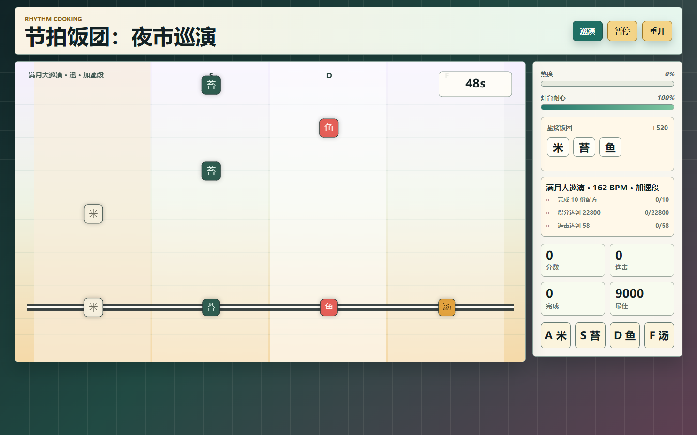
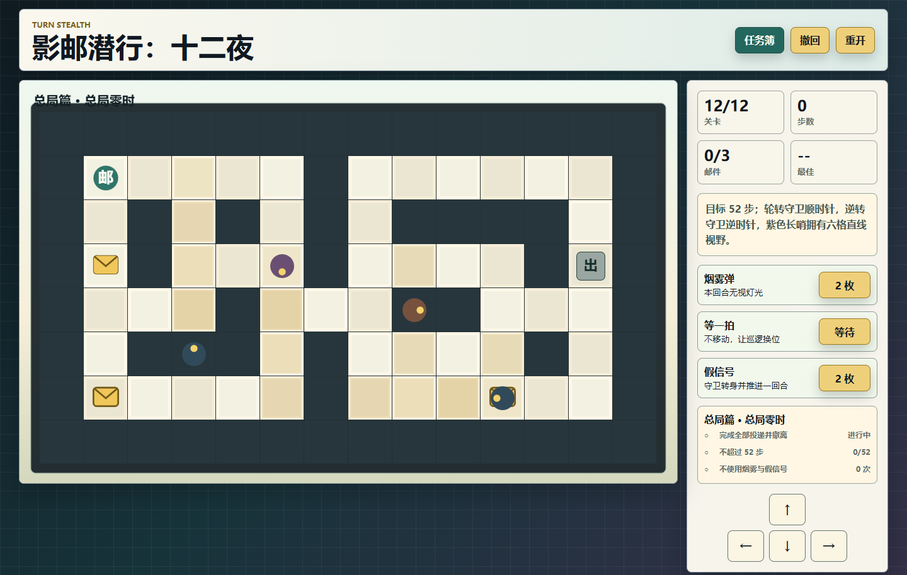
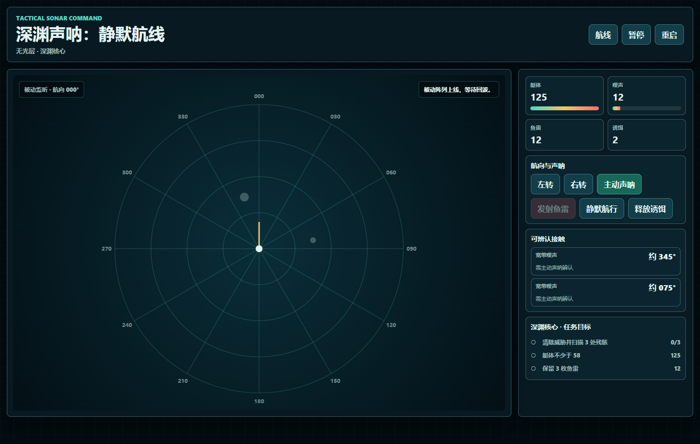

# 看不全，也不能靠猜：三个单 HTML 浏览器游戏的不完全信息设计实战

> 发布说明（发布时可删除）
>
> - 文章类型：原创。
> - 建议分区：游戏开发；备选分区：前端 / JavaScript。
> - 文章封面：`docs/images/readable-uncertainty/cover.jpg`，1920×1080；只设置为 CSDN 封面，不在正文重复插入。
> - 正文图 1：`docs/images/readable-uncertainty/beat-bento.png`，放在节拍案例开头。
> - 正文图 2：`docs/images/readable-uncertainty/shadow-post.png`，放在潜行案例开头。
> - 正文图 3：`docs/images/readable-uncertainty/abyss-sonar.png`，放在声呐案例开头。
> - 建议摘要：隐藏信息能制造紧张感，也很容易把游戏变成没有依据的猜谜。我用三个零依赖、单 HTML 浏览器游戏做了一轮真实升级：节奏游戏用暗拍制造时间不确定性，回合潜行用视锥制造空间不确定性，声呐战术用被动监听与主动探测制造身份不确定性。本文拆解线索、确认成本、反馈、撤回和自动化验证怎样共同保证“看不全，但始终能推理”。
> - 建议标签：`HTML5 游戏`、`JavaScript`、`游戏设计`、`Canvas`、`Vibe Coding`。

我最近升级了三款看起来毫不相关的浏览器小游戏：

- 《节拍饭团：夜市巡演》是四轨节奏烹饪；
- 《影邮潜行：十二夜》是回合制视野潜行；
- 《深渊声呐：静默航线》是方位、距离和噪声驱动的潜艇战术。

它们的操作方式不同，底层却在解决同一个问题：**玩家无法同时看到全部有效信息。**

节奏游戏隐藏的是未来几秒的准确时机，潜行游戏隐藏的是守卫下一回合的位置，声呐游戏隐藏的是接触身份与精确方位。隐藏信息可以制造预判、紧张和风险，但只要少一个环节，也会迅速退化成“系统想让我输”。

这轮升级后，我给这类玩法总结出一条约束：

> 不完全信息不是删除信息，而是把信息拆成线索、确认和反馈三个阶段。

玩家可以暂时不知道答案，但必须知道该观察什么、怎样付出代价确认，以及判断错误后为什么错。

## 三类不完全信息，不能用同一种做法

这三款游戏分别处理时间、空间和身份不确定性：

| 游戏 | 暂时隐藏的内容 | 玩家先看到什么 | 主动确认或应对 | 判断错误的反馈 |
| --- | --- | --- | --- | --- |
| 节拍饭团 | 音符准确到达时机 | 轨道、颜色、下落速度、判定线 | 提前读谱、选择主厨特性 | 极准/稳/空拍/漏拍，连击与耐心变化 |
| 影邮潜行 | 守卫下一回合位置和朝向 | 当前视锥、守卫颜色、固定行为规则 | 等待、烟雾、假信号、撤回 | 被发现的位置和当前灯锥保持可见 |
| 深渊声呐 | 接触身份、精确方位、距离和结构 | 被动宽带噪声与大致方位 | 主动声呐、锁定、静默、诱饵 | 丢失制导、敌方解算、艇体受损 |

同样叫“隐藏信息”，三者需要的界面完全不同。节奏游戏不能弹窗解释每个音符，潜行游戏不能只给一个抽象警戒值，声呐游戏也不能一开始就把所有敌艇画成精确红点。

## 时间不确定性：暗拍不能真的消失

> 图 1：《节拍饭团：夜市巡演》的暗拍演出。远处音符降低透明度，轨道、运动方向和判定线仍然保留。

《节拍饭团》原本只有一场 82 秒单局。四种食材从上方落下，玩家按 `A/S/D/F` 或直接点击轨道，在判定线上完成饭团配方。

核心手感已经成立，问题是所有音符使用固定 600ms 间隔。玩过一局以后，玩家只是在重复同一节奏。

升级版扩展为三章 12 场演出，BPM 从 96 递增到 162，并加入五种读谱规则：

- 正拍：稳定间隔，用于建立基础；
- 摇摆拍：特定位置延后 0.42 个基础间隔；
- 双押：周期性加入不同轨道的奖励音符；
- 加速段：演出后 38% 区间把速度提高到 1.2 倍；
- 暗拍：距离判定线较远时降低音符透明度，接近后恢复。

暗拍是最容易做坏的一种。如果把音符完全隐藏，玩家只能背谱或碰运气；如果只改颜色，它又不会改变读谱。我最后选择降低远处音符的透明度，但保留轨道、运动方向和接近判定线后的完整显示。

玩家失去的是“很早就能看清”的优势，不是做判断的依据。

四名主厨进一步改变信息容错：

- 凪保持均衡；
- 澪把判定窗口扩大 18%，但得分降低 6%；
- 迅把得分提高 14%，同时把判定窗口收紧到 92%；
- 月把热度获取提高 35%。

这不是常见的线性加攻击。它让玩家根据自己读取时间信息的能力选择容错、得分或爆发节奏。

### 一个预生成谱面里的状态错位问题

节奏玩法还暴露了一个纯工程问题：为了让音符提前出现在画面上，代码会预生成未来约 2.3 秒的谱面。如果生成音符和当前配方共用同一个游标，玩家在这 2.3 秒内完成配方后，已经生成的旧配方音符会被新配方判定，造成“明明按对却断连”的错误。

升级版把两个进度彻底分开：

- `recipeIndex / progress` 记录玩家实际完成到哪里；
- `spawnRecipeIndex / spawnRecipeProgress` 只负责未来谱面生成。

这是不完全信息游戏里很典型的一类问题：玩家本来就在依据有限线索判断，如果系统内部状态再错位一次，玩家几乎不可能区分是自己没读懂，还是代码判错。

## 空间不确定性：规则要比地图更稳定

> 图 2：《影邮潜行：十二夜》的回合潜行地图。不同颜色的守卫对应稳定行为，当前视锥直接显示在棋盘上。

《影邮潜行》的目标很简单：收集地图上的所有邮件，然后到出口撤离。玩家每移动一步，守卫也行动一次。

原版只有四关和两种守卫。升级后变为三章 12 图，并把守卫行为拆成四类：

| 守卫 | 每回合行为 | 视野特点 |
| --- | --- | --- |
| 轮转守卫 | 顺时针旋转 90° | 四格前向视野，保留近身侧视 |
| 逆转守卫 | 逆时针旋转 90° | 与轮转颜色不同，规则相反 |
| 巡逻守卫 | 沿固定路线移动并朝向移动方向 | 位置变化但路线可重复学习 |
| 长哨 | 原地不动 | 六格直线视野，没有侧视 |

这里最重要的不是守卫种类多，而是**同一种颜色永远对应同一种行为**。地图可以越来越复杂，规则不能在没有提示时临时改变。

当前灯锥会直接画在格子上；守卫移动后，新的灯锥立即更新。玩家不需要根据一个模糊的“警戒值”猜测自己是否安全。

### 可逆操作让实验不等于惩罚

潜行解谜需要试探。如果每一次错误都强制重开，玩家会倾向于穷举或查攻略，而不是理解守卫规则。

因此游戏保留完整撤回快照：

- 玩家位置；
- 所有守卫位置、朝向与巡逻步；
- 邮件完成状态；
- 烟雾与假信号数量；
- 道具使用次数和总步数。

烟雾保护下一步穿过视线；假信号让所有守卫转身，并把这次操作计为一回合。两件道具都能解决问题，但每关第三颗星要求不使用道具。

这样一来，第一次通关允许玩家用资源验证想法，之后再追求纯路线。隐藏信息不会因为追求高评价而妨碍基础通关。

### 关卡数据也需要自动检查

增加到 12 图后，人工看地图很容易漏掉一堵墙：页面能加载，棋盘也能画出来，但某封邮件可能根本不可达。

专项检查会验证：

1. 每张地图所有行长度一致；
2. 恰好有一个起点和一个出口；
3. 从起点进行静态 BFS，所有邮件和出口都在同一可达区域。

守卫会改变时机，不应该改变地图的基础连通性。先证明“存在路线”，再讨论这条路线是否需要等待、烟雾或假信号。

## 身份不确定性：主动确认必须有代价

> 图 3：《深渊声呐：静默航线》的被动监听界面。未确认接触只提供噪声和大致方位，主动声呐才会换取精确信息。

《深渊声呐》原版会在主动声呐后把全部接触直接画成红点或绿点，发射鱼雷时再自动选择航向最接近的敌人。

这能运行，但几乎没有“声呐战”的判断：按扫描、对准红点、开火即可。

重制版把接触信息分为两层。

被动阵列只会对高噪声、距离较近的接触显示：

- “宽带噪声”；
- 取整到 15° 的大致方位；
- 不显示身份、精确距离和结构。

主动声呐才会获得：

- 猎潜艇、深水护卫、水雷、鲸群或残骸身份；
- 精确方位；
- 距离；
- 敌方剩余结构。

确认不是免费的。主动声呐会提高自身噪声，并把敌方警觉至少推到 0.55。敌方听见玩家后开始接近；警觉超过 0.72 且距离小于 330 时，会按各自冷却进行攻击解算。

玩家可以：

- 静默航行，加快噪声恢复并降低敌方接近速度；
- 释放诱饵，降低噪声并把全部敌方警觉乘以 0.35；
- 选择具体接触锁定，而不是让系统自动选目标；
- 调整到目标方位，在制导容差内发射。

这形成一个完整的信息交换：主动获得精确信息，同时把自己的位置暴露给对方。

六项双槽模块改变的也不是抽象战力，而是信息流程本身：宽域阵列延长回波，线导鱼雷扩大方位容差，静音推进器降低操作噪声；其余模块改变艇体、诱饵和弹舱资源。

## 我最后保留的通用检查表

做完三款以后，我会用下面五个问题检查不完全信息玩法：

### 1. 玩家在答案出现前看到了什么？

如果答案出现前没有任何线索，那不是预判，只是随机揭晓。

### 2. 主动确认需要付出什么？

确认完全免费，最优策略就会变成不停扫描；确认代价过大，玩家又不敢使用系统。代价应该改变风险，而不是取消选择。

### 3. 错误以后能不能解释？

节拍要显示判定，潜行要保留灯锥，鱼雷要报告目标方位与当前航向。只显示“失败”无法帮助玩家建立模型。

### 4. 第一次尝试是否允许低成本实验？

判定容错主厨、撤回、烟雾和诱饵都在降低第一次学习规则的代价。高星目标再要求精确、少步或资源保留。

### 5. 自动化测试有没有覆盖玩法独有状态？

联合 Playwright 回归不是只检查三个页面能打开，而是实际执行：

- 键盘命中一枚已排队节拍并确认分数增加；
- 键盘移动潜行角色一回合并确认步数变化；
- 主动声呐提高噪声，锁定目标后点击发射并确认鱼雷消耗和目标损毁；
- 12 场演出、12 张地图、8 条航线和各自成长数据完整；
- 三种 V2 存档码完成导出、清洗和导入往返；
- 三张 Canvas 在桌面与 390×844 手机上都有非空像素信号且无横向溢出。

测试不能证明规则一定好玩，但能确认玩家收到的反馈来自同一套稳定状态，而不是偶然工作的 UI。

## 结语

信息越少，不代表游戏越有深度。真正有价值的是玩家能否利用有限线索建立一个越来越准确的模型。

暗拍应该让玩家更晚确认，而不是彻底看不见；守卫应该让玩家预测下一回合，而不是随机转身；主动声呐应该交换双方信息，而不是一个没有代价的“显示答案”按钮。

这三款游戏仍然保持单 HTML、零外部依赖，源码和专项测试都在同一个开源仓库：

<https://github.com/wangzifan396-wzf/mini-browser-games>

如果正在设计潜行、侦察、推理、节奏或任何依赖隐藏信息的玩法，我更建议先写清楚“玩家怎样知道自己为什么错”，再决定要藏掉多少内容。前者决定它是不是一套可学习的规则，后者只决定它看起来有多神秘。

## 发布信息（发布时可删除）

- 推荐标题：看不全，也不能靠猜：三个单 HTML 浏览器游戏的不完全信息设计实战
- 备选标题 1：隐藏信息不等于让玩家靠猜：三个浏览器小游戏的设计与验证
- 备选标题 2：从暗拍、守卫视野到主动声呐：浏览器游戏如何设计可学习的未知
- 备选标题 3：玩家看不全时，游戏怎样保持公平？三个单 HTML 项目的实战复盘
- 推荐标签：`HTML5 游戏`、`JavaScript`、`游戏设计`、`Canvas`、`Vibe Coding`
- 推荐分区：游戏开发；备选分区：前端、JavaScript
- 推荐封面：`docs/images/readable-uncertainty/cover.jpg`
- 发布前按正文顺序上传三张配图并保留紧随其后的图注；封面只通过 CSDN 封面控件设置。
