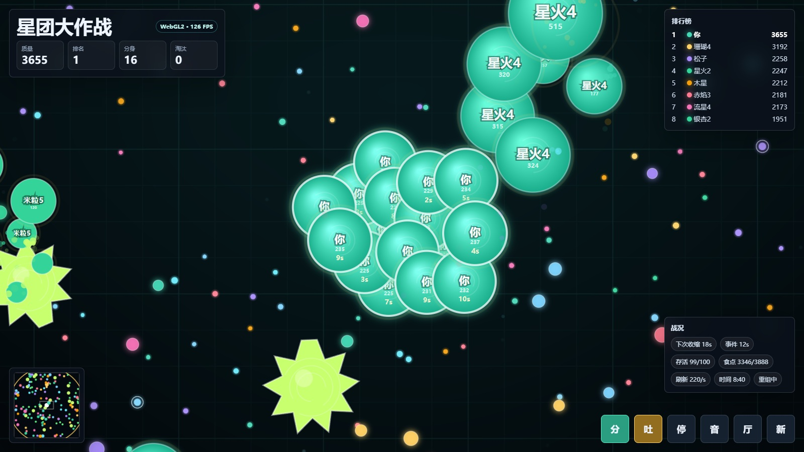
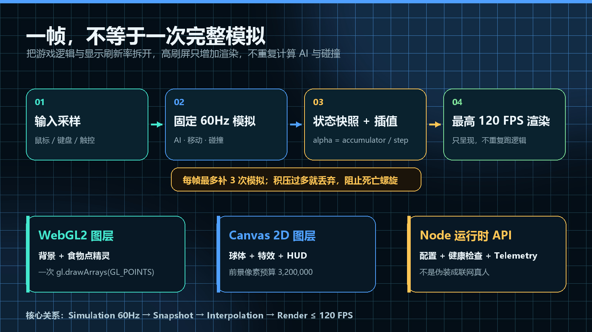
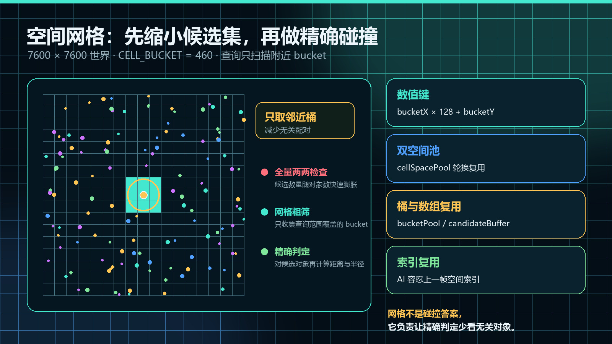
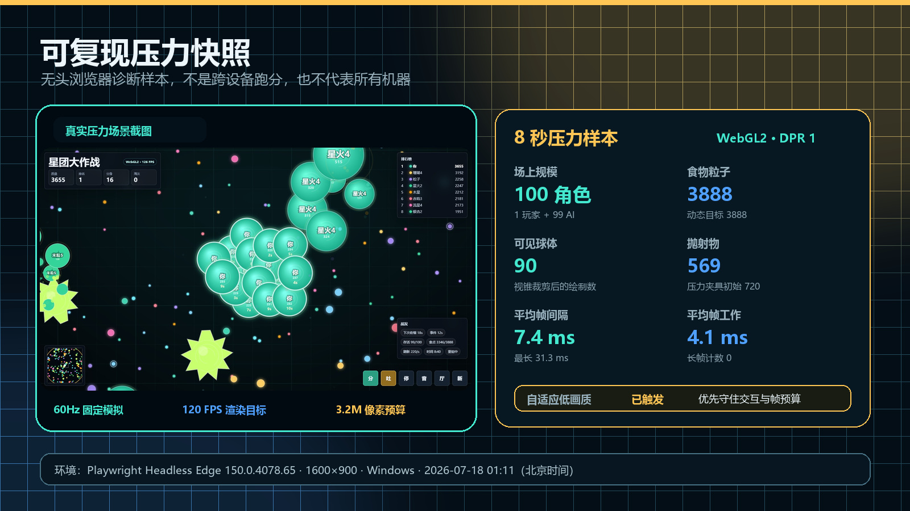

# 浏览器里同时跑 99 个 AI 和 2100+ 粒子：WebGL2、Canvas 与固定时间步优化实战

> 发布说明（这段发布时可以删除）
>
> - 文章类型：原创。
> - 建议分区：前端 / JavaScript；备选分区：游戏开发。
> - 文章封面：`docs/images/browser-performance/cover.jpg`，1920×1080。只设置为 CSDN 封面，不必在正文首屏重复插入。
> - 正文图 1：`star-cluster-stress.jpg`，放在开场之后，用真实画面建立场景规模。
> - 正文图 2：`architecture.jpg`，放在“先拆开模拟与渲染”一节开头。
> - 正文图 3：`spatial-grid.jpg`，放在空间网格原理说明之后、代码之前。
> - 正文图 4：`runtime-card.jpg`，放在实测数据一节开头。
> - 建议摘要：一个浏览器吞噬竞技场里有 1 名玩家、99 个 AI、2100 个基础食物对象，以及病毒、抛射物和粒子特效。本文基于真实开源项目，拆解固定 60Hz 模拟、最高 120 FPS 插值渲染、空间网格、对象复用、WebGL2 点精灵批处理、Canvas 2D 前景和像素预算，并公开一套可复现的无头浏览器压力采集流程。

我在做《星团大作战》时，遇到的性能问题并不是“Canvas 能不能画几个圆”，而是下面这些工作会同时出现：

- 1 名玩家和 99 个 AI 持续移动、追击、逃跑、分裂与吞噬；
- 7600×7600 的世界里，基础食物对象有 2100 个；
- 病毒、吐出物、临时粒子和大量分裂球体继续增加更新与绘制压力；
- 游戏要能在高刷新率屏幕上平滑显示，但不能因为显示器变成 120Hz 或 160Hz，就把 AI 和碰撞也多算一倍；
- 高 DPI 和 4K 屏幕会让填充像素量快速膨胀，即使对象数量没有变化。

如果继续使用最直接的 `update(dt) + draw()`，并让每一次 `requestAnimationFrame` 都完整运行 AI、空间查询和碰撞，高刷屏反而会把 CPU 主线程先拖慢。

下面是项目调试接口自动构造的压力场景。它不是宣传效果图，而是 Playwright 启动真实页面、填充后期对象并截下来的游戏画面。



> 图 1：1 玩家 + 99 AI 的大逃杀压力场景。画面只显示视野内对象，世界中的对象总数与实际提交绘制的对象数并不相同。

这篇文章不做“优化后提升 10 倍”一类没有对照基准的结论。我更想完整解释：在一个真实浏览器游戏里，怎样确定预算、拆分更新与渲染、减少候选对象、批量提交绘制，并让性能数据可以复现。

## 先把场景规模说清楚

项目中的核心预算如下：

| 项目 | 配置 | 含义 |
| --- | ---: | --- |
| 世界尺寸 | 7600×7600 | 大多数对象不在当前视野内 |
| 对局角色 | 100 | 1 名玩家 + 99 个 AI，不是 100 名联网真人 |
| 食物基线 | 2100 | 代码中的 `FOOD_BASE_COUNT` |
| 食物压力夹具 | 3600 | `stressLateGame()` 的初始填充值 |
| 大逃杀动态目标 | 最高 3888 | 3600 再乘该模式的 1.08 缩放 |
| 病毒基线 | 54 | 大小病毒共同存在 |
| 吐出物上限 | 720 | `MAX_EJECTED` |
| 临时特效粒子上限 | 560 | `MAX_PARTICLES` |
| 前景像素预算 | 3,200,000 | 控制高 DPI Canvas 内部尺寸 |

标题里的“2100+ 粒子”主要指用 GPU 点精灵绘制的食物对象。源码内部仍然严格区分 `foods`、`ejected` 和短生命周期的 `particles`，它们的更新规则并不相同。

还有一个容易误读的数字：`FOOD_MAX_COUNT = 3600` 是标准模式的目标上界，不是所有模式的绝对硬上限。大逃杀使用 `foodTargetScale = 1.08`，因此后期动态目标可以到 3888。把常量、模式倍率和实测数量分开，才能避免性能文章中的数字互相打架。

## 第一步不是换 WebGL，而是拆开模拟与渲染



> 图 2：输入、固定时间步模拟、状态快照、插值渲染之间的关系。高刷显示只提高呈现频率，不让 AI 和碰撞跟着重复运行。

我把游戏的时间分成了两条线：

1. 游戏模拟固定为 60Hz，负责 AI、移动、碰撞和规则结算；
2. 渲染目标最高 120 FPS，负责把两个模拟状态之间的画面平滑显示出来。

核心常量很简单：

```js
const SIMULATION_STEP = 1 / 60;
const MAX_SIMULATION_STEPS = 3;
const TARGET_RENDER_FPS = Math.min(120, REQUESTED_REFRESH_RATE);
```

主循环使用 accumulator 累积真实时间。时间足够一个固定步长时才执行 `update()`：

```js
simulationAccumulator = Math.min(0.1, simulationAccumulator + dt);

let steps = 0;
while (
  simulationAccumulator >= SIMULATION_STEP &&
  steps < MAX_SIMULATION_STEPS
) {
  captureSimulationState();
  simulationNow += SIMULATION_STEP * 1000;
  update(SIMULATION_STEP, simulationNow);
  simulationAccumulator -= SIMULATION_STEP;
  steps += 1;
}
```

这样做有两个直接收益。

第一，60Hz、120Hz、160Hz 显示器上的游戏规则一致。速度、AI 思考和碰撞不再暗中依赖显示刷新率。

第二，渲染帧变多时，主线程不会等比例增加最重的逻辑工作。浏览器仍然会进入每个 `requestAnimationFrame`，但完整模拟只按固定步长推进。

## 每帧最多补 3 步，防止“死亡螺旋”

固定时间步还有一个常见陷阱：假设某一帧卡了很久，accumulator 会积压多个模拟步。补模拟本身又消耗时间，下一帧继续积压，最后进入越补越慢的循环。

因此项目限定一帧最多补 3 次：

```js
if (
  steps === MAX_SIMULATION_STEPS &&
  simulationAccumulator >= SIMULATION_STEP
) {
  simulationAccumulator %= SIMULATION_STEP;
  simulationNow = now - simulationAccumulator * 1000;
}
```

这是一种明确的取舍：极端卡顿后允许丢掉一部分历史时间，也不要让主线程永远追不上现实时间。实时交互游戏里，恢复控制通常比逐毫秒补完旧状态更重要。

## 固定 60Hz 之后，怎样让 120 FPS 不显得一跳一跳

如果只把逻辑限制到 60Hz，却直接绘制最新状态，那么 120Hz 屏幕上会连续两帧看到几乎相同的位置。

解决办法是保存模拟前后的状态，再根据 accumulator 剩余比例插值：

```js
const interpolation = simulationAccumulator / SIMULATION_STEP;

applyInterpolatedFrame(interpolation);
draw(now);
restoreInterpolatedFrame();
```

例如一个球体上一次模拟在 `x = 100`，本次模拟在 `x = 110`，当前 `interpolation = 0.4`，渲染位置就是 104。逻辑仍然只跑 60 次，显示位置却可以跟随更高刷新率平滑变化。

这里还需要注意内存分配。插值不应该每帧为所有球体新建数组和包装对象，否则平滑运动可能换来周期性的垃圾回收停顿。项目复用球体状态与渲染缓冲，并在绘制后恢复真实模拟状态。

## 空间网格：不要让每个球体检查所有球体

对象增加后，最先要解决的通常不是绘制，而是“谁需要和谁比较”。

如果每个球体都与所有球体做距离判断，候选配对在最坏情况下会按平方增长。但吞噬、碰撞和 AI 关注的对象通常只在附近，没有必要先扫描整个 7600×7600 世界。

项目把世界划分为边长 460 的 bucket，并用数值键存入 `Map`。



> 图 3：空间网格先收集查询范围覆盖的 bucket，再对候选对象执行精确距离与半径判断。网格不是碰撞答案，而是缩小候选集的工具。

网格构建的核心结构如下：

```js
function cellBucketKey(bucketX, bucketY) {
  return bucketX * 128 + bucketY;
}

function nearbyCells(grid, point, range, output) {
  const list = output || [];
  list.length = 0;

  const minX = Math.floor((point.x - range) / CELL_BUCKET);
  const maxX = Math.floor((point.x + range) / CELL_BUCKET);
  const minY = Math.floor((point.y - range) / CELL_BUCKET);
  const maxY = Math.floor((point.y + range) / CELL_BUCKET);

  for (let x = minX; x <= maxX; x++) {
    for (let y = minY; y <= maxY; y++) {
      const bucket = grid.get(cellBucketKey(x, y));
      if (bucket) list.push(...bucket);
    }
  }
  return list;
}
```

这里还有四个比算法名字更容易被忽略的细节：

- `cellSpacePool` 使用两套空间结构轮换，不为每次构建创建新 `Map`；
- 每个空间结构保存 `bucketPool`，清空数组后再次使用；
- `visibleCellBuffer`、`ejectedCandidateBuffer`、`cellCandidateBuffer`、`virusCandidateBuffer` 都循环复用；
- AI 决策可以容忍上一帧的空间索引，因此同一个模拟帧不必为 AI 和碰撞各重建一次最大结构。

最后一点是一种业务允许的近似。AI 晚 1 帧获取附近目标，玩家通常感知不到；少构建一次大索引，却能稳定减少主线程工作。优化不是把所有数据都更新到“理论最新”，而是先判断哪一类数据真的需要零延迟。

## WebGL2 点精灵：把数千次小绘制变成一次批量提交

食物对象数量多、尺寸小、结构一致，非常适合批处理。

GPU 渲染器给每个食物写入 8 个 float：世界坐标 `x/y`、半径、RGB、脉冲相位和稀有标记。缓冲容量不足时指数扩容，之后使用同一个 `Float32Array` 和 GPU buffer：

```js
const floatsPerSprite = 8;
const needed = foods.length * floatsPerSprite;

if (needed > this.spriteCapacity) {
  this.spriteCapacity = Math.max(
    needed,
    Math.max(1024, this.spriteCapacity * 2)
  );
  this.spriteData = new Float32Array(this.spriteCapacity);
  gl.bufferData(
    gl.ARRAY_BUFFER,
    this.spriteData.byteLength,
    gl.DYNAMIC_DRAW
  );
}

gl.bufferSubData(gl.ARRAY_BUFFER, 0, this.spriteData, 0, needed);
gl.drawArrays(gl.POINTS, 0, foods.length);
```

这段优化的价值不在于“GPU 一定比 Canvas 快多少倍”——没有同机、同版本、同场景对照时，我不会给出倍数——而在于把大量结构一致的小对象压成一批连续数据和一次 `gl.drawArrays(GL_POINTS)`。

容量扩展只在不够时发生，也避免了每帧重新创建 GPU buffer。

## 为什么没有把整个游戏都改成 WebGL

项目采用的是混合渲染：

- WebGL2 负责背景和大量食物点精灵；
- Canvas 2D 负责球体、病毒、特效和游戏前景；
- DOM 负责 HUD、按钮、排行榜和可访问性文本；
- WebGL 不可用时自动回退 Canvas 2D。

这是维护成本与性能预算之间的选择。大量同构粒子适合 GPU 批处理，而频繁变化的文字、面板和复杂 2D 反馈继续使用 Canvas/DOM，迭代会更直接。

GPU 背景也没有在每个显示帧都重绘。它以最高 80 FPS 更新隐藏缓存，再复制到唯一可见的前景 Canvas：

```js
const GPU_CACHE_FPS = Math.min(80, TARGET_RENDER_FPS);

const updateGpuCache =
  gpuRenderer &&
  gpuRenderer.active &&
  (now - lastGpuFrame >= 1000 / GPU_CACHE_FPS || !backgroundCacheReady);
```

最终只保留一个不透明可见表面，可以减少双透明 Canvas 的合成压力。游戏过程中也不会为了短期降画质反复改变 4K Canvas 尺寸，因为 resize 往往伴随纹理重建、闪白和长停顿。

## 高 DPI 不能只看 devicePixelRatio

如果 3840×2160 屏幕再按 DPR 2 创建 Canvas，内部像素会达到约 3318 万。即使场景对象数量相同，清屏、混合和复制的成本也完全不同。

项目先按 320 万前景像素预算计算倍率上限：

```js
function renderRatioCeiling() {
  const deviceRatio = window.devicePixelRatio || 1;
  const cssPixels = Math.max(1, innerWidth * innerHeight);
  const pixelBudgetRatio = Math.sqrt(
    MAX_FOREGROUND_PIXELS / cssPixels
  );

  return clamp(
    pixelBudgetRatio,
    0.7,
    Math.min(1.25, deviceRatio)
  );
}
```

DOM 界面仍由浏览器以原生分辨率排版，只有游戏前景 Canvas 受像素预算约束。这样牺牲的是一部分高压场景中的内部采样精度，不是把整个页面都变模糊。

系统还会根据平均帧间隔、平均工作时间、可见球体和吐出物压力切换低画质。低画质不是失败状态，而是预算控制器真的开始工作：先减少非关键特效和昂贵滤镜，保住操作反馈与模拟稳定。

## Node 后端为什么存在：运行配置与遥测，而不是假装联网多人

这仍然是一场本地玩家与 AI 的对局。Node 服务没有把 99 个 AI 描述成在线真人，它主要负责静态资源、压缩、健康检查和运行时信息：

```text
GET  /api/health
GET  /api/runtime
POST /api/telemetry
GET  /api/telemetry
```

`/api/runtime` 会明确返回当前版本启用的性能策略，例如：

```json
{
  "fixedSimulationHz": 60,
  "foregroundPixelBudget": 3200000,
  "gpuSpriteBatching": true,
  "stableCanvasDuringPlay": true,
  "pooledCollisionBuffers": true,
  "spatialIndexReuse": true
}
```

页面关闭时上报一条内存遥测样本，包括平均 FPS、帧工作时间、实际渲染后端、DPR、最长帧和是否进入低画质。它不落盘，也不替代完整的性能分析工具，但能回答“这次到底走了 WebGL2 还是 2D 回退”“画质控制器有没有触发”这些发布前问题。

最终使用独立显卡还是集成显卡，仍由浏览器和操作系统图形策略决定。请求 `powerPreference: high-performance` 不是独显保证，所以页面会显示 WebGL 实际设备，而不是根据机器配置猜测。

## 一次可复现的压力采样结果



> 图 4：Playwright Headless Edge、1600×900、DPR 1 下的 8 秒压力样本。它用于验证代码路径和预算机制，不代表不同设备上的统一成绩。

本次采集环境识别到：

```text
WebGL2
ANGLE / AMD Radeon(TM) Graphics / Direct3D 11
Edge 150.0.4078.65
Windows · 1600×900 · DPR 1
```

8 秒压力样本的关键数据如下：

| 指标 | 结果 |
| --- | ---: |
| 对局目标角色 | 100（1 玩家 + 99 AI） |
| 仍存活角色 | 99 |
| 食物对象 / 动态目标 | 3888 / 3888 |
| 吐出物 | 569（夹具初始 720） |
| 视野内实际绘制球体 | 90 |
| 视野内实际绘制食物 | 139 |
| 平均帧间隔 | 7.4ms |
| 平均每帧工作时间 | 4.1ms |
| 最长帧 | 31.3ms |
| 超过 80ms 的长帧 | 0 |
| 自适应低画质 | 已触发 |

这里不能直接把 `7.4ms` 写成所有设备都能达到的“135 FPS”。无头浏览器的 `requestAnimationFrame` 调度不等同于真实显示器呈现，代码中的渲染预算仍然是最高 120 FPS。这个样本能证明的是：指定环境里 WebGL2 与点精灵批处理被启用，压力夹具确实创建了目标规模，帧工作时间、长帧和自适应状态都被记录下来。

另一个重要区别是“世界对象数”和“绘制对象数”。场上有 3888 个食物对象，不代表每帧要把 3888 个全部提交到当前视野；样本里实际可见食物为 139。空间查询和视锥裁剪同样是渲染预算的一部分。

## 我没有采用的几种做法

### 1. 不让模拟频率跟着显示器刷新率走

这会让 160Hz 设备承担比 60Hz 设备更多的 AI 和碰撞工作，还容易造成规则差异。

### 2. 不把所有对象都交给 Canvas 2D 逐个绘制

Canvas 2D 继续承担擅长的前景反馈，大量同构食物则由 WebGL 点精灵批处理。

### 3. 不盲目追求原生 DPR

游戏画布有明确像素预算；界面清晰度与高压场景采样精度分别处理。

### 4. 不在游戏过程中频繁 resize 画布

动态缩放看起来很聪明，实际可能制造纹理重建和比降画质更明显的停顿。项目选择稳定画布尺寸，在内容和特效层面降级。

### 5. 不把 `powerPreference` 当成硬件保证

运行时读取真实 WebGL 设备，WebGL 不可用就回退，而不是在文案中承诺一定启用某张显卡。

## 这套优化顺序可以复用到其他浏览器游戏

如果重新做一遍，我仍会按下面的顺序处理：

1. 先定义角色数、世界对象数、可见对象数、像素数和目标帧预算；
2. 把固定频率模拟与高刷新率渲染拆开；
3. 用空间结构减少候选对象，而不是先微调绘制语句；
4. 把大量同构小对象改成连续数据和批量提交；
5. 复用热点路径上的数组、桶、包装对象和缓冲区；
6. 给高 DPI Canvas 设置像素预算；
7. 保留清晰的回退路径和自适应降级；
8. 用真实压力夹具、运行时快照和截图验证，而不是只凭肉眼感觉流畅。

这套顺序背后的原则是：先减少不该做的工作，再让必须做的工作更便宜，最后才讨论某个 API 在理论上快多少。

## 采集脚本与全部源码已开源

项目地址：

<https://github.com/wangzifan396-wzf/mini-browser-games>

对应目录与源码：

- 游戏前端：`star-cluster-arena/frontend/`
- 固定时间步、空间网格与 Canvas 前景：`star-cluster-arena/frontend/js/game.js`
- WebGL2 点精灵批处理：`star-cluster-arena/frontend/js/gpu-renderer.js`
- Node 运行时 API：`star-cluster-arena/backend/server.mjs`
- 本文压力采集：`promo-video/scripts/capture-performance-article.mjs`
- 本文配图生成：`promo-video/scripts/create-browser-performance-article-images.py`
- 原始测量数据：`docs/images/browser-performance/runtime-measurement.json`

复现采集与配图：

```powershell
cd promo-video
npm install
npm.cmd run article:performance:capture
npm.cmd run article:performance:images
```

如果你也在做 Canvas/WebGL 游戏，希望这份拆解能帮你少走一个弯路：性能优化不是把每一段代码都改得更复杂，而是让模拟、查询、绘制、像素和验证各自拥有清楚的预算。

---

## 发布信息（发布时可删除）

- 推荐标题：浏览器里同时跑 99 个 AI 和 2100+ 粒子：WebGL2、Canvas 与固定时间步优化实战
- 备选标题 1：高刷屏为什么会拖慢浏览器游戏？固定时间步 + WebGL2 的完整解法
- 备选标题 2：从 O(n²) 碰撞到 WebGL2 批处理：百人浏览器竞技场性能实战
- 备选标题 3：我怎样让 1 玩家 + 99 AI 跑在浏览器里：模拟、碰撞、渲染与像素预算
- 推荐标签：`JavaScript`、`WebGL2`、`Canvas`、`游戏开发`、`性能优化`
- 推荐封面：`docs/images/browser-performance/cover.jpg`
- 正文字数较长，CSDN 目录建议保留二级标题，不把三级标题加入目录。
