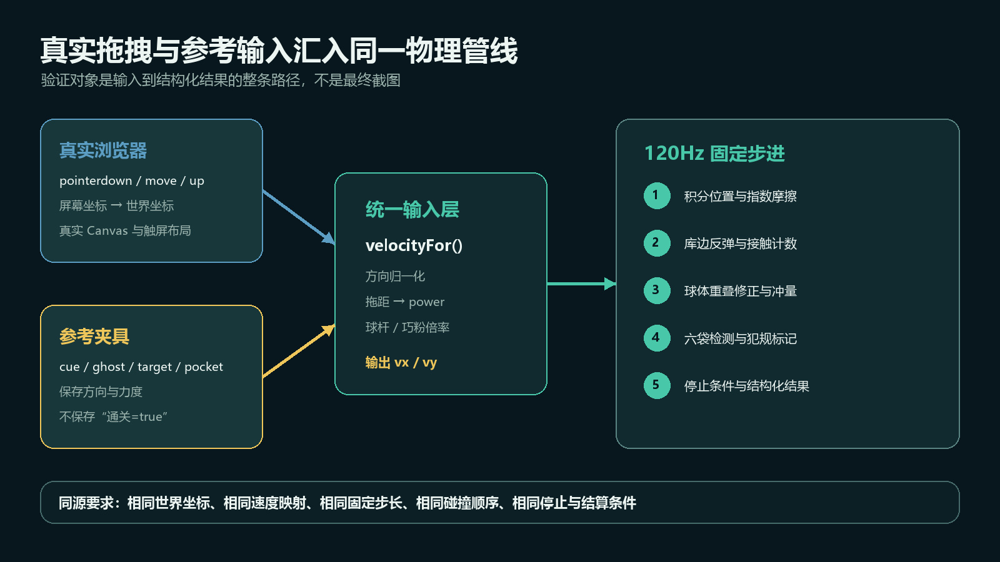
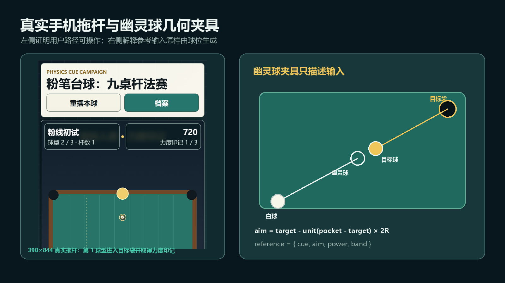
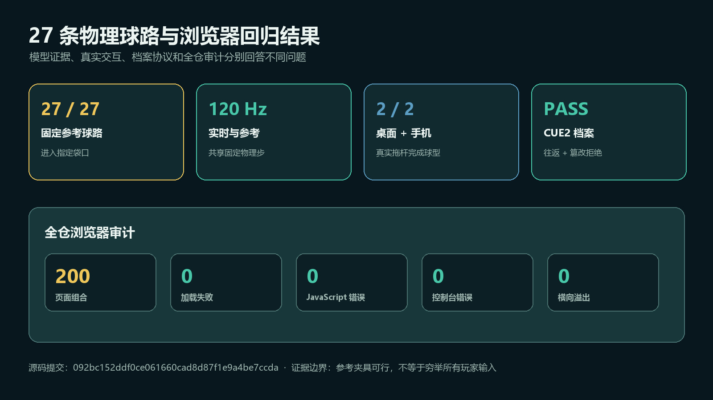

# 别拿录屏当物理验证：浏览器连续模拟的固定时间步、参考输入与自动验收

> 发布说明（发布时可删除）
>
> - 文章类型：原创。
> - 推荐分区：前端；备选分区：软件工程、自动化测试、游戏开发。
> - 备选标题 1：27 条球路怎样自动证明可进？从拖拽输入到同源物理回归
> - 备选标题 2：浏览器物理关卡怎么测：固定时间步、轨迹夹具与 Playwright 真拖拽
> - 备选标题 3：Canvas 不报错还不够：给连续碰撞系统建立可复现验收
> - 文章封面：`docs/images/physics-reference/cover.jpg`，1920×1080；只设置为 CSDN 封面，不在正文重复插入。
> - 正文图 1：`docs/images/physics-reference/evidence-pipeline.jpg`，图名“真实拖拽与参考输入汇入同一物理管线”，放在“先定义什么叫同源验证”一节。
> - 正文图 2：`docs/images/physics-reference/trajectory-evidence.jpg`，图名“真实手机拖杆与幽灵球几何夹具”，放在“参考球路保存输入，不保存答案”一节。
> - 正文图 3：`docs/images/physics-reference/validation-results.jpg`，图名“27 条物理球路与浏览器回归结果”，放在“模型通过以后，仍要走真实浏览器”一节。
> - 发布元数据：`docs/images/physics-reference/csdn-metadata.json`，包含推荐标题、三个备选标题、摘要、分区、标签、封面和正文图片映射。
> - 建议摘要：截图和录屏能证明浏览器物理画面在动，却不能证明固定场景真的可完成，也不能解释不同帧率下碰撞结果为什么漂移。本文以一个零依赖 Canvas 物理页面为真实样本，把屏幕拖拽归一化为世界坐标输入，让玩家出杆与 27 条参考杆共享速度映射、120Hz 固定物理步、球体碰撞、指数摩擦、库边反弹和袋口判定；再用 Playwright 完成桌面与 390×844 触屏真实拖杆、档案防篡改和 Canvas 像素回归。重点不是介绍游戏，而是讨论连续数值系统怎样建立可复现、可定位且不过度承诺的工程证据。
> - 建议标签：`JavaScript`、`Canvas`、`物理模拟`、`Playwright`、`自动化测试`。

一个 Canvas 页面运行起来，球会滚，撞到边会反弹，录屏看着也很顺。

这能证明什么？

它最多证明“这次、这台机器、这段操作下，画面曾经动过”。它没有证明同一输入在 60Hz 和 144Hz 屏幕上得到相同结果，没有证明固定关卡存在合法解，也没有证明触屏坐标经过缩放后仍然指向同一条轨迹。

连续数值系统最麻烦的地方正在这里：错误通常不是一个稳定的异常，而是一次略早的碰撞、一次略深的穿透，随后被后续几十次积分逐步放大。最后看见的只是“偶尔进不了”“手机上偏一点”或“录屏时没问题”。

本文不讨论怎样把一款游戏做得更好玩，而是借一个零依赖 Canvas 台球页面，拆解一条可迁移到粒子系统、车辆、拖拽编辑器和可视化模拟器的验收链：

1. 动画帧只负责报告经过时间，物理模型使用固定步长；
2. 玩家输入和参考输入必须汇入同一速度映射与物理内核；
3. 参考夹具保存可重放输入，不保存“通过”答案；
4. 模型回归以后，再用真实浏览器验证鼠标、触屏、布局和绘制信号。

## 录屏为什么不是物理证据

最直接的动画循环通常长这样：

```javascript
function frame(now) {
  const dt = (now - last) / 1000;
  last = now;
  stepPhysics(state, dt);
  draw(state);
  requestAnimationFrame(frame);
}
```

对于只做匀速平移的对象，`x += vx * dt` 看起来足够合理。但一旦每一步还包含碰撞检测、重叠修正、摩擦、阈值停止和边界判定，`dt` 就不再只是一个比例系数。

假设球速为 1200 px/s：

- 60Hz 下单步约移动 20px；
- 120Hz 下单步约移动 10px；
- 页面短暂卡顿 33ms 时单步接近 40px。

如果碰撞只检查“这一步结束后两个圆是否重叠”，采样点不同就可能产生三种结果：尚未接触、轻微重叠、已经穿过。即使都检测到碰撞，重叠修正量也不同，接下来的速度和位置自然会分叉。

这也是为什么录屏很难帮忙定位：录屏保留的是渲染结果，不是每一步的 `dt`、接触顺序、碰撞前速度和结算状态。

## 固定时间步解决的到底是什么

样本页面把每帧时间先放进累加器，再用 `1 / 120` 秒反复推进模型：

```javascript
function update(dt) {
  if (state?.mode !== "running") return;

  state.physicsAccumulator = Math.min(
    0.1,
    state.physicsAccumulator + dt
  );

  const step = 1 / 120;
  while (state.physicsAccumulator >= step) {
    stepPhysics(state, step);
    if (state.inShot) state.shotTime += step;
    state.physicsAccumulator -= step;
  }

  if (state.inShot && state.shotTime > 0.35 && allStill(state)) {
    state.inShot = false;
    resolveShot();
  }
}
```

现在显示器帧率只决定一次渲染之间跑几个物理步：60Hz 通常跑两步，120Hz 通常跑一步。积分、摩擦和碰撞始终看到相同的 `dt`，参考模拟也能用完全相同的步长离线执行。

`Math.min(0.1, ...)` 是另一条重要边界。页面切到后台或主线程长时间阻塞后，如果无上限地追赶历史时间，恢复时可能连续运行几百个物理步，形成“越追越慢”的螺旋。这里宁愿丢弃过长的积压，也不让恢复帧拖垮页面。

固定步长并不保证所有物理都正确。它解决的是“相同输入因为帧时间不同而走不同采样序列”，没有自动解决这些问题：

- 极高速小物体仍可能跨过碰撞区域；
- 碰撞对的遍历顺序仍可能影响多体接触；
- 浮点运算跨引擎或跨架构不一定逐位相同；
- 120Hz 模型配 60Hz 渲染时，若对象很快，仍可能需要插值改善观感。

本例使用的是固定步长的离散碰撞，不是连续碰撞检测（CCD）。如果业务允许子弹、细线或高速刚体一帧跨越目标，就应增加扫掠测试、到达时间求解或自适应子步，而不是简单把步长无限缩小。

## 物理步内部也需要稳定顺序

固定 `dt` 只是前提，物理步内部的阶段也要稳定。样本的 `stepPhysics()` 按以下顺序运行：位置积分与指数摩擦、低速归零、库边处理、两轮球体碰撞修正、袋口检测。

```javascript
function stepPhysics(s, dt) {
  for (const ball of s.balls) {
    if (ball.pocketed) continue;

    ball.x += ball.vx * dt;
    ball.y += ball.vy * dt;

    const damp = Math.exp(-1.35 * dt);
    ball.vx *= damp;
    ball.vy *= damp;

    if (Math.hypot(ball.vx, ball.vy) < 3) {
      ball.vx = ball.vy = 0;
    }
    rail(ball);
  }

  for (let pass = 0; pass < 2; pass++) {
    for (let i = 0; i < s.balls.length; i++) {
      for (let j = i + 1; j < s.balls.length; j++) {
        collide(s.balls[i], s.balls[j]);
      }
    }
  }

  detectPockets(s);
}
```

这里使用 `Math.exp(-k * dt)`，而不是每帧简单乘 `0.98`。后者把摩擦强度偷偷绑定在调用次数上；指数衰减则把它绑定到经过时间。即使以后把固定步长从 120Hz 改为 100Hz，同一秒内的理论衰减仍接近一致。

两轮碰撞修正不是通用刚体求解器，只是这个小规模圆球模型在复杂度与稳定性之间的取舍。工程上重要的不是把简化模型包装成“真实物理”，而是把求解顺序写死、用参考输入回归，并明确它不负责的场景。

## 先定义什么叫同源验证



> 图 1：真实拖拽与参考输入汇入同一物理管线。两类输入可以来自不同入口，但世界坐标、速度映射、固定步长、碰撞顺序和结算条件必须相同。

“自动跑了一条参考轨迹”还不够。如果参考函数绕过摩擦、直接设置目标球坐标，或者测试里另写一份简化碰撞公式，它通过得越稳定，误导性反而越强。

我把同源约束拆成五项：

| 环节 | 玩家路径 | 参考路径 | 必须共享的语义 |
| --- | --- | --- | --- |
| 坐标 | 屏幕指针转换为世界坐标 | 夹具直接保存世界坐标 | 相同球桌坐标系 |
| 方向 | 从拉杆终点指向起点 | 从白球指向幽灵球 | 归一化后的出杆方向 |
| 力度 | 拖拽距离映射到 `power` | 夹具保存 `power` | 相同速度曲线与球杆倍率 |
| 模拟 | 动画累加器多次调用 | 循环固定次数调用 | 同一个 `stepPhysics()` 与 `1/120` |
| 结算 | 等待静止后判袋口和犯规 | 等待静止后读取同一状态 | 相同停止、袋口和犯规条件 |

玩家拖拽与参考球路现在共用同一个速度入口：

```javascript
function velocityFor(from, to, power, force = 1) {
  const dx = to.x - from.x;
  const dy = to.y - from.y;
  const length = Math.hypot(dx, dy) || 1;
  const speed = (560 + 1050 * power) * force;

  return {
    vx: dx / length * speed,
    vy: dy / length * speed
  };
}
```

参考输入调用 `velocityFor(dr.cue, dr.aim, dr.power, 1)`；玩家向后拉杆，所以调用 `velocityFor(aim.now, aim.start, power, force)`。二者的原始点位不同，但都把“出杆起点到目标点”交给同一个归一化与速度曲线。

此前玩家事件处理器复制过一遍速度公式。它当时数值相同，专项测试也能通过，但只要将来调整 `560 + 1050 * power`，参考轨迹和真实拖杆就可能悄悄分叉。所谓同源不只是今天写了同样的公式，而是维护时只有一个公式可改。

## 参考球路保存输入，不保存答案



> 图 2：真实手机拖杆与幽灵球几何夹具。左侧是真实 390×844 触屏页面，右侧展示参考输入怎样由白球、目标球、目标袋和幽灵球位置组成。

对于直线入袋，目标球应该先沿“目标球到袋口”的方向移动。把这个方向反向延长两个球半径，就得到白球碰撞目标球时的理想圆心位置，也就是常说的幽灵球：

```javascript
const direction = unit(pocket - target);
const ghost = target - direction * (2 * ballRadius);

const reference = {
  cue,
  aim: ghost,
  power,
  band
};
```

夹具保存的是起点、瞄准点、力度和目标力度区间。它不保存目标球最终坐标，也不保存 `success: true`。执行时仍要经过正式速度映射、球球碰撞、摩擦、库边、袋口和犯规判断。

一条参考杆的模拟器可以很小：

```javascript
function simulateDrill(drill) {
  const state = {
    balls: ballsFor(drill),
    targetPocket: -1,
    shotFoul: false
  };

  const cue = state.balls[0];
  const velocity = velocityFor(
    drill.cue,
    drill.aim,
    drill.power,
    1
  );
  cue.vx = velocity.vx;
  cue.vy = velocity.vy;

  for (let step = 0; step < 1600; step++) {
    stepPhysics(state, 1 / 120);
    if (step > 40 && allStill(state)) break;
  }

  return {
    ok: state.targetPocket === drill.pocket && !state.shotFoul,
    targetPocket: state.targetPocket,
    cuePocket: cue.pocket
  };
}
```

1600 步不是“一定模拟这么久”，而是防止异常状态无限运行的上限。正常球路在所有球静止后提前结束。测试最终断言目标袋口和犯规状态，不断言循环跑完，也不接受夹具自己给出的布尔答案。

本次共有 9 组固定场景，每组 3 条球路，27 条参考输入全部通过正式模型并进入指定袋口。这项结果能证明固定内容至少存在可行输入，也能在修改摩擦、碰撞或袋口半径后立即指出哪一条内容失效。

它不能证明：

- 任意玩家输入都不会出现异常；
- 参考力度是唯一解或最优解；
- 模型已经覆盖所有多球接触与高速穿透；
- 关卡难度和手感一定合理。

“27/27”是一条存在性证据，不是输入空间的穷举证明。把边界写在结果旁边，比追求一个看似强大的通过率更重要。

## 模型通过以后，仍要走真实浏览器



> 图 3：27 条物理球路与浏览器回归结果。模型证据、真实交互、档案协议和全仓页面审计分别回答不同问题，不能互相替代。

模型测试不会替你发现 Canvas 在手机上缩成零宽，也不会发现触屏事件没有进入 `pointerup`。所以专项脚本还要在真实浏览器里完成一次桌面拖杆和一次触屏拖杆。

测试先读取 Canvas 在页面中的矩形，再把世界坐标变换为屏幕坐标：

```javascript
const data = await page.evaluate(() => ({
  drag: window.__chalkBilliards.referenceDrag(),
  table: window.__chalkBilliards.tableRect()
}));

const box = await page.locator("#gameCanvas").boundingBox();
const screen = (point) => ({
  x: box.x + data.table.x + point.x * data.table.scale,
  y: box.y + data.table.y + point.y * data.table.scale
});

const start = screen(data.drag.start);
const end = screen(data.drag.end);

await page.mouse.move(start.x, start.y);
await page.mouse.down();
await page.mouse.move(end.x, end.y, { steps: 8 });
await page.mouse.up();
```

这段操作没有直接调用 `fire()`，而是走 `pointerdown`、`pointermove` 和 `pointerup`。随后测试等待场景从第 1 条进入第 2 条，并断言杆数与力度印记都变成 1。移动端使用 390×844、`isMobile: true`、`hasTouch: true` 和 2 倍设备像素比，在同一套坐标变换下重跑。

同时还保留三类浏览器证据：

1. 监听 `pageerror` 与 `console.error`，不是只看测试进程有没有退出；
2. 抽样读取 Canvas 像素，要求不透明样本和颜色分布超过阈值，防止“脚本正常但画布空白”；
3. 检查 `scrollWidth - clientWidth <= 4`，防止移动端横向溢出。

像素信号仍然不是视觉回归。它能发现空白或极端退化，不能判断文字遮挡和构图好坏，所以脚本继续输出桌面、手机截图供人工检查。

档案协议也在同一次浏览器运行中完成往返：导出文本必须以 `CUE2.` 开头，解码后恢复 9 组星级；在末尾追加字符后必须抛出“杆法档案校验失败”。这与物理正确性无关，却能防止一次功能升级破坏用户的可携带进度。

最终专项结果如下：

| 证据 | 结果 | 回答的问题 |
| --- | ---: | --- |
| 固定参考球路 | 27 / 27 | 固定内容是否至少存在可行输入 |
| 物理步长 | 120Hz | 实时与离线模拟是否使用同一采样尺度 |
| 真实拖杆 | 桌面、390×844 触屏均通过 | 用户事件与坐标变换是否可达 |
| 档案协议 | `CUE2` 往返、篡改拒绝 | 进度协议是否可恢复且能发现损坏 |
| 浏览器错误 | 0 | 专项运行是否出现脚本或控制台错误 |
| 横向溢出 | 0 | 两种视口是否出现布局越界 |

此外，全仓 100 个页面又以桌面和触屏两种视口形成 200 个页面组合，加载失败、JavaScript 错误、控制台错误、横向溢出和 viewport 缺失均为 0。全仓审计证明公共发布面没有明显回归，但它同样不能替代 27 条物理参考球路的领域断言。

## 一条失败应该能指向哪一层

把所有检查塞进一个“PASS”会让诊断重新变得困难。更有效的做法是让失败保留层次：

| 失败现象 | 优先检查 |
| --- | --- |
| 参考球路在所有环境稳定失败 | 内容夹具、速度曲线、碰撞或结算规则 |
| 只在低帧率或后台恢复后失败 | 累加器上限、固定步推进、时间来源 |
| 模型通过但桌面真拖杆失败 | 屏幕到世界坐标、指针捕获、事件顺序 |
| 桌面通过但触屏失败 | 触屏上下文、设备像素比、响应式布局 |
| 状态通过但 Canvas 信号失败 | 画布尺寸、缩放、绘制初始化 |
| 物理通过但档案失败 | 协议版本、校验码、归一化与兼容策略 |

这样做的价值不只是测试更全面，而是失败时不必反复看录屏猜原因。参考夹具指出“哪条固定输入变了”，真实拖拽指出“用户路径是否可达”，像素和布局信号指出“页面是否真的画出来”，档案断言则守住持久化边界。

## 可直接复用的验收清单

如果正在维护任何带连续状态的浏览器页面，可以按下面的顺序建立证据：

- 让 `requestAnimationFrame` 只提供经过时间，不直接决定物理步长；
- 使用带上限的累加器，明确后台恢复时是追赶还是丢弃积压；
- 把位置积分、阻尼、碰撞、边界和结算顺序固定下来；
- 让玩家输入与参考输入共享坐标系、力度映射和规则内核；
- 参考夹具只保存输入，禁止保存最终状态或成功布尔值；
- 给模拟循环设置最大步数，并在稳定停止条件成立时提前退出；
- 在真实浏览器里至少走一次鼠标和一次触屏操作；
- 同时采集页面异常、控制台错误、Canvas 像素信号和横向溢出；
- 把协议往返和篡改拒绝放进同一轮回归；
- 在报告中写清“通过”证明了什么，以及没有证明什么。

## 结语

连续模拟最容易给人一种错觉：只要画面顺，系统就可靠。实际上，画面是最末端的结果，也是信息损失最多的一层。

固定时间步把帧率从规则中剥离，参考输入把固定内容变成可重放证据，真实浏览器拖拽再把坐标、事件和布局接回用户路径。三者组合后，录屏才从“唯一证据”退回它更合适的位置：辅助观察，而不是物理正确性的证明。

更重要的是，不要夸大自动验收。27 条参考球路全部通过是一项有边界的工程事实：它证明这些输入在当前正式模型中可行。承认它没有穷举所有输入，不会削弱结论，反而让这条证据真正可信。

---

实现与专项测试对应开源提交：`092bc152ddf0ce061660cad8d87f1e9a4be7ccda`

项目地址：<https://github.com/wangzifan396-wzf/mini-browser-games>
