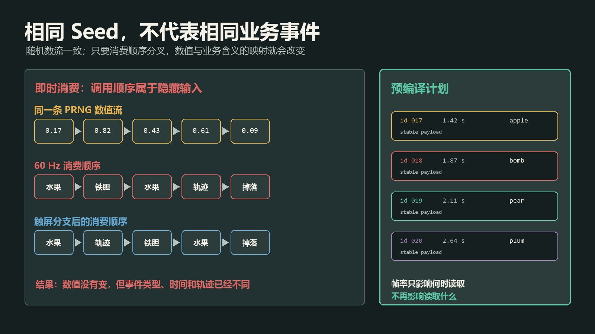
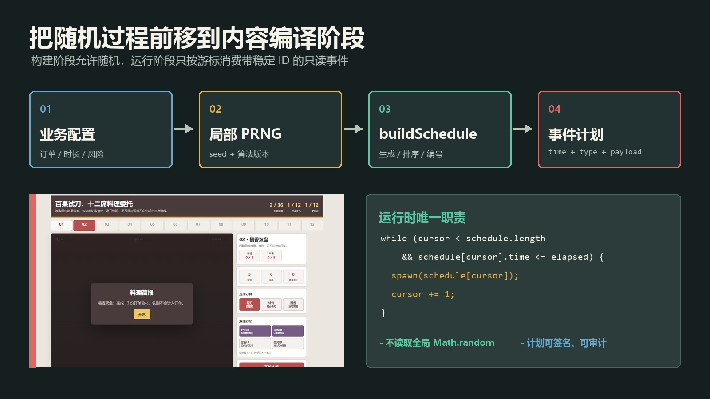
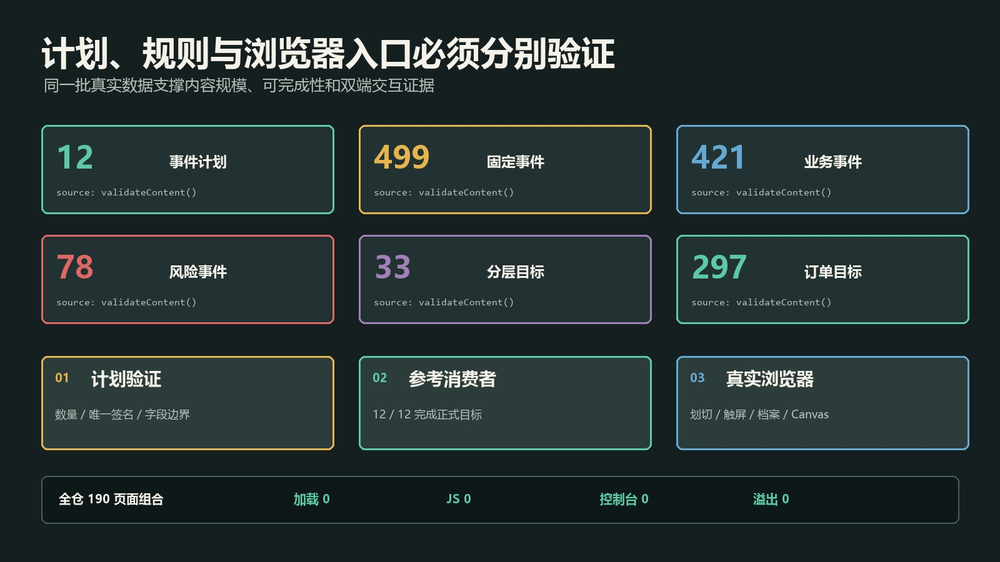

# Seed 不是可复现的终点：把实时随机内容编译成可验证事件计划

> 发布说明（发布时可删除）
>
> - 文章类型：原创。
> - 推荐分区：前端；备选分区：软件工程、自动化测试。
> - 文章封面：`docs/images/deterministic-schedules/cover.jpg`，1920×1080；只设置为 CSDN 封面，不在正文重复插入。
> - 正文图 1：`docs/images/deterministic-schedules/seed-vs-schedule.jpg`，图名“相同随机数流与稳定事件计划的差别”，放在“同一个 Seed 为什么仍然会分叉”一节。
> - 正文图 2：`docs/images/deterministic-schedules/compile-pipeline.jpg`，图名“从配置与局部 PRNG 到只读事件计划”，放在“把随机过程前移到编译阶段”一节。
> - 正文图 3：`docs/images/deterministic-schedules/validation-results.jpg`，图名“事件计划、参考消费者与浏览器回归的三层验证”，放在“三层验证：计划正确、规则可完成、用户入口可用”一节。
> - 发布元数据：`docs/csdn-deterministic-event-schedules-metadata.json`，包含推荐标题、三个备选标题、摘要、分区、标签、封面和正文图片映射。
> - 建议摘要：固定随机种子只能保证伪随机数流一致，不能保证动画帧、输入事件和分支代码以相同顺序消费它。本文结合一个零依赖 Canvas 实时页面，说明如何把 seed、业务配置和局部 PRNG 放进纯构建阶段，预先编译带稳定 ID 的事件计划，再让运行时只按时间游标消费事件。真实样例生成 12 份互不重复的计划、499 个事件、297 份订单目标，并由共享正式命中与物理函数的参考消费者全部完成；Playwright 还验证真实划切、档案防篡改、双端 Canvas 和 190 个全仓页面组合。文章同时讨论调用顺序分叉、浮点时间、计划签名、版本化、参考方案过拟合及不适合预编译的随机边界。
> - 建议标签：`JavaScript`、`确定性测试`、`Canvas`、`自动化测试`、`前端架构`。

前端项目使用固定随机种子以后，经常会出现一种过早的放心：

> 只要 seed 相同，结果就一定能复现。

这句话少了一个很重要的前提：随机数必须以完全相同的顺序、完全相同的次数，被完全相同的业务分支消费。

对批处理脚本来说，这个前提有时自然成立；对实时页面却未必。`requestAnimationFrame` 的间隔会变化，触屏事件数量与鼠标不同，页面暂停和恢复会改变分支，某次提前返回也可能少消费一个随机数。PRNG 生成的数值流仍然相同，但“第几个数字代表什么”已经变了。

我最近把一个零依赖 Canvas 实时页面从临时随机生成改成固定内容时，没有只把 `Math.random()` 换成带 seed 的 PRNG，而是多做了一层：

```text
seed + 业务配置
        ↓
buildSchedule()
        ↓
带稳定 ID 的事件计划
        ↓
运行时只按时间游标消费
```

随机性仍然存在，但只允许发生在内容构建阶段。页面正式运行以后，不再临时决定“下一个是什么、何时出现、从哪里进入”。

这篇文章不讨论某一款游戏怎么玩，而是讨论这种结构为什么比“只固定 seed”更容易复现、测试、平衡和排查问题。

## Seed 真正保证了什么

先把 PRNG 的保证说准确。

给定：

- 相同初始 seed；
- 相同算法实现；
- 相同调用次数；
- 相同调用顺序；

PRNG 会返回相同数值流，例如：

```text
0.17, 0.82, 0.43, 0.61, 0.09 ...
```

它保证的是“第 N 次调用得到相同数值”，不是“苹果、铁胆、轨迹和奖励仍然得到原来的数值”。业务含义来自调用位置，而调用位置仍可能分叉。

一个看似普通的实时生成器可能这样写：

```javascript
function update(dt) {
  spawnTimer -= dt;

  if (spawnTimer <= 0) {
    spawnTimer = 0.6 + random() * 0.3;
    const kind = random() < 0.12 ? "bomb" : "fruit";
    const lane = Math.floor(random() * 7);
    spawn(kind, lane);
  }
}
```

如果每帧只执行一次、没有暂停、没有补帧、没有别的分支调用 `random()`，它可以稳定运行。但真实页面常会继续增加逻辑：

```javascript
if (pointerType === "touch" && random() < 0.1) addAssist();
if (combo > 10) velocity += random() * 0.2;
if (document.hidden) return;
```

从这里开始，seed 仍然一样，随机数流也一样，消费映射却不再一样。

## 同一个 Seed 为什么仍然会分叉



> 图 1：相同随机数流与稳定事件计划的差别。左侧数值流没有变化，但触屏分支改变了消费顺序；右侧事件类型、时间与载荷已经在运行前固定，帧率只影响事件何时被读取，不再决定读取什么。

实时页面里至少有五类常见分叉源。

### 1. 帧率和补帧策略

60 Hz 和 120 Hz 显示器会产生不同数量的更新调用。若随机函数放在每帧分支中，即使总运行时间相同，消费次数也可能不同。

固定时间步可以缓解物理差异，但它仍不能自动约束所有 UI 分支、粒子效果和异步回调。

### 2. 输入事件密度

鼠标移动可能每秒触发数十次事件，触屏通常是另一种频率。若输入处理器会随机生成火花、辅助线或业务对象，后续随机流就被设备类型影响。

### 3. 分支提前返回

一次碰撞可能命中铁胆后立即返回，另一次则继续处理后面的目标。只要随机调用位于返回点之后，两个状态就从此错位。

### 4. 异步完成顺序

图片加载、网络请求、音频解码和定时器没有稳定的完成顺序。谁先完成、谁先消费随机数，不能只靠 seed 约束。

### 5. “无关”表现层偷走随机数

最难排查的是业务逻辑和粒子效果共用同一个 PRNG。后来只增加几颗装饰粒子，就可能改变关卡内容。

所以更准确的公式是：

```text
可复现结果
= 稳定算法
+ 稳定 seed
+ 稳定调用图
+ 稳定时间语义
+ 稳定输入上下文
```

只保存 seed，只保存了其中一项。

## 把随机过程前移到编译阶段



> 图 2：从配置与局部 PRNG 到只读事件计划。业务配置和 seed 只进入 `buildSchedule()`；运行时循环按 `elapsed` 推进游标并复制事件，不再读取全局随机状态。

这次实现把内容分成四层：

| 层 | 输入 | 输出 | 是否允许随机 |
| --- | --- | --- | --- |
| 业务配置 | 目标、时长、节奏、风险、首领层数 | 一份任务描述 | 否 |
| 局部 PRNG | seed、固定算法 | 可重复数值流 | 是 |
| 计划构建器 | 配置、局部 PRNG | 排序并编号的事件数组 | 是 |
| 运行时 | 事件数组、经过时间、用户输入 | 当前状态 | 否 |

关键不是“项目里从此没有随机”，而是随机只能跨过一次明确边界。

### PRNG 必须是构建器的局部依赖

页面使用一个显式 seed 创建局部随机函数：

```javascript
function rng(seed) {
  let value = seed >>> 0;

  return () => {
    value = Math.imul(value ^ value >>> 15, 1 | value);
    value ^= value + Math.imul(value ^ value >>> 7, 61 | value);
    return ((value ^ value >>> 14) >>> 0) / 4294967296;
  };
}
```

构建每份计划时重新创建实例：

```javascript
function buildSchedule(index) {
  const mission = missions[index];
  const random = rng(mission.seed);
  const schedule = [];

  // 生成目标事件、风险事件和分层事件……

  return schedule
    .sort((a, b) => a.time - b.time)
    .map((event, id) => ({ ...event, id }));
}
```

它不读取模块级 `Math.random()`，也不与粒子、声音和 UI 动画共用随机状态。某一份计划多消费一次，不会污染下一份计划。

### 先满足业务约束，再打乱表现顺序

完全随机地抽事件，容易出现“看似变化丰富，实际目标根本无法完成”。

这次构建顺序是：

1. 根据订单数量创建全部必需事件；
2. 添加少量非必需内容；
3. 使用局部 PRNG 洗牌；
4. 按任务参数插入风险事件；
5. 在明确时间窗追加分层目标；
6. 排序并分配稳定 ID。

这样“内容必须包含什么”来自业务配置，“以什么顺序出现”才交给随机过程。

这也是确定性生成与纯随机生成最重要的区别：前者首先满足约束，后者只能事后祈祷。

### 运行时只消费计划

运行时循环不需要知道 seed：

```javascript
while (
  state.cursor < schedule.length &&
  schedule[state.cursor].time <= state.elapsed
) {
  spawnEvent(state, schedule[state.cursor]);
  state.cursor += 1;
}
```

60 Hz 与 120 Hz 可能在不同一帧读到事件，但只要 `elapsed` 的定义相同，读到的仍是同一个 ID、同一种类型和同一份载荷。

事件进入活动状态时使用浅复制：

```javascript
function spawnEvent(state, event) {
  state.objects.push({
    ...event,
    y: 1.08,
    dead: false,
    cutCooldown: 0
  });
}
```

原计划继续作为只读内容，运动位置、冷却和销毁标记进入运行时对象。否则一次游玩修改计划本身，下一次重开就不再是同一份内容。

## 一份事件计划至少需要哪些字段

不是所有项目都需要同一套 schema，但下面几类字段很常用：

```javascript
{
  id: 18,
  time: 1.87,
  type: "bomb",
  x: 0.62,
  vx: -0.08,
  vy: -1.01,
  hp: 1,
  version: 1
}
```

### `id`：稳定身份

不要只把数组下标临时当身份。日志、错误报告和回放证据都更适合引用稳定 ID：

```text
mission 04 / event 018 / bomb / 1.87 s
```

如果以后需要在中间插入新事件，最好使用构建期生成且版本内稳定的 ID，而不是依赖当前排序位置。

### `time`：业务时间，不是墙上时间

事件时间应基于任务经过时间，不应直接保存 `Date.now()`。暂停时业务时间停止，恢复后继续推进。

浮点时间还要明确比较规则。测试不应该期待 `1.87` 在二进制浮点里精确相等，可以在序列化签名中固定小数位，运行时则使用 `<= elapsed + epsilon` 或整数毫秒。

### `type` 与 `payload`：区分路由与数据

类型决定进入哪个规则入口，载荷描述这次事件的具体参数。不要把行为函数直接塞入计划，否则计划难以序列化、签名和跨线程传递。

### `version`：内容协议会变化

一旦计划需要长期保存、分享或与问题报告一起上传，就应该记录：

- PRNG 算法版本；
- 计划 schema 版本；
- 内容配置版本；
- 生成器版本或提交 SHA。

相同 seed 配合不同生成器，不应被描述成“同一份计划”。

## 计划签名比只记录 Seed 更有诊断价值

seed 能重新生成内容，前提是生成器版本完全相同。实际排查中，我更愿意同时记录一份计划摘要或哈希：

```javascript
const signature = schedule
  .map((event) => [
    event.id,
    event.time.toFixed(2),
    event.type,
    event.x.toFixed(2)
  ].join(":"))
  .join("|");
```

它可以回答两个不同问题：

- seed 是否相同？
- 最终生成的业务事件是否相同？

生产环境可以进一步对规范 JSON 计算 SHA-256。需要注意，规范化必须先固定字段顺序、数字精度和缺省值，否则同义对象也可能得到不同哈希。

当前专项校验会为 12 份计划建立签名集合，重复就立即失败：

```javascript
if (signatures.has(signature)) {
  throw new Error(`第 ${index + 1} 份事件计划重复`);
}
signatures.add(signature);
```

“seed 不同”不能自动证明内容不同；比较计划签名才是在比较业务结果。

## 三层验证：计划正确、规则可完成、用户入口可用



> 图 3：事件计划、参考消费者与浏览器回归的三层验证。计划层证明内容规模和唯一性，参考消费者证明正式规则下存在完成路径，Playwright 再证明鼠标、触屏、档案和 Canvas 入口真实可用。

预编译事件计划只是结构改进，不代表内容自动正确。至少要分三层验证。

### 第一层：计划本身满足内容契约

真实校验结果为：

| 指标 | 结果 |
| --- | ---: |
| 固定计划 | 12 |
| 总事件 | 499 |
| 普通业务事件 | 421 |
| 风险事件 | 78 |
| 分层目标 | 33 层 |
| 必需订单目标 | 297 |
| 重复计划签名 | 0 |

这一层检查数量、字段、目标覆盖和唯一性。它能发现漏配置、重复脚本和不可能满足的静态约束，但不能证明运行规则真的允许完成。

### 第二层：参考消费者必须经过正式规则

参考消费者逐帧等待目标进入有效区域，再调用和玩家相同的线段命中函数：

```javascript
function referenceSlash(state) {
  for (const object of state.objects) {
    if (
      !object.dead &&
      !object.bomb &&
      object.y > 0.12 &&
      object.y < 0.94 &&
      object.cutCooldown <= 0
    ) {
      slash(
        state,
        { x: object.x, y: object.y },
        { x: object.x, y: object.y }
      );
      break;
    }
  }
}
```

它没有直接把订单计数加满，也没有删除风险对象。目标轨迹、重力、切口冷却、命中距离、计分和订单累计仍由正式函数处理。

12 份计划最终全部完成，风险事件命中为 0。这个结果证明“存在一条参考完成路径”，不等于证明所有玩家策略都能完成，也不等于难度已经完美平衡。

### 第三层：Playwright 必须执行真实输入

模型通过以后，浏览器测试仍然会：

1. 打开真实 HTML；
2. 点击覆盖层的“开席”按钮；
3. 等待一个业务对象进入 Canvas；
4. 根据 Canvas 坐标按下鼠标；
5. 分五步拖过目标；
6. 松开并等待正式状态中的切取数增加；
7. 检查档案往返与篡改拒绝；
8. 在 390×844 触屏上下文重新点击入口；
9. 检查 Canvas 非空像素、颜色信号和横向溢出。

专项命令：

```powershell
cd promo-video
node scripts/check-fruit-slice.mjs
```

真实结果为：

```json
{
  "checks": "PASS",
  "missions": 12,
  "events": 499,
  "referenceWins": 12,
  "realSlash": true,
  "archiveTamperRejected": true,
  "desktopOverflow": false,
  "mobileOverflow": false
}
```

随后全仓审计覆盖 95 个活跃页面的桌面与手机视口，共 190 个页面组合：加载失败、JavaScript 错误、控制台错误、横向溢出和视口缺失均为 0。

## 参考消费者最容易变成哪种测试后门

参考消费者很有用，也很容易写成自我欺骗。

下面这种写法没有证明任何规则：

```javascript
function passReference(state) {
  state.progress = { ...state.mission.orders };
  state.won = true;
}
```

它只是为结算 UI 准备状态，最多适合测试“胜利弹窗能否显示”，不能作为内容可完成性的证据。

更可靠的参考消费者应该满足：

- 读取正式事件计划；
- 通过正式状态转移入口行动；
- 遵守冷却、资源、碰撞和时间；
- 不能直接写胜负字段；
- 失败时报告计划 ID、事件 ID 和剩余目标；
- 与一条真实用户输入测试配合。

还要避免另一个极端：为了让参考消费者通过，把难度调成只适合自动瞄准。参考消费者证明的是下界，不是玩家体验。人工试玩、非参考策略和失败分布仍然需要单独观察。

## 八个容易踩到的边界

### 1. 构建器偷偷读取全局随机状态

如果 `buildSchedule()` 一部分使用局部 `random()`，另一部分仍调用 `Math.random()`，整个计划就不再可复现。可以在测试环境临时替换 `Math.random` 为抛错函数，检查构建过程是否偷读全局随机。

### 2. 运行时修改原计划

事件进入活动对象时应复制。开发模式还可以：

```javascript
Object.freeze(schedule);
schedule.forEach(Object.freeze);
```

浅冻结只适用于载荷没有嵌套可变对象的情况；复杂 payload 需要深冻结或结构化克隆。

### 3. 同时事件依赖排序偶然性

如果两个事件时间相同，排序规则必须明确：

```javascript
schedule.sort((a, b) => a.time - b.time || a.id - b.id);
```

不要依赖旧引擎的排序实现细节，也不要让 ID 在排序后才决定业务优先级。

### 4. 浮点时间直接进入签名

`0.1 + 0.2` 并不精确等于 `0.3`。事件时间可以使用整数毫秒，或在规范化时固定精度。显示精度、签名精度和运行比较精度应分别定义。

### 5. 计划暴露了未来信息

客户端已经拥有整份计划，不代表 UI 应该把它全部展示给玩家。测试接口、调试面板和正式提示必须分层，避免“可复现”顺手变成透视未来。

### 6. 计划太大

几百个小事件直接保存在内存很轻；数十万事件则不一定。大规模系统可以按章节预编译、分块加载，或保存高层事件并在局部使用独立子 seed。关键是每个块仍有明确边界和签名。

### 7. 生成器升级却没有版本

修改一次洗牌算法，同一个 seed 就可能产生全新内容。若旧计划需要继续回放，应保存旧生成器版本或直接保存规范计划；若不支持，应明确拒绝，不要静默生成“看起来差不多”的新内容。

### 8. 把生成成功误当成体验成功

计划字段合法、参考消费者通过，只能说明内容存在且可完成。密度是否疲劳、风险是否可读、触屏是否易误触，仍然需要实际截图、输入回归和人工体验判断。

## 哪些随机适合预编译，哪些不适合

| 随机来源 | 是否适合预编译 | 更合适的做法 |
| --- | --- | --- |
| 教程提示顺序 | 适合 | 构建固定提示计划 |
| 模拟告警和故障注入 | 适合 | 生成带时间和载荷的事件表 |
| 演示数据、压测流量 | 适合 | 保存 seed、版本、计划签名 |
| 关卡刷怪、节奏内容 | 适合 | 先满足业务约束，再打乱顺序 |
| 用户点击产生的粒子 | 通常不必 | 使用独立表现层 PRNG |
| 网络返回顺序 | 不适合预测 | 记录真实响应或使用测试夹具 |
| 密码学随机数 | 不适合 | 使用 Web Crypto，不追求可复现 |
| 依赖实时传感器的数据 | 不适合预知 | 录制输入流用于复现 |

目标不是把所有变化都冻结，而是把“会影响业务结算、又可以在运行前确定”的随机内容变成显式输入。

## 事件计划与命令回放不是一回事

我之前写过命令日志与确定性回放。两种结构解决的是不同方向：

```text
事件计划：系统将向用户呈现什么
命令日志：用户怎样响应这些内容
```

完整复现包可以同时包含：

```json
{
  "scheduleVersion": 2,
  "scheduleHash": "...",
  "seed": 1283,
  "commands": [
    { "type": "SLASH", "from": [0.2, 0.7], "to": [0.4, 0.6] }
  ]
}
```

只保存事件计划，可以复现环境，但不能复现用户行为；只保存命令日志，如果环境仍在临时随机，也可能重放到另一套内容上。

这两个方向合并后，问题报告才能回答：

- 系统当时提供了哪些输入？
- 用户按什么顺序做了什么？
- 哪条规则把状态推进到错误结果？

## 可以直接复用的落地清单

- [ ] 明确哪些随机内容会影响业务结果；
- [ ] 为每个内容单元保存 seed、配置和版本；
- [ ] 构建器只使用局部 PRNG；
- [ ] 先满足必需业务约束，再随机排列表现顺序；
- [ ] 为事件分配稳定 ID；
- [ ] 明确同时事件的排序规则；
- [ ] 使用业务经过时间，不直接依赖墙上时间；
- [ ] 运行时只按游标消费计划；
- [ ] 活动对象与原始计划分离；
- [ ] 为规范计划计算签名或哈希；
- [ ] 用内容契约检查数量、字段与唯一性；
- [ ] 用参考消费者经过正式规则证明存在完成路径；
- [ ] 保留至少一条真实鼠标或触屏测试；
- [ ] 不把参考消费者结果描述成难度或体验证明；
- [ ] 记录生成器、PRNG 和 schema 版本。

## 文章配图可以复现

本文封面和三张正文图读取：

```text
docs/images/deterministic-schedules/article-data.json
```

图片由 Pillow 脚本生成：

```powershell
cd promo-video
python scripts/create-deterministic-schedule-article-images.py
```

脚本还会读取专项测试生成的真实桌面截图。测试数量、提交 SHA 或审计结果变化时，先更新结构化数据并重新生成，避免同一个数字散落在四张图片里分别手改。

## 结语

seed 很重要，但它只是随机数流的起点，不是业务结果的完整身份证。

对实时前端来说，更稳妥的做法是把随机过程前移：使用局部 PRNG 和明确业务配置构建事件计划，排序、编号、签名以后，再交给运行时按游标消费。这样帧率、输入密度和表现层变化不再轻易改写内容本身。

当计划契约、参考消费者和真实浏览器输入形成三层证据以后，“这次刚好能跑”才有机会变成“这份内容可以重复生成、重复完成、重复验证”。

本文对应页面、专项测试、文章数据与制图脚本位于开源仓库：

<https://github.com/wangzifan396-wzf/mini-browser-games>

---

## 发布信息（发布时可删除）

- 推荐标题：Seed 不是可复现的终点：把实时随机内容编译成可验证事件计划
- 备选标题 1：同一个 Seed 为什么仍然复现不了？JavaScript 实时随机内容的事件计划设计
- 备选标题 2：别在动画循环里随手 Math.random：先生成 Schedule，再运行和回归
- 备选标题 3：从 PRNG 到事件计划：让 Canvas 实时内容可复现、可校验、可回放
- 推荐标签：`JavaScript`、`确定性测试`、`Canvas`、`自动化测试`、`前端架构`
- 推荐分区：前端；备选分区：软件工程、自动化测试
- 推荐封面：`docs/images/deterministic-schedules/cover.jpg`
- 正文图 1 图名：相同随机数流与稳定事件计划的差别
- 正文图 2 图名：从配置与局部 PRNG 到只读事件计划
- 正文图 3 图名：事件计划、参考消费者与浏览器回归的三层验证
- 发布元数据：`docs/csdn-deterministic-event-schedules-metadata.json`
- 开源仓库：<https://github.com/wangzifan396-wzf/mini-browser-games>
- 源码提交：<https://github.com/wangzifan396-wzf/mini-browser-games/commit/449a0b1a6d110021a34eb9944948098642fe1ac8>
- 发布前在 CSDN 预览中检查宽表格、JavaScript 代码块、任务清单和三张正文图清晰度；封面不在正文重复插入，由作者本人决定保存草稿或公开发布。
