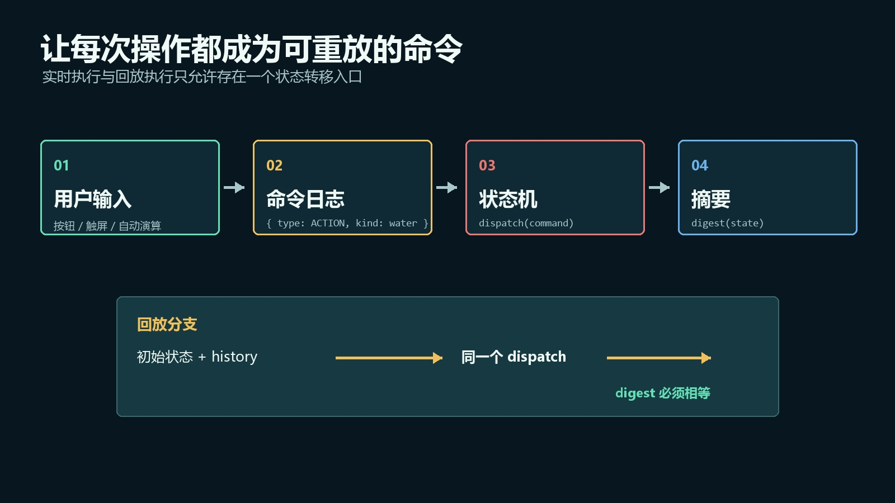
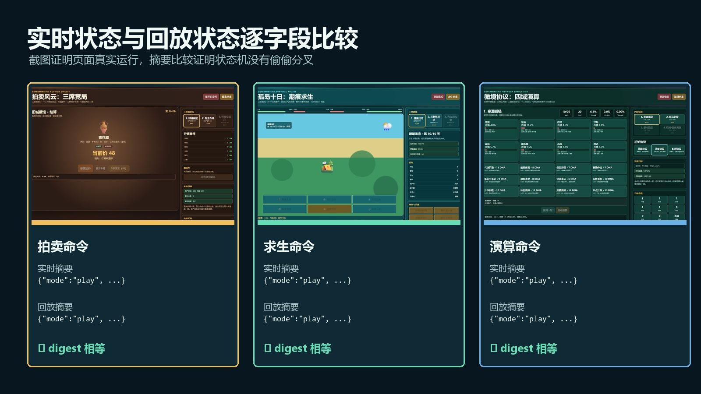
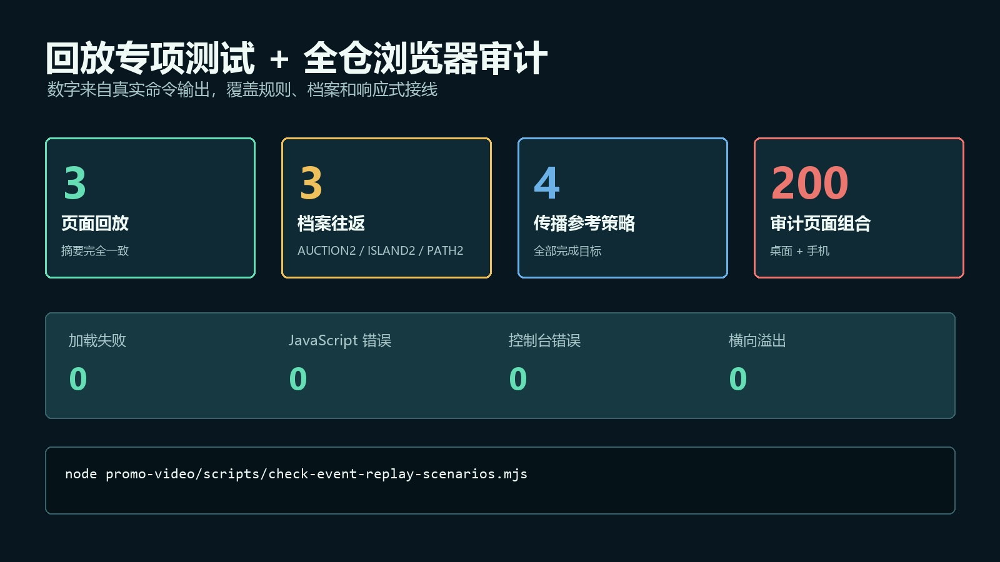

# 把前端状态机做成可回放系统：命令日志、确定性重放与回归测试

> 发布说明（发布时可删除）
>
> - 文章类型：原创。
> - 推荐分区：前端；备选分区：软件工程、自动化测试。
> - 文章封面：`docs/images/event-replay/cover.jpg`，1920×1080；只设置为 CSDN 封面，不在正文重复插入。
> - 正文图 1：`docs/images/event-replay/architecture.jpg`，图名“命令日志驱动的确定性回放结构”，放在“先建立四条确定性约束”一节。
> - 正文图 2：`docs/images/event-replay/replay-evidence.jpg`，图名“三个真实页面的实时状态与回放状态比较”，放在“不要比较整个 state，要比较规范摘要”一节。
> - 正文图 3：`docs/images/event-replay/validation-results.jpg`，图名“回放专项测试与全仓浏览器审计结果”，放在“怎样在真实浏览器里验证回放”一节。
> - 建议摘要：复杂前端最难排查的往往不是崩溃，而是“按同样步骤却无法复现”。本文用三个零依赖单 HTML 页面做一次确定性回放改造：把按钮、触屏和自动流程统一转换成小型命令，通过唯一 `dispatch` 入口修改状态；回放时从同一初态重新执行命令序列，再用规范化 `digest` 逐字段比较实时状态与回放状态。文章同时讨论随机数、时间、浮点数、持久化副作用和版本兼容等边界，并用 Playwright 完成三组真实命令回放、三种档案往返、四条参考策略及 200 个桌面/手机页面组合审计。
> - 建议标签：`JavaScript`、`前端架构`、`状态机`、`Playwright`、`自动化测试`。

复杂前端最难修的 Bug，常常不是报错，而是这句话：

> 我刚才点了几下就出问题了，但现在按同样顺序又复现不了。

页面仍然能打开，控制台也没有异常。真正丢失的是“状态怎样一步步走到这里”的证据。

录屏能保留视觉过程，却不能告诉我们每次操作对应的结构化输入；保存一个最终状态快照，又无法说明中间经过了哪些分支。若页面还依赖随机数、当前时间、网络返回或隐藏的全局变量，即使拿到相同点击顺序，也可能得到不同结果。

我这次没有引入 Redux、后端日志服务或完整事件溯源框架，而是在三个零依赖单 HTML 页面中加入一套最小回放结构：

1. 所有可改变规则状态的输入先变成命令；
2. 所有命令只经过一个 `dispatch` 入口；
3. 回放从同一场景初态重新执行原命令序列；
4. 用规范化状态摘要比较实时结果与回放结果。

这套方案不只适用于游戏。配置向导、可视化编辑器、规则表单、排班工具和离线工作台，只要状态变化主要由离散操作驱动，都可以用相同思路提高可复现性。

## 快照、DOM 录制和命令日志不是一回事

先把三种常见方案分清楚。

| 方案 | 保存什么 | 适合解决什么 | 主要缺点 |
| --- | --- | --- | --- |
| 状态快照 | 某一时刻的完整或部分 state | 恢复现场、断点续用 | 看不到状态形成过程 |
| DOM 操作录制 | 点击坐标、选择器、键盘事件 | UI 自动化、真实交互回放 | 与布局和文案强耦合 |
| 命令日志 | 具有业务语义的离散输入 | 复现状态转移、比较规则结果 | 要求状态机具有确定性 |

例如“点击页面坐标 `(214, 633)`”只是设备输入；“寻找淡水”才是业务命令：

```javascript
{ type: "ACTION", kind: "water" }
```

选择器改名、按钮换位置或移动端改成底部工具栏后，这条命令仍然有效。

反过来，命令日志也不能替代端到端测试。它能证明同一规则入口产生同一状态，不能证明按钮可见、触控区域足够大或事件绑定没有失效。因此本文最后仍会让 Playwright 真正点击页面。

## 先建立四条确定性约束



> 图 1：命令日志驱动的确定性回放结构。实时执行和回放执行共享同一个 `dispatch`；给定相同初始上下文与命令序列，规范化 `digest` 必须完全相等。

一套状态机能够回放，至少要满足四条约束。

### 1. 初始上下文必须明确

命令序列本身通常不够。下面两次操作显然会得到不同结果：

```text
场景 A + [STEP, STEP, BUY air]
场景 B + [STEP, STEP, BUY air]
```

因此回放输入至少应包含：

- 场景或关卡 ID；
- 规则版本；
- 玩家在开始前选择的角色、协议或难度；
- 若确实存在随机过程，则包含固定种子，而不是保存某次 `Math.random()` 的偶然结果。

本次三个页面分别把拍卖行索引、生存路线索引、传播情景与初始协议作为回放上下文。`makeState()` 只读取这些明确数据，构造固定初态。

### 2. 状态变化只能通过统一入口

以生存页面为例，四类规则输入被压缩为一个小型命令集合：

```javascript
function dispatch(command, recordCommand = true) {
  if (recordCommand) state.history.push({ ...command });

  if (command.type === "ACTION") action(command.kind);
  else if (command.type === "CRAFT") craft(command.kind);
  else if (command.type === "END_DAY") endDay();
  else if (command.type === "EVENT") chooseEvent(command.choice);
}
```

页面按钮不再直接修改木材、口渴或信号值，而是发出命令：

```javascript
button.onclick = () => dispatch({
  type: "ACTION",
  kind: button.dataset.action
});
```

自动流程同样不能绕过入口。传播页面的自动演算只是定时发出 `{ type: "STEP" }`，而不是另写一套“快速模拟”逻辑。

### 3. 规则函数不能偷偷读取不稳定输入

最常见的破坏源包括：

- `Math.random()`；
- `Date.now()`；
- 动画帧间隔；
- 网络请求返回顺序；
- DOM 当前文本；
- 没有进入初态或命令的模块级变量。

这次使用固定拍品、固定天气、固定事件序列和固定地区网络。变化仍然很多，但变化来自数据与命令，而不是无法追踪的即时随机。

如果产品确实需要随机性，可以把随机数生成器也放进状态：

```javascript
const roll = nextRandom(state.seed);
state.seed = roll.seed;
state.value = roll.value;
```

只要初始种子和算法版本相同，回放仍然成立。

### 4. 副作用必须与规则结果分开

一次实时通关可能会：

- 更新生涯星级；
- 写入 `localStorage`；
- 播放音效；
- 弹出通知；
- 发送遥测。

回放不能再次执行这些副作用，否则“查看复盘”可能把统计累加两遍。

当前单文件实现使用 `state.replaying` 抑制生涯写入：

```javascript
if (!state.replaying) {
  profile.stars[index] = Math.max(profile.stars[index], stars);
  profile.clears += 1;
  save();
}
```

更大型的工程适合让状态转移函数返回 `{ nextState, effects }`，实时运行器执行 `effects`，回放运行器直接丢弃它们。这样规则和副作用边界会比布尔标记更清楚。

## 回放不是“把 history 再循环一次”这么简单

最小实现看起来确实只是重新执行命令：

```javascript
function replay(commands, index = routeIndex) {
  const oldIndex = routeIndex;
  const liveState = state;

  routeIndex = index;
  state = makeState();
  state.replaying = true;

  for (const command of commands) {
    dispatch(command, false);
  }

  const result = digest(state);
  state = liveState;
  routeIndex = oldIndex;
  renderAll();
  return result;
}
```

其中 `dispatch(command, false)` 的第二个参数非常重要。若回放时继续记录命令，遍历中的 `history` 会不断增长，轻则重复，重则形成无法结束的循环。

这个实现适合小型单文件项目，但它还暴露了一个工程风险：回放临时替换了模块级 `state`。如果中途抛出异常，现场恢复可能无法执行。

至少应使用 `try/finally`：

```javascript
const liveState = state;
try {
  state = makeState();
  state.replaying = true;
  for (const command of commands) dispatch(command, false);
  return digest(state);
} finally {
  state = liveState;
}
```

更稳妥的长期方向是把核心改成纯 reducer：

```javascript
function replay(commands, context) {
  return commands.reduce(
    (current, command) => reduce(current, command).nextState,
    createInitialState(context)
  );
}
```

这时回放不会碰真实页面状态，也不需要先保存再恢复全局变量。

## 不要比较整个 state，要比较规范摘要



> 图 2：三个真实页面的实时状态与回放状态比较。截图用于证明页面经过了真实交互；测试分别取得实时 `digest` 与从命令日志重建的 `digest`，然后执行严格相等比较。

直接执行 `JSON.stringify(liveState) === JSON.stringify(replayState)` 通常过于脆弱。

完整 state 里可能包含：

- `history` 本身；
- 只供 UI 展示的日志序号；
- 定时器句柄；
- “是否正在回放”这样的运行标记；
- 可由核心状态重新计算的缓存；
- 浮点计算产生的无意义尾差。

因此每个页面定义一个规范摘要。传播模型只保留决定规则结果的字段，并把浮点数统一到四位小数：

```javascript
function digest(state) {
  return JSON.stringify({
    mode: state.mode,
    cycle: state.cycle,
    dna: +state.dna.toFixed(4),
    cure: +state.cure.toFixed(4),
    deaths: +state.deaths.toFixed(4),
    upgrades: state.up,
    levels: state.levels,
    regions: state.regions.map((item) => +item.inf.toFixed(4)),
    modifiers: state.mods
  });
}
```

这里的 `digest` 不是密码学摘要，也不负责安全校验。它只是一个稳定的状态投影，用于回答：

> 影响后续规则和结算的字段是否一致？

字段选择过少会漏掉分叉，选择过多又会把无关 UI 状态变成失败原因。一个实用判断是：如果某个字段不同会改变下一条合法命令或最终结算，它通常应该进入摘要。

## 回放日志和跨设备档案要分开

命令日志可能很长，而且通常只对当前局有效；跨设备档案则应该小、稳定，并能跨版本迁移。

本次三种档案只保存局外结果：

| 档案 | 保存内容 | 不保存内容 |
| --- | --- | --- |
| `AUCTION2` | 解锁、星级、最佳资产、生涯统计 | 当前竞价 history |
| `ISLAND2` | 路线星级、最佳生命、完成纪录 | 当前十日命令序列 |
| `PATH2` | 情景星级、最佳周期、研究纪录 | 当前演算中间状态 |

这种拆分避免把调试数据永久塞进用户存档，也避免规则版本变化后，旧命令被新状态机错误解释。

如果产品确实要分享复盘，应单独设计回放协议，例如：

```text
REPLAY.2.<scenario>.<ruleset-hash>.<commands>.<checksum>
```

其中至少要包含规则版本或内容哈希。只保存命令而不锁定规则版本，几个月后同一日志可能因为平衡调整产生完全不同的结果。

## 怎样在真实浏览器里验证回放

专项测试没有直接向 `history` 塞假数据，而是先操作真实页面：

```javascript
await page.locator('[data-action="wood"]').click();
await page.locator('[data-action="water"]').click();
await page.locator('#sleepBtn').click();
await page.locator('[data-choice="0"]').click();
```

然后在页面上下文中取实时摘要和回放摘要：

```javascript
const result = await page.evaluate(() => {
  const api = window.__islandSurvival;
  return {
    live: api.digest(api.state()),
    replay: api.replay(api.state().history)
  };
});

assert.equal(result.live, result.replay);
```

这样一次断言同时覆盖了：

- DOM 事件是否生成了正确命令；
- 命令是否进入日志；
- 实时与回放是否调用同一状态入口；
- 规范摘要是否一致。

传播模型还额外保存四条参考策略。测试从四个情景的固定初态运行对应命令计划，最终分别在 12、12、18、22 个周期完成目标。这不能证明策略最优，但能证明内容发布时至少存在一条满足当前阈值的可行路径。

执行命令：

```powershell
node promo-video/scripts/check-event-replay-scenarios.mjs
```



> 图 3：回放专项测试与全仓浏览器审计结果。三组真实命令序列的实时摘要与回放摘要完全一致，三种档案完成往返，四条参考策略全部通关；全仓 100 个页面在桌面和手机共 200 个组合中未发现加载失败、脚本错误、控制台错误或横向溢出。

本次真实验证结果如下：

| 检查 | 结果 |
| --- | ---: |
| 命令序列回放 | 3 / 3 摘要一致 |
| 跨设备档案往返 | 3 / 3 通过 |
| 传播参考策略 | 4 / 4 完成目标 |
| 桌面与手机专项页面 | 6 / 6 无横向溢出 |
| 全仓页面组合 | 200 |
| 加载失败 | 0 |
| JavaScript 错误 | 0 |
| 控制台错误 | 0 |
| 横向溢出 | 0 |

全仓审计命令为：

```powershell
node promo-video/scripts/audit-games.mjs
```

这里仍要强调证据边界：三条样例命令一致，不代表所有可能序列都已穷举；四条参考策略可行，也不代表数值平衡已经最优；Chromium 的桌面与移动上下文不能替代 Safari 和真实低性能设备。

## 五个容易踩中的坑

### 1. 只记录成功操作

如果一次“购买”因为资源不足被拒绝，是否应该进入日志？

若拒绝结果完全由当前状态决定，记录命令通常更有诊断价值，因为它保留了用户真实意图。若只记录成功动作，复盘会看起来像用户从未点击过。

但要保持一致：要么记录所有已提交命令，要么在命令结果中明确标记 `accepted`，不要让不同按钮采用不同规则。

### 2. 自动流程绕过 dispatch

定时器、AI、批处理和“自动完成”按钮最容易另写一套快捷逻辑。只要它们能改变核心状态，就应该发出同一类命令，或产生可记录的系统命令。

### 3. 把音效、动画时间写进核心状态

视觉插值和音频播放位置通常不应该进入规则摘要。否则不同帧率、后台标签页节流或音频策略会让同一命令序列产生不同 `digest`。

### 4. 忘记命令协议也需要版本

`{ type: "BUY", id: "air" }` 的含义可能随版本改变。长期保存或联网传输回放时，应给命令协议和内容数据加版本，并为旧版本定义迁移或明确拒绝策略。

### 5. 日志无限增长

编辑器和长期工作台不能把所有命令永远留在内存。常见做法是定期生成快照，只保留快照之后的增量命令；调试上传还要设置大小上限并清理敏感字段。

## 什么时候值得做命令回放

出现下面任意两项时，我会优先考虑这套结构：

- 用户报告经常依赖一串操作才能复现；
- 同一规则被鼠标、触屏、快捷键和自动流程共同调用；
- 页面包含长流程、分支、撤销或重做；
- 规则测试需要绕过大量 DOM 准备状态；
- 产品希望提供复盘、分享或问题诊断包；
- 随机、时间和副作用已经让回归结果不稳定。

最小落地清单可以压缩为十项：

- [ ] 定义少量、带业务语义的命令；
- [ ] 所有核心输入统一经过 `dispatch`；
- [ ] 初始上下文包含场景、配置和规则版本；
- [ ] 随机过程使用可保存种子；
- [ ] 核心状态不读取 DOM、时间和网络隐式值；
- [ ] 回放不重复记录 history；
- [ ] 持久化、音效和遥测在回放中被抑制；
- [ ] `digest` 只包含会影响规则与结算的规范字段；
- [ ] 浮点字段按业务精度归一化；
- [ ] 至少有一条真实 UI 操作到命令回放的端到端测试。

## 结语

可回放系统最有价值的地方，不是多了一个“回看”按钮，而是它迫使前端回答三个架构问题：

1. 什么才算一次业务操作？
2. 哪些数据真正决定状态转移？
3. 哪些行为只是可以被隔离的外部副作用？

当这些边界明确以后，实时执行、自动演算、问题复现和回归测试才有机会共享同一套规则，而不是各自维护一份看起来相似的流程。

本文对应源码、专项测试与图片生成脚本位于开源仓库：

<https://github.com/wangzifan396-wzf/mini-browser-games>

## 发布信息（发布时可删除）

- 推荐标题：把前端状态机做成可回放系统：命令日志、确定性重放与回归测试
- 备选标题 1：前端 Bug 为什么总是复现不了？用命令日志给状态机加上确定性回放
- 备选标题 2：别录 DOM，录命令：一套可测试的前端状态回放设计
- 备选标题 3：从点击事件到可重放状态机：3 个纯前端页面的确定性改造实战
- 推荐标签：`JavaScript`、`前端架构`、`状态机`、`Playwright`、`自动化测试`
- 推荐分区：前端；备选分区：软件工程、自动化测试
- 推荐封面：`docs/images/event-replay/cover.jpg`
- 正文共 3 张图，图名依次为“命令日志驱动的确定性回放结构”“三个真实页面的实时状态与回放状态比较”“回放专项测试与全仓浏览器审计结果”。
- 发布前在 CSDN 预览中检查宽表格、JavaScript 代码块和任务清单；由作者本人决定保存草稿或公开发布。
