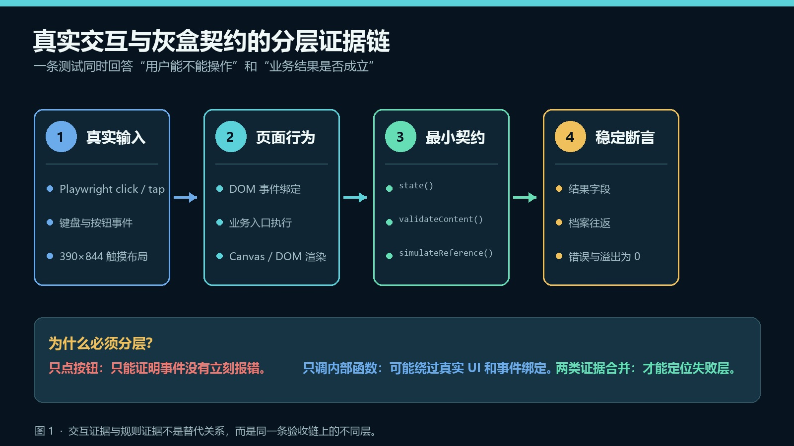
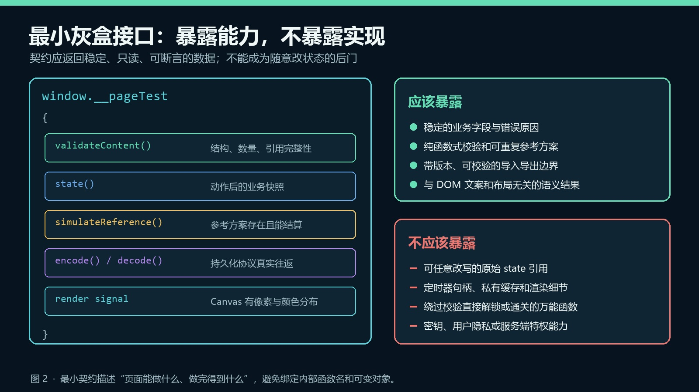
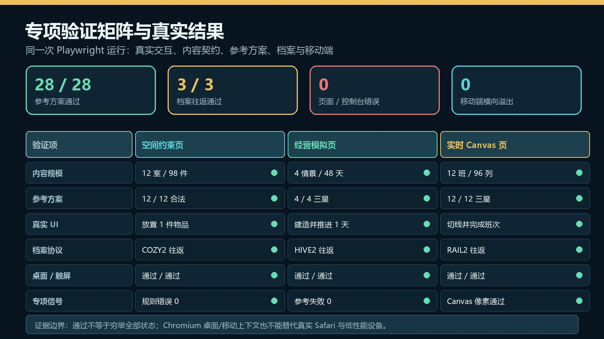

# 别让 Playwright 只能点按钮：前端灰盒测试接口的设计与边界

> 发布说明（发布时可删除）
>
> - 文章类型：原创。
> - 推荐分区：前端；备选分区：软件工程、自动化测试。
> - 文章封面：`docs/images/gray-box-contracts/cover.jpg`，1920×1080；只设置为 CSDN 封面，不在正文重复插入。
> - 正文图 1：`docs/images/gray-box-contracts/evidence-layers.jpg`，图名“真实交互与灰盒契约的分层证据链”，放在“为什么只点按钮仍然不够”一节。
> - 正文图 2：`docs/images/gray-box-contracts/contract-surface.jpg`，图名“最小灰盒接口的能力边界”，放在“最小契约应该长什么样”一节。
> - 正文图 3：`docs/images/gray-box-contracts/validation-results.jpg`，图名“专项验证矩阵与真实结果”，放在“把真实交互与契约断言放进同一条测试”一节。
> - 发布元数据：`docs/csdn-gray-box-frontend-contracts-metadata.json`，包含推荐标题、三个备选标题、摘要、分区、标签、封面和正文图片映射。
> - 建议摘要：Playwright 能证明按钮可以点击，却未必能证明内容完整、规则存在可行解、状态真的变化或档案能够恢复。本文讨论一种最小前端灰盒测试契约：保留真实 UI 点击与触摸，再通过 `validateContent`、`state`、`simulateReference`、`encode/decode` 和 Canvas 像素信号补足业务证据；同时说明哪些内部状态不应暴露、如何避免测试后门，以及黑盒、灰盒和模型测试各自应负责什么。文中给出三个零依赖页面的真实专项结果：28 条参考方案全部通过，3 种档案完成往返，页面与控制台错误为 0，390×844 横向溢出为 0；全仓 200 个桌面/手机页面组合复测同样实现加载、JavaScript、控制台和横向溢出失败全部为 0。
> - 建议标签：`JavaScript`、`Playwright`、`自动化测试`、`前端架构`、`E2E测试`。

一条 Playwright 测试可以成功打开页面、点击“开始”、等待两秒，再截一张漂亮的图。

它全部通过，仍然可能没有回答这些问题：

- 页面号称有十二关，数据里是否真的有十二关？
- 玩家点了一次按钮，业务状态到底有没有变化？
- 固定关卡是否至少存在一条合法解？
- 导出的档案能不能被同一版本真实导入？
- Canvas 没有报错，是否真的绘制出了有效像素？

如果只观察 DOM，测试很容易退化成“按钮还找得到，页面没有立即崩溃”。这对于登录、导航和普通表单已经很有价值，但对规则编辑器、可视化工作台、离线工具、模拟器或长流程前端来说，证据仍然不够。

我在三个零依赖单 HTML 页面上采用了一种很小的补充：仍然让 Playwright 真实点击和触摸页面，同时在 `window` 下暴露一个只服务于测试的稳定契约。它不把全部内部变量摊开，也不提供“直接通关”的万能后门，只提供状态摘要、内容校验、参考方案模拟、档案编解码和渲染信号。

这种做法通常被称为灰盒测试：测试知道少量业务结构，但仍然从真实浏览器和真实页面入口运行。

## 为什么只点按钮仍然不够



> 图 1：真实交互与灰盒契约的分层证据链。UI 证据验证事件绑定和可用性，契约证据验证动作后的业务结果；两者合并后，失败才更容易定位。

先看一个常见的“看起来像 E2E”的测试：

```javascript
await page.goto("/planner.html");
await page.getByRole("button", { name: "开始" }).click();
await expect(page.getByText("进行中")).toBeVisible();
```

它证明了三件事：页面能加载、按钮能定位、点击后出现了某段文字。但这段文字可能只是事件处理器改了 DOM，真正的模型仍停留在初始状态；也可能页面只加载了两条任务数据，而不是产品声明的十二条。

反过来，只在测试里直接调用内部函数也有问题：

```javascript
await page.evaluate(() => internalModel.finishAll());
```

这条测试可能绕过按钮、输入校验、事件绑定和触屏布局。内部模型通过，不代表用户真的能完成同一操作。

更稳妥的证据链应该分成四层：

| 层 | 主要问题 | 典型证据 |
| --- | --- | --- |
| 真实输入 | 用户能否完成操作 | `click()`、`tap()`、键盘输入、拖拽 |
| 页面行为 | 事件是否进入业务入口 | DOM 反馈、Canvas 更新、加载与控制台错误 |
| 灰盒契约 | 业务结果是否成立 | 状态摘要、内容校验、参考方案、档案往返 |
| 稳定断言 | 结果是否满足产品约束 | 数量、状态、评分、错误原因、协议版本 |

这里不存在“灰盒替代黑盒”。真实 UI 点击仍然是必要证据，灰盒接口只是补足 DOM 不适合表达的业务事实。

## 灰盒契约不是“把所有变量挂到 window”

最省事的做法是这样：

```javascript
window.app = {
  state,
  timers,
  cache,
  setLevel,
  addScore,
  unlockEverything
};
```

它确实方便测试，却制造了三个新问题。

第一，测试会直接修改原始对象，得到用户正常路径不可能产生的状态。第二，内部重构会不断打碎测试：变量改名、缓存调整或定时器替换都变成“契约变更”。第三，这个接口很容易混入敏感信息或特权操作，最后既不是稳定 API，也不是安全边界。

我更倾向把它当作一个小型产品协议来设计：

```javascript
window.__pageTest = Object.freeze({
  version: 1,
  state: () => structuredClone(selectPublicState(state)),
  validateContent: () => validateContent(content),
  simulateReference: (id) => simulateReference(id),
  encode: () => encodeArchive(profile),
  decode: (code) => decodeArchive(code)
});
```

这个接口有四个约束：

1. 暴露业务能力，不暴露模块私有变量；
2. 返回投影或副本，不返回可任意改写的原始引用；
3. 同样输入应得到同样结果，尽量不依赖动画帧和当前时间；
4. 接口足够小，重构渲染层时不必同步重写全部测试。

本次单文件页面为了保持零构建依赖，契约直接挂在独立的 `window.__...` 命名空间下。测试只读取 `state()` 的少量字段，但当前实现返回的仍是页面状态对象；如果继续扩展项目，我会把它收紧为只读投影或结构化克隆，避免测试代码意外修改运行态。这也是灰盒接口需要被当成正式边界，而不是临时调试钩子的原因。

## 最小契约应该长什么样



> 图 2：最小灰盒接口的能力边界。接口描述“页面能做什么、做完得到什么”，不暴露原始可变状态、定时器、私有缓存、密钥或特权后门。

不同产品不需要复制同一组函数，但下面五类能力很常用。

### 1. `state()`：只返回值得断言的状态

不要对整个 state 做深比较。动画进度、悬停项、当前时间、随机生成的 DOM ID 都会让测试脆弱。应该先定义一份业务投影：

```javascript
function selectPublicState(state) {
  return {
    mode: state.mode,
    day: state.day,
    delivered: state.delivered,
    strikes: state.strikes,
    score: state.score
  };
}
```

Playwright 只断言与本次操作有关的字段：

```javascript
await page.getByRole("button", { name: "结束一天" }).click();

const state = await page.evaluate(() => window.__pageTest.state());
expect(state.day).toBe(2);
```

这样可以证明点击真正进入了业务模型，又不会把测试绑死在所有内部字段上。

### 2. `validateContent()`：把“数据完整”变成可执行契约

对于数据驱动页面，页面能打开不等于内容完整。关卡数组可能少了一项，引用的类型 ID 可能不存在，目标值也可能在重构时变成数组或 `undefined`。

一个内容校验器至少应检查：

- 数量是否满足产品声明；
- ID 是否唯一，外键是否都能解析；
- 数值范围、枚举和必填字段是否合法；
- 参考方案是否覆盖所有固定场景；
- 结算目标是否为正确类型，而不是“碰巧能参与运算”。

本次空间约束页的契约返回：

```javascript
{
  valid: true,
  errors: [],
  rooms: 12,
  chapters: 4,
  pieces: 98,
  references: 12
}
```

测试可以直接深比较这份稳定摘要：

```javascript
expect(await page.evaluate(() =>
  window.__cozyOrganizer.validateContent()
)).toEqual({
  valid: true,
  errors: [],
  rooms: 12,
  chapters: 4,
  pieces: 98,
  references: 12
});
```

这比在 DOM 中数十二个按钮更可靠，因为按钮可能受解锁状态影响，也不能证明 98 件物品的规则引用都合法。

### 3. `simulateReference()`：证明固定内容至少存在一条可行路径

内容数量正确，仍然可能无解。空间谜题可能因为障碍和相邻规则冲突而无法摆放；经营情景可能因为目标过高而无法完成；调度班表也可能让两列车在任何操作下都会冲突。

参考方案不是自动替玩家通关，而是一条离线可执行的内容证据：

```javascript
const references = scenarios.map((_, index) =>
  simulateReference(index)
);

if (references.some(item => item.stars < 3)) {
  errors.push("reference plan");
}
```

这里要防止“自己证明自己”的循环：

- 参考输入应由人独立编写，而不是从被测输出反推；
- 参考方案调用正式规则裁定器，不另写一套简化规则；
- 断言最终业务结果，不只断言函数返回 `true`；
- 明确它只证明“至少有一条可行路径”，不证明平衡最佳，也不证明其他路径都正常。

如果产品不适合公开完整参考解，可以只在测试构建中提供模拟入口，或把参考输入保存在测试目录；不必把答案展示给最终用户。

### 4. `encode()` / `decode()`：直接验证持久化协议

仅断言导出文本框非空，没有证明导入能恢复数据。更有效的检查是完成一次真实协议往返：

```javascript
const code = await page.evaluate(() => window.__pageTest.encode());
expect(code).toMatch(/^APP2\./);

const restored = await page.evaluate(
  code => window.__pageTest.decode(code),
  code
);
expect(restored.stars[0]).toBe(3);
```

理想情况下，`decode()` 只负责校验和返回数据，不在函数内部偷偷写 `localStorage` 或刷新页面。UI 的“导入”按钮再显式调用保存和渲染逻辑。这样协议测试不会产生难以清理的副作用。

档案测试至少要覆盖：

- 固定前缀或协议版本；
- 校验码失败；
- 不兼容版本；
- 数组长度与数值边界归一化；
- 编码后解码得到等价业务数据。

### 5. Canvas 像素信号：比“没有报错”多走一步

Canvas 页面可能正常执行脚本，却因为宽高为零、坐标计算错误或绘制状态未初始化而呈现空白。Playwright 可以抽样读取像素：

```javascript
const signal = await page.evaluate(() => {
  const canvas = document.querySelector("canvas");
  const context = canvas.getContext("2d", {
    willReadFrequently: true
  });
  const pixels = context.getImageData(
    0, 0, canvas.width, canvas.height
  ).data;

  let colored = 0;
  const colors = new Set();
  for (let i = 0; i < pixels.length; i += 80) {
    if (pixels[i + 3] > 0) {
      colored++;
      colors.add(`${pixels[i] >> 4},${pixels[i + 1] >> 4},${pixels[i + 2] >> 4}`);
    }
  }
  return { colored, spread: colors.size };
});

expect(signal.colored).toBeGreaterThan(1000);
expect(signal.spread).toBeGreaterThan(8);
```

这仍然不是视觉回归。它只能证明画布存在足够像素和颜色分布，不能判断文字是否重叠、路线是否美观。因此我仍然保留桌面和移动端截图，并进行人工检查。

## 把真实交互与契约断言放进同一条测试



> 图 3：专项验证矩阵与真实结果。同一次浏览器运行覆盖真实 UI、内容规模、参考方案、档案往返、桌面/触屏布局和 Canvas 像素信号；28 条参考方案全部通过。

下面这段结构展示了两类证据怎样组合：

```javascript
await page.goto("/cozy-organizer.html", { waitUntil: "load" });
await page.waitForFunction(() => Boolean(window.__cozyOrganizer));

// 业务数据证据：不是从 DOM 数按钮
expect(await page.evaluate(() =>
  window.__cozyOrganizer.validateContent()
)).toEqual({
  valid: true,
  errors: [],
  rooms: 12,
  chapters: 4,
  pieces: 98,
  references: 12
});

// 真实交互证据：必须由用户可达的按钮和格子触发
await page.locator('[data-piece="p0"]').click();
await page.locator('[data-x="0"][data-y="0"]').click();

// 灰盒结果证据：放置确实进入了业务状态
expect(await page.evaluate(() =>
  window.__cozyOrganizer.state().moves
)).toBe(1);

// 内容可行性与档案边界
const result = await page.evaluate(() => {
  const api = window.__cozyOrganizer;
  const reference = api.applyReference(0);
  return {
    reference,
    stars: api.finish(),
    code: api.encode()
  };
});

expect(result.reference).toEqual({ ok: true, errors: [] });
expect(result.stars).toBe(3);
expect(result.code).toMatch(/^COZY2\./);
```

注意测试顺序：先执行真实 UI，再读取状态；参考方案和档案检查放在后面。这样前半段不会因为参考函数直接改好状态而“伪造”一次用户操作。

本次专项脚本验证了三类页面：

| 页面类型 | 内容契约 | 参考方案 | 真实 UI 样例 | 档案 |
| --- | --- | ---: | --- | --- |
| 空间约束 | 12 室、4 章、98 件物品 | 12 / 12 合法 | 选择并放置一件物品 | `COZY2` 往返 |
| 经营模拟 | 4 情景、48 天、3 谱系、5 岗位、6 设施 | 4 / 4 三星 | 均衡岗位、建设设施、推进一天 | `HIVE2` 往返 |
| 实时调度 | 3 编组站、12 班、96 列车、4 类型 | 12 / 12 三星 | 切换进路、启停并完成一班 | `RAIL2` 往返 |

此外还覆盖：

- 三个页面的桌面真实交互；
- 三个页面在 390×844 触屏上下文中的真实触摸；
- 六个桌面/手机页面的横向溢出检查；
- 页面异常和 `console.error` 监听；
- 实时调度页的桌面与移动 Canvas 像素信号；
- 六张全页截图和人工布局检查。

当前真实结果如下：

| 检查 | 结果 |
| --- | ---: |
| 参考方案 | 28 / 28 通过 |
| 档案编解码 | 3 / 3 往返通过 |
| 桌面/手机专项页面 | 6 / 6 无横向溢出 |
| 页面错误 | 0 |
| 控制台错误 | 0 |
| Canvas 像素信号 | 桌面、移动均通过 |
| 全仓桌面/手机页面组合 | 200 |
| 全仓加载/JavaScript/控制台/溢出失败 | 0 / 0 / 0 / 0 |

专项测试与全仓审计命令为：

```powershell
node promo-video/scripts/check-spatial-colony-rail.mjs
node promo-video/scripts/audit-games.mjs
```

这些数字有明确边界：28 条参考方案通过，不等于所有输入序列都被穷举；Chromium 的桌面与移动上下文，也不能替代真实 Safari、辅助技术和低性能设备。

## 一张失败定位表，比更多截图更有用

分层以后，失败信息会更接近原因：

| 失败现象 | 更可能的问题 |
| --- | --- |
| 真实点击失败，但直接契约调用正常 | 选择器、事件绑定、遮挡、禁用态或布局 |
| 点击成功，但 `state()` 不变化 | UI 到业务入口的连接断开，或动作被错误拒绝 |
| `validateContent()` 失败 | 数据数量、ID、引用、类型或目标配置错误 |
| 参考方案失败 | 关卡无解、规则回归、目标失衡或模拟入口偏离正式规则 |
| `encode/decode` 失败 | 协议版本、校验、字段迁移或边界归一化问题 |
| Canvas 像素信号失败 | 画布尺寸、绘制初始化、坐标或渲染循环问题 |
| 所有自动检查通过，但截图明显重叠 | 视觉断言不足，需要截图审查或视觉回归 |

这也是灰盒契约最实际的收益：不是追求更多断言，而是让每个断言对应一个清楚的责任层。

## 参考方案最容易变成“测试后门”

`simulateReference()` 很有价值，也最需要克制。

下面这种接口不应该出现：

```javascript
window.__test.win = () => {
  state.score = 999999;
  state.completed = true;
};
```

它没有经过正式规则，只是在修改结果。即使测试变绿，也没有证明内容可行。

合格的参考方案应当是一串正常业务输入，或由正式规则函数逐步执行的计划：

```javascript
function simulateReference(index) {
  const model = makeInitialState(index);
  for (const command of REFERENCES[index]) {
    applyCommand(model, command);
  }
  return finish(model);
}
```

空间布局类页面如果需要把参考布局应用到当前画面，测试应先单独调用规则校验器，再执行正式结算；模拟经营和调度则更适合在隔离模型中执行，不影响当前页面状态。

还要避免参考方案与校验器复制同一个错误。如果条件允许，可以增加第二种证据：

- 对小状态空间进行属性测试或穷举；
- 对关键数值使用独立公式复算；
- 把参考方案数据与规则代码交给不同人审查；
- 在内容变更的代码评审中同时展示失败原因和结果摘要。

参考方案是一条“存在性证据”，不是数学证明。

## 测试契约要不要出现在生产环境

答案取决于项目形态。

对于有构建流程的应用，可以只在测试构建中注入：

```javascript
if (import.meta.env.MODE === "test") {
  window.__pageTest = createTestContract();
}
```

对于离线、静态、单 HTML 工具，没有构建环境可切换。此时保留一个很小的只读契约通常可以接受，但需要遵守几条底线：

- 不包含 Token、用户隐私或服务端密钥；
- 不提供超出正常用户权限的远端操作；
- 不返回可直接改写的原始状态；
- 不把“隐藏 `window` 接口”误当作安全机制；
- 给接口加独立命名空间，必要时加版本；
- 在性能敏感页面中让重校验按调用执行，而不是每帧运行。

前端代码本来就会下发到浏览器。删除测试命名空间不能保护真正的秘密，权限校验仍然必须在可信服务端完成。测试契约的安全目标不是“让用户看不到”，而是“即使看到了，也只有本地可观察、可验证的业务能力”。

## `data-testid` 和灰盒契约不是同一件事

`data-testid` 解决的是“稳定找到哪个控件”：

```html
<button data-testid="finish-day">结束一天</button>
```

灰盒契约解决的是“动作后哪个业务事实应该成立”：

```javascript
const day = await page.evaluate(() =>
  window.__pageTest.state().day
);
```

前者属于交互定位，后者属于结果观察。两者可以一起用，但不要用内部函数替代可达控件，也不要为了读取一个结果而在 DOM 中塞入大量隐藏文本。

如果一个结果本来就应该让用户看到，例如订单金额、错误原因或保存状态，优先断言可访问 DOM；只有内容完整性、规则模型、协议往返、长流程模拟等不适合呈现给用户的事实，才需要灰盒接口。

## 一份可直接落地的检查清单

在给页面增加测试契约前，可以逐项回答：

- [ ] 这项事实为什么不能通过用户可见 DOM 稳定验证？
- [ ] 接口返回的是业务投影，还是内部可变对象？
- [ ] 返回值是否与动画帧、当前时间和随机全局量解耦？
- [ ] `validateContent()` 能否返回具体错误，而不是只有布尔值？
- [ ] 参考方案是否经过正式规则入口？
- [ ] 参考方案是否只证明存在可行路径，没有被写成万能通关？
- [ ] 编解码函数能否在无持久化副作用的情况下往返？
- [ ] Canvas 信号是否和截图或视觉检查配合？
- [ ] Playwright 是否仍然至少执行一条真实用户路径？
- [ ] 测试是否只断言与当前行为有关的稳定字段？
- [ ] 契约是否避免密钥、隐私和远端特权操作？
- [ ] 失败信息能否直接指出 UI、数据、规则、协议或渲染层？

如果大部分问题无法回答，先不要急着把更多内部函数挂到 `window`。灰盒测试的关键不是“看得更多”，而是“只看足够稳定、足够有解释力的部分”。

## 结语

Playwright 最擅长证明真实浏览器里的真实操作。它不应该退化成只会寻找按钮，也不需要为了验证业务规则而承担所有状态准备和内容遍历。

一个好的前端灰盒契约只做三件事：

1. 给真实交互提供稳定的业务结果观察点；
2. 给数据、参考方案和持久化协议提供可执行校验；
3. 清楚划出不能暴露的内部状态与特权边界。

当 UI 点击、业务状态、内容可行性、档案往返和渲染信号被放进同一条证据链，测试通过才不只是“页面没有报错”，失败时也更容易知道应该修哪一层。

本文对应的三个页面、专项 Playwright 脚本、文章图片生成脚本和机器可读发布元数据均位于开源仓库：

<https://github.com/wangzifan396-wzf/mini-browser-games>

## 发布信息（发布时可删除）

- 推荐标题：别让 Playwright 只能点按钮：前端灰盒测试接口的设计与边界
- 备选标题 1：前端测试不能只找按钮：如何设计最小灰盒契约
- 备选标题 2：从 DOM 点击到内容契约：Playwright 如何验证真实前端状态
- 备选标题 3：给 Web 应用留一扇测试门：状态接口、参考方案与 E2E 边界
- 推荐标签：`JavaScript`、`Playwright`、`自动化测试`、`前端架构`、`E2E测试`
- 推荐分区：前端；备选分区：软件工程、自动化测试
- 推荐封面：`docs/images/gray-box-contracts/cover.jpg`
- 正文共 3 张图，图名依次为“真实交互与灰盒契约的分层证据链”“最小灰盒接口的能力边界”“专项验证矩阵与真实结果”。
- 发布元数据：`docs/csdn-gray-box-frontend-contracts-metadata.json`
- 发布前在 CSDN 预览中检查宽表格、JavaScript 代码块、任务清单和图片清晰度；由作者本人决定保存草稿或公开发布。
