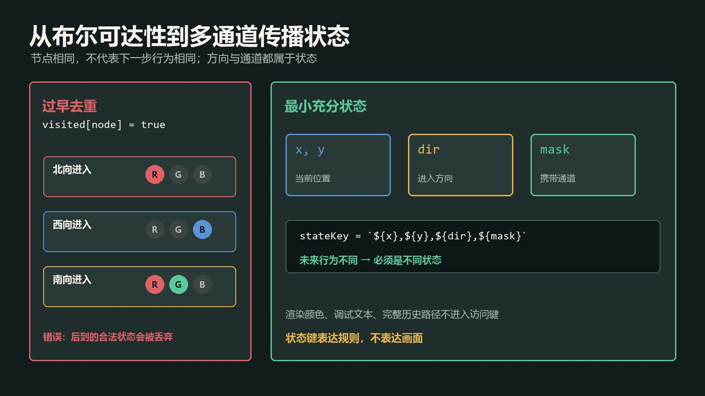
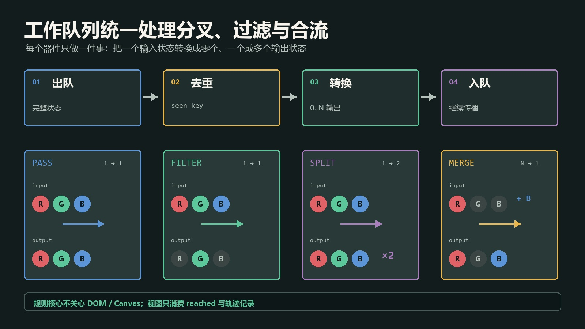
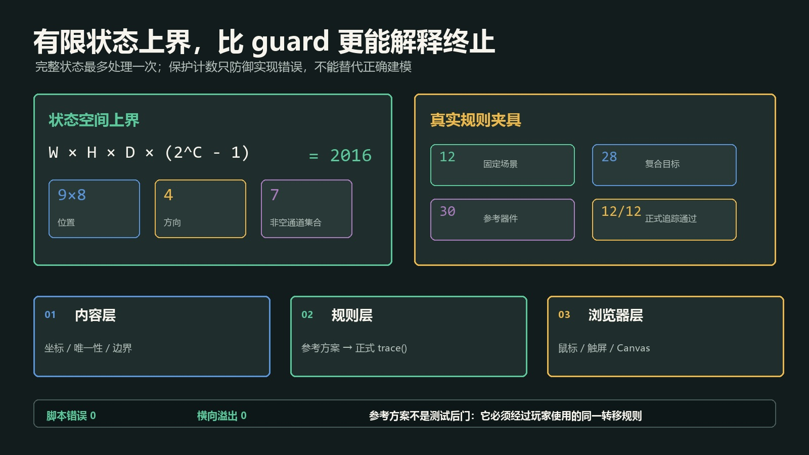

# 别再用 Boolean 表示传播状态：位掩码、工作队列与循环终止

> 发布说明（发布时可删除）
>
> - 文章类型：原创。
> - 推荐分区：前端；备选分区：软件工程、算法。
> - 备选标题 1：《一个可终止的多通道传播引擎：位掩码、分叉队列与状态去重》。
> - 备选标题 2：《图里有环也不怕：用有限状态上界写稳 JavaScript 传播算法》。
> - 备选标题 3：《从 visited[node] 到完整状态键：多通道图传播的建模与验证》。
> - 文章封面：`docs/images/multichannel-propagation/cover.jpg`，1920×1080；只设置为 CSDN 封面，不在正文重复插入。
> - 正文图 1：`docs/images/multichannel-propagation/state-model.jpg`，图名“从布尔可达性到多通道传播状态”，放在“先把通道集合压成位掩码”一节。
> - 正文图 2：`docs/images/multichannel-propagation/queue-pipeline.jpg`，图名“工作队列驱动的分叉、过滤与合流”，放在“不要递归追一条线，用工作队列处理整个传播过程”一节。
> - 正文图 3：`docs/images/multichannel-propagation/termination-validation.jpg`，图名“有限状态上界与三层验证结果”，放在“循环不是异常，无法证明终止才是问题”一节。
> - 发布元数据：`docs/csdn-multichannel-propagation-engine-metadata.json`，包含推荐标题、三个备选标题、摘要、分区、标签、封面和正文图片映射。
> - 建议摘要：权限、信号、依赖、颜色和能力传播常被写成一串递归与布尔标记，遇到多通道、分叉、过滤、合流和回路后很快失控。本文用一个零依赖 JavaScript 传播核心说明如何用位掩码表达通道集合，用工作队列统一处理分支，用 `(节点, 方向, 通道)` 作为访问状态，并通过有限状态上界证明循环必然终止。真实样例包含 12 份固定场景、28 个复合目标和 30 个参考器件，12/12 参考方案通过同一正式追踪器；文章同时讨论队列顺序、状态爆炸、有记忆节点、测试夹具与适用边界。
> - 建议标签：`JavaScript`、`算法`、`位运算`、`前端架构`、`图搜索`。

很多前端传播逻辑一开始只需要回答一个问题：

> 这个节点能不能到达？

于是代码里出现一个 `visited: boolean`，再用递归沿着相邻节点继续走。只要规则永远是“经过或不经过”，这种实现足够简单。

真正麻烦的是需求通常会继续生长：

- 同一条路径携带多种权限、信号或能力；
- 某些节点只保留部分通道；
- 某些节点把一个输入拆成多个输出；
- 多条路径可以在目标处合并；
- 图中存在回路，但回路本身不是错误；
- 相同节点从不同方向进入时，结果并不相同。

此时 `visited[node] = true` 已经丢失了关键状态，递归也会让分支、终止和调试纠缠在一起。

我最近把一套多通道传播规则改成了一个很小的有限状态引擎：通道集合用位掩码表示，待处理分支进入工作队列，访问键包含位置、方向和通道，合流结果使用按位或累积。它仍然是零依赖 JavaScript，却可以明确回答三件事：

1. 哪些状态可以被区分？
2. 每种器件怎样转换状态？
3. 即使存在环，为什么算法仍然一定结束？

这套结构不只适用于光线。权限继承、工作流路由、数据血缘、能力标签传播、网络包过滤和依赖分析，都可能遇到相同问题。

## 先把通道集合压成位掩码



> 图 1：从布尔可达性到多通道传播状态。位掩码同时表达单通道与组合通道；访问状态还必须包含节点位置和进入方向，不能只记录“这个格子来过”。

假设系统只有红、绿、蓝三个独立通道，可以给每个通道分配一位：

```javascript
const CHANNEL = {
  red:   0b001,
  green: 0b010,
  blue:  0b100,
  all:   0b111
};
```

组合状态不需要新枚举：

```javascript
const yellow = CHANNEL.red | CHANNEL.green; // 0b011
const cyan = CHANNEL.green | CHANNEL.blue;  // 0b110
const white = CHANNEL.all;                  // 0b111
```

判断是否包含某个通道：

```javascript
function has(mask, channel) {
  return (mask & channel) === channel;
}
```

过滤器也只是一次按位与：

```javascript
function filter(mask, allowed) {
  return mask & allowed;
}
```

两个来源在目标处合流，则使用按位或：

```javascript
reached.set(targetId, (reached.get(targetId) ?? 0) | incomingMask);
```

位掩码真正解决的不是“少写几个字符”，而是让集合运算具有明确代数性质：

| 操作 | 位运算 | 性质 |
| --- | --- | --- |
| 合并通道 | `a \| b` | 交换、结合、幂等 |
| 保留通道 | `a & allowed` | 不会凭空增加新通道 |
| 移除通道 | `a & ~removed` | 结果一定是原集合子集 |
| 检查包含 | `(a & b) === b` | 可验证目标需要的全部通道 |

交换和结合意味着多条路径以不同顺序抵达目标，最终组合结果仍然一致；幂等意味着同一通道重复抵达不会改变结果。这两个性质会直接降低队列顺序对业务结果的影响。

位掩码也有边界。JavaScript 常规位运算按 32 位有符号整数执行，通道很多时不应继续硬塞。超过约 30 个有效位，可以改用 `BigInt`、`Set` 或专门的 bitset；选择标准应该是状态规模和可读性，而不是“位运算一定更快”。

## 状态不等于节点

很多循环 Bug 来自过早定义访问键：

```javascript
if (visited.has(nodeId)) return;
visited.add(nodeId);
```

这段代码默认“一个节点无论怎样进入都只有一种结果”。但传播规则可能依赖方向和通道：

- 从北侧进入镜面与从西侧进入，输出方向不同；
- 红色通道经过过滤器仍然存在，蓝色通道会被截断；
- 同一位置先收到红色、后收到蓝色，两次都是有效的新状态。

因此访问键至少应该是：

```javascript
function stateKey(x, y, direction, mask) {
  return `${x},${y},${direction},${mask}`;
}
```

这里的原则是：**凡是会影响下一步转移结果的字段，都属于状态。**

如果节点还拥有开关状态、剩余次数或时间相位，这些字段也必须进入状态键；否则算法会把本应不同的分支错误合并。反过来，把纯渲染字段、历史路径或日志 ID 全部塞进访问键，又会制造没有意义的状态爆炸。

判断一个字段是否应该进入键，可以问一个具体问题：

> 在位置、方向和通道都相同的情况下，只改变这个字段，下一步输出是否可能不同？

如果答案是“会”，它就是规则状态；如果只是改变颜色、动画或调试文本，它不该进入搜索状态。

## 不要递归追一条线，用工作队列处理整个传播过程



> 图 2：工作队列驱动的分叉、过滤与合流。每个队列元素都是完整传播状态；器件只负责把输入状态转换为零个、一个或多个输出状态，目标结果则独立累积。

工作队列把“现在沿哪条线追踪”和“未来还有哪些分支”分开。一个最小状态可以写成：

```javascript
{
  x: 0,
  y: 4,
  dir: 1,
  mask: 0b111
}
```

核心循环如下：

```javascript
function trace(sources, graph) {
  const queue = sources.map(source => ({ ...source }));
  const seen = new Set();
  const reached = new Map();

  while (queue.length) {
    const state = queue.shift();
    const key = stateKey(state.x, state.y, state.dir, state.mask);

    if (seen.has(key)) continue;
    seen.add(key);

    const node = graph.get(state.x, state.y);
    if (!node) continue;

    if (node.target) {
      const oldMask = reached.get(node.id) ?? 0;
      reached.set(node.id, oldMask | state.mask);
    }

    for (const next of transform(node, state)) {
      if (next.mask !== 0) queue.push(next);
    }
  }

  return reached;
}
```

这段循环故意不知道“镜片”“权限网关”或“流程路由器”是什么。所有业务差异集中在 `transform(node, state)`：它接收一个状态，返回零个、一个或多个新状态。

### 1. 直通与反射：一进一出

```javascript
function pass(state) {
  return [{ ...state, ...step(state) }];
}

function reflect(state, nextDirection) {
  return [{
    ...state,
    ...step({ ...state, dir: nextDirection }),
    dir: nextDirection
  }];
}
```

### 2. 过滤：通道只减不增

```javascript
function applyFilter(state, allowedMask) {
  const nextMask = state.mask & allowedMask;
  return nextMask === 0 ? [] : [{ ...state, mask: nextMask }];
}
```

返回空数组就是“传播在这里结束”，无需额外的停止标志。

### 3. 分叉：一进多出

```javascript
function split(state, directions) {
  return directions.map(dir => ({ ...state, dir }));
}
```

队列天然容纳任意数量的输出。与递归相比，它更容易观察队列长度、限制总状态数、记录调试轨迹，也不会让调用栈深度取决于业务地图长度。

### 4. 拆分通道：按位生成分支

```javascript
function separate(state, routeByBit) {
  const output = [];

  for (const bit of [0b001, 0b010, 0b100]) {
    if ((state.mask & bit) === 0) continue;
    output.push({ ...state, mask: bit, dir: routeByBit[bit] });
  }

  return output;
}
```

“空间分叉”和“通道拆分”是两件事：前者可以复制完整通道集合，后者把集合拆成若干子集。把两者都塞进一个模糊的 `split()`，后续很容易写出重复通道或丢失通道的错误。

### 5. 合流：不要急着创造一个新队列状态

如果目标只关心“最终收到哪些通道”，合流可以直接在 `reached` 中按位或，不必等待所有来源：

```javascript
const combined = (reached.get(id) ?? 0) | incomingMask;
reached.set(id, combined);
```

只有当“组合后的通道还要继续向下传播”时，才需要把合流节点建模成一个真正的状态机。这时必须明确它何时触发、是否会重复触发、旧输入是否保留，否则结果可能依赖队列顺序。

## 循环不是异常，无法证明终止才是问题



> 图 3：有限状态上界与三层验证结果。访问键覆盖所有会影响转移的字段后，每个状态最多处理一次；保护计数只是防御未知实现错误，不能替代终止性设计。

不少实现看到图里有环，就加一个看似保险的限制：

```javascript
let guard = 0;
while (queue.length && guard++ < 10000) {
  // ...
}
```

保护计数有价值，但它只能防止页面彻底卡死，不能证明结果完整。上限太小会悄悄截断合法传播，上限太大则只是晚一点暴露错误。

真正的终止依据来自有限状态空间。

假设：

- 网格宽 `W`、高 `H`；
- 方向数量为 `D`；
- 独立通道数量为 `C`；
- 通道集合不允许为空。

那么状态数上界是：

```text
W × H × D × (2^C - 1)
```

一个 `9 × 8` 网格、4 个方向、3 个通道，理论上最多只有：

```text
9 × 8 × 4 × 7 = 2016
```

只要满足两条约束，算法必然结束：

1. 每次出队都先用完整状态键去重；
2. 转移函数只产生这个有限集合内的状态。

环路只会重新生成已经见过的状态，然后被跳过。保护计数仍可以保留，用来防御坐标失控、状态字段遗漏或第三方规则扩展，但触发保护计数应该被视为测试失败，而不是正常结束。

### 为什么不能只用 `(位置, 方向)` 去重

如果忽略通道，红光先经过某节点后，随后到达的蓝光会被错误丢弃。结果可能表现为“某些路径偶尔点不亮”，而且会随着队列顺序改变。

### 为什么也不能把完整路径放进键

路径每增长一步都不同，环路就能产生无限多个字符串。访问键必须表达“未来行为所需的最小充分状态”，不能把历史本身当状态。

### 广度优先还是深度优先

当转移是纯函数、目标合流使用交换且幂等的按位或时，FIFO 队列、LIFO 栈通常得到同一最终可达集合。选择 FIFO 的主要理由是调试轨迹更接近传播层次，并且容易统计每一层的状态数量。

如果节点带有容量、抢占、首次到达奖励或时间窗，顺序就会进入业务语义。此时不能靠替换 `queue.shift()` 与 `stack.pop()` 猜结果，而要把时间、优先级或资源占用显式建模。

## 测试不能写死“最终成功”

最弱的测试是直接把目标设为成功：

```javascript
state.won = true;
```

它只能验证成功界面能否显示，完全没有经过传播规则。

更有效的做法是给固定场景保留参考器件，再交给正式追踪器运行：

```javascript
function validateReference(scene) {
  const state = createState(scene);

  for (const piece of scene.reference) {
    state.pieces.set(piece.id, piece);
  }

  const reached = trace(scene.sources, buildGraph(state));

  return scene.targets.every(target => {
    const actual = reached.get(target.id) ?? 0;
    return (actual & target.requiredMask) === target.requiredMask;
  });
}
```

这类参考方案不是用来证明“玩家只有一种解”，而是证明发布内容至少存在一条经过正式规则的合法路径。

当前样例的验证规模是：

| 验证对象 | 结果 |
| --- | ---: |
| 固定场景 | 12 |
| 单色与复合目标 | 28 |
| 参考器件 | 30 |
| 正式追踪器通过 | 12 / 12 |
| 桌面与触屏页面 | 2 / 2 |
| Canvas 空白、脚本错误、横向溢出 | 0 |

专项测试分三层：

1. **内容层**：数量、坐标、器件位置、场景唯一签名是否合法；
2. **规则层**：参考器件是否通过同一 `trace()`，目标通道是否真实满足；
3. **浏览器层**：鼠标和触屏能否落子，撤回、提示、档案、Canvas 与响应式布局是否正常。

模型通过不能替代真实交互，真实点击也不能证明全部固定场景可解。两者验证的是不同风险。

## 三个容易被忽略的工程边界

### 1. 转移函数必须尽量纯

同一个输入状态和同一个节点应得到同样的输出。若 `transform()` 内部读取 `Date.now()`、全局随机数或 DOM 状态，访问去重就不再可靠，因为“同一状态”可能产生不同结果。

确实需要时间或随机性时，应把时间片、随机种子或预编译事件 ID 作为显式输入，而不是隐藏依赖。

### 2. 记录轨迹与判定结果要分开

动画可能需要保存每一段路径，规则判定只需要 `seen` 和 `reached`。不要为了画出漂亮轨迹，把完整历史塞入访问键；可以在处理状态时额外追加一条渲染记录：

```javascript
segments.push({ from, to, mask });
```

规则状态保持最小，渲染层仍然拥有足够证据。

### 3. 有记忆节点需要升级模型

一次性开关、计数门、蓄积器和延迟节点会改变全局状态。简单的 `(位置, 方向, 通道)` 已经不够，需要选择：

- 把有限的节点内部状态并入搜索状态；
- 按离散时间片推进整个系统；
- 或把问题改写为事件模拟，而不是静态可达性分析。

不要假装它们仍是无状态图传播。状态漏建模往往比算法选择错误更难排查。

## 什么时候值得使用这套结构

适合：

- 通道数量较少，集合组合是核心规则；
- 图允许分叉、过滤、反射或合流；
- 回路合法，但需要确定终止；
- 希望用固定夹具验证内容可达性；
- 需要把规则结果同时交给 DOM、Canvas 或其他视图。

不适合直接套用：

- 通道数量很大且频繁动态增删；
- 节点有复杂连续时间、容量和竞争关系；
- 路径成本决定最优解，此时可能需要 Dijkstra 或 A*；
- 传播依赖概率分布，目标是统计估计而非确定性可达。

工作队列只是执行骨架，不会替你定义业务状态。真正决定正确性的，是状态字段、转移函数和终止条件是否对应真实规则。

## 最后整理成一份实现清单

开始写多通道传播前，可以按下面的顺序检查：

1. 列出所有独立通道，决定用 `Number` 位掩码、`BigInt` 还是 `Set`；
2. 找出所有会改变下一步结果的字段，组成最小状态键；
3. 让每类节点实现“输入一个状态，输出零到多个状态”的统一接口；
4. 用工作队列管理分支，用 `seen` 保证每个有限状态最多处理一次；
5. 只在目标或明确合流节点累积通道，不把渲染历史混入规则状态；
6. 写出状态空间上界，并把保护计数触发视为错误；
7. 用参考夹具调用正式规则，而不是在测试里复制规则或直接授予成功；
8. 最后补真实鼠标、键盘、触屏、Canvas 和布局验证。

从 `boolean` 到位掩码，看起来只是数据类型变化；真正有价值的是随之建立的状态边界。状态定义准确以后，分叉只是多压几个队列元素，过滤只是一次按位与，合流只是一次按位或，循环也从“可能卡死”变成一个可以计算上界的有限问题。

示例项目：<https://github.com/wangzifan396-wzf/mini-browser-games>
