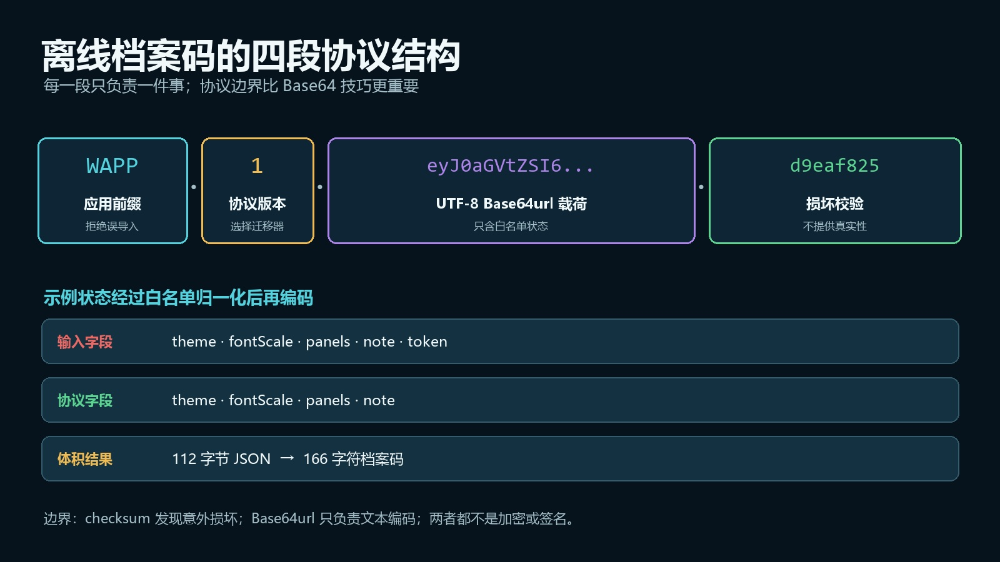
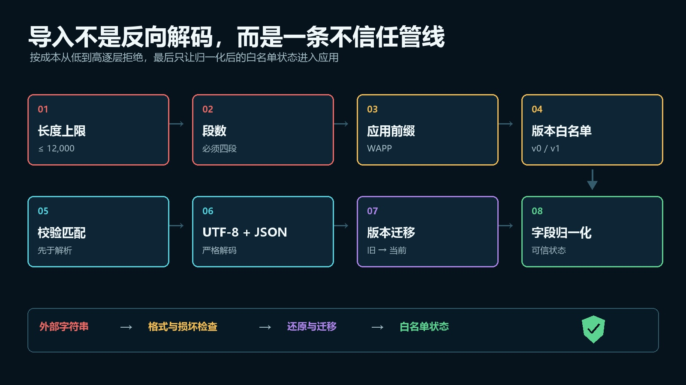
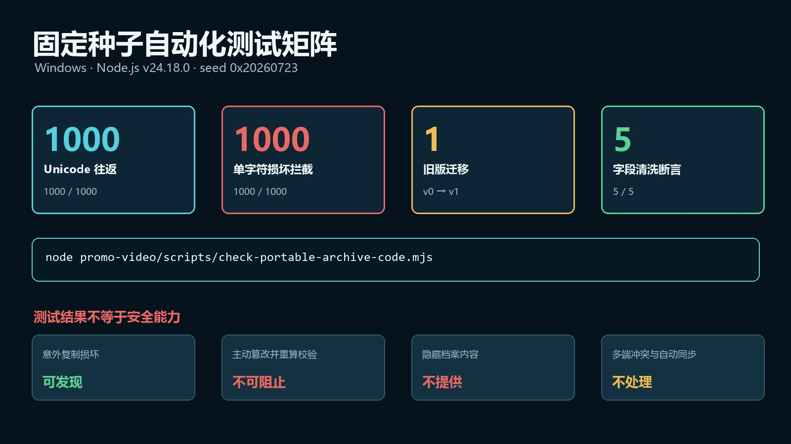

# 不接后端，Web 应用怎样跨设备迁移数据？版本、校验、兼容与安全边界实战

> 发布说明（发布时可删除）
>
> - 文章类型：原创。
> - 推荐分区：前端；备选分区：JavaScript、软件工程。
> - 文章封面：`docs/images/offline-archive/cover.jpg`，1920×1080；只设置为 CSDN 封面，不在正文重复插入。
> - 正文图 1：`docs/images/offline-archive/protocol-anatomy.jpg`，放在“先把档案码当成一个协议”一节。
> - 正文图 2：`docs/images/offline-archive/import-validation.jpg`，放在“导入不是反向解码，而是一条不信任管线”一节。
> - 正文图 3：`docs/images/offline-archive/test-matrix.jpg`，放在“怎样证明它没有只在我的示例上工作”一节。
> - 建议摘要：纯前端 Web 应用使用 localStorage 后，数据通常被锁在当前浏览器和来源中。本文设计一套不依赖账号与服务器的便携档案协议：用显式字段白名单缩小状态，用 UTF-8 与 Base64url 编码中文，用版本读取器迁移旧数据，用校验码发现复制损坏，再在导入边界重新验证全部字段。配套 Node.js 脚本以固定种子完成 1000 次 Unicode 往返、1000 次损坏拦截、1 次旧版迁移和 5 项字段清洗断言，同时说明 Base64、校验码、加密、数字签名与真正多端同步之间不能混淆的安全边界。
> - 建议标签：`JavaScript`、`localStorage`、`数据迁移`、`前端安全`、`离线应用`。

一个纯前端小工具用 `localStorage` 保存设置和草稿，开发体验很好：不需要账号，不需要数据库，断网也能继续使用。

问题通常在换浏览器、换电脑或清理站点数据时出现。用户会问一句很自然的话：

> 能不能给我一个字符串，我复制到另一台设备就恢复？

最直接的实现似乎只有两行：

```javascript
const code = btoa(JSON.stringify(localStorage));
const data = JSON.parse(atob(code));
```

但这两行同时埋下了五类问题：中文可能编码失败；内部缓存和无关字段被一起导出；未来改字段后旧数据无法识别；复制少一个字符也要等到深层解析才报错；更危险的是，开发者很容易把 Base64 或普通校验码误认为“安全”。

我最后把这件事当成一个小型数据协议，而不是一个 Base64 技巧。本文给出一套可运行的实现，并回答四个问题：

1. 哪些状态应该进入档案，哪些绝不能进入？
2. 怎样兼容中文、emoji 和旧版本？
3. 怎样尽早拒绝损坏或越界数据？
4. 什么时候离线档案已经不够，必须使用后端、加密或签名？

## 本文验证了什么

示例是一份通用工作台配置，不依赖任何游戏或业务框架，只允许四个字段：

| 字段 | 含义 | 导入约束 |
| --- | --- | --- |
| `theme` | 界面主题 | 只能是 `light`、`dark`、`system` |
| `fontScale` | 字号缩放 | 限制在 `0.8` 到 `1.6` |
| `panels` | 工作台面板 | 白名单、去重，最多四项 |
| `note` | 本地便签 | 必须是字符串，最多 500 字符 |

配套脚本在 Windows、Node.js `v24.18.0` 下用固定种子 `0x20260723` 执行了：

- 1000 份包含中文和 emoji 的状态往返；
- 1000 次对载荷单字符修改的损坏拦截；
- 1 份 `v0` 旧档案迁移到 `v1`；
- 5 项越界、重复、未知字段与敏感字段清洗断言。

这里的测试只证明本文协议实现满足这些约束，不代表所有浏览器、所有数据规模或所有攻击场景都已经得到安全保证。

## 先分清：便携档案不是云同步

离线档案适合的是“低频、用户主动、可以整份覆盖”的数据迁移，例如：

- 主题、布局和快捷设置；
- 个人仪表盘配置；
- 小型表单草稿；
- 不含敏感信息的本地进度；
- 可以由用户手动复制的离线工作状态。

它与真正的多端同步有本质差异：

| 能力 | `localStorage` | 便携档案码 | 后端同步 |
| --- | --- | --- | --- |
| 断网可用 | 是 | 是 | 取决于客户端设计 |
| 用户主动跨设备迁移 | 否 | 是 | 是 |
| 自动合并两端修改 | 否 | 否 | 可以设计 |
| 账号与权限 | 否 | 否 | 通常有 |
| 适合保存秘密 | 否 | 否 | 仍需加密和权限设计 |
| 冲突解决 | 无 | 整份覆盖 | 需要版本或合并策略 |

如果产品需要多人协作、自动同步、审计记录、撤销历史或细粒度冲突合并，便携档案不能替代后端。它解决的是“把一份明确状态安全地搬过去”，不是“让多份状态持续保持一致”。

## 先把档案码当成一个协议

我使用的格式是：

```text
WAPP.1.<base64url-payload>.<checksum>
```



> 图 1：档案码由应用前缀、协议版本、UTF-8 Base64url 载荷和校验值组成。图中的字符串来自本文真实示例；校验值只负责发现意外损坏，不代表身份认证。

四段各自承担一个职责：

| 片段 | 作用 | 为什么不能省 |
| --- | --- | --- |
| `WAPP` | 应用/协议前缀 | 避免把其他工具的字符串误当成本应用档案 |
| `1` | 协议版本 | 让导入器知道应该使用哪套字段解释与迁移规则 |
| `payload` | 精简后的 JSON | 只携带公开、稳定、真正需要迁移的状态 |
| `checksum` | 复制损坏检测 | 在 JSON 解析前发现截断、漏字和常见粘贴错误 |

这个设计的关键不在分隔符，而在于：**版本和校验覆盖的边界必须固定，字段语义必须由协议定义。**

本文把校验输入固定为：

```javascript
const signedPart = `${version}.${payload}`;
const code = `WAPP.${signedPart}.${checksum(signedPart)}`;
```

这样修改版本或载荷都会使校验失效。前缀没有进入校验，是因为它在更早的格式判断中已经被严格匹配；也可以把前缀纳入，只要编码器和解码器保持同一约定。

## 不要导出 localStorage，要导出稳定的数据契约

直接序列化整个 `localStorage` 的最大问题不是体积，而是把存储实现当成了公开协议。

真实项目里常见的本地键包括：

- UI 临时状态；
- 可重新计算的缓存；
- 旧版本遗留字段；
- 调试开关；
- 最近一次错误信息；
- 不应该离开设备的令牌或用户标识。

正确方向是先建立白名单，再编码：

```javascript
function normalizeState(value) {
  if (!value || typeof value !== "object" || Array.isArray(value)) {
    throw new Error("state must be a plain object");
  }

  const themes = new Set(["light", "dark", "system"]);
  const allowedPanels = new Set(["tasks", "calendar", "notes", "stats"]);
  const rawPanels = Array.isArray(value.panels) ? value.panels : [];

  return {
    theme: themes.has(value.theme) ? value.theme : "system",
    fontScale: Math.max(0.8, Math.min(1.6,
      Number.isFinite(Number(value.fontScale)) ? Number(value.fontScale) : 1
    )),
    panels: [...new Set(rawPanels)]
      .filter((item) => allowedPanels.has(item))
      .slice(0, 4),
    note: typeof value.note === "string" ? value.note.slice(0, 500) : ""
  };
}
```

这段函数同时用于导出和导入，但两次调用的理由不同：

- 导出前调用，是为了保持档案精简稳定；
- 导入后调用，是因为外部字符串永远不能被信任。

示例故意向载荷塞入 `token: "must-not-survive"`。完成导入后，返回对象中不存在 `token`。这不是“删除一个坏字段”，而是白名单设计自然产生的结果：没有被协议声明的字段，从来没有资格进入运行状态。

## 中文和 emoji：不要直接把 JSON 交给 btoa

浏览器的 `btoa()` 接收的是二进制字符串，不是任意 Unicode 文本。直接执行下面代码，在遇到中文或 emoji 时可能抛出异常：

```javascript
btoa(JSON.stringify({ note: "周五整理资料 🚀" }));
```

更稳妥的做法是先用 `TextEncoder` 转为 UTF-8 字节，再编码为 Base64url：

```javascript
function utf8ToBase64Url(text) {
  const bytes = new TextEncoder().encode(text);
  let binary = "";

  for (let start = 0; start < bytes.length; start += 0x8000) {
    binary += String.fromCharCode(
      ...bytes.subarray(start, start + 0x8000)
    );
  }

  return btoa(binary)
    .replaceAll("+", "-")
    .replaceAll("/", "_")
    .replace(/=+$/u, "");
}
```

分块处理 `Uint8Array` 是为了避免在较大输入上一次展开过多函数参数。Base64url 把 `+`、`/` 替换为更适合复制和 URL 场景的 `-`、`_`，并移除尾部填充。

解码时按相反顺序恢复，并让 `TextDecoder` 以严格 UTF-8 模式工作：

```javascript
function base64UrlToUtf8(value) {
  if (!/^[A-Za-z0-9_-]+$/u.test(value)) {
    throw new Error("payload is not base64url");
  }

  const padded = value
    .replaceAll("-", "+")
    .replaceAll("_", "/")
    + "=".repeat((4 - value.length % 4) % 4);

  const binary = atob(padded);
  const bytes = Uint8Array.from(
    binary,
    (character) => character.charCodeAt(0)
  );

  return new TextDecoder("utf-8", { fatal: true }).decode(bytes);
}
```

`fatal: true` 会让非法 UTF-8 直接失败，而不是悄悄替换成乱码字符。导入边界上，明确失败通常比“尽量显示点什么”更容易定位问题。

## 校验码能做什么，不能做什么

示例使用 32 位 FNV-1a 生成八位十六进制校验值：

```javascript
function checksum(value) {
  let hash = 0x811c9dc5;

  for (let index = 0; index < value.length; index += 1) {
    hash ^= value.charCodeAt(index);
    hash = Math.imul(hash, 0x01000193);
  }

  return (hash >>> 0).toString(16).padStart(8, "0");
}
```

它适合尽早发现：

- 复制时漏掉一个字符；
- 聊天工具截断长字符串；
- 用户误删一段；
- 载荷和版本不再匹配。

但它**不能证明档案来自可信来源**。任何能阅读 JavaScript 的人都可以修改载荷，再重新计算 FNV-1a。

同样，Base64url 只是编码，不是加密。解码后 JSON 一目了然。

不同需求应该使用不同机制：

| 目标 | 普通校验码是否足够 | 应考虑的方案 |
| --- | --- | --- |
| 发现意外复制损坏 | 足够 | CRC、FNV 或加密哈希摘要 |
| 防止恶意修改 | 不足 | 服务端持有密钥的 HMAC，或数字签名 |
| 隐藏档案内容 | 不足 | AES-GCM 等认证加密，并认真设计密钥管理 |
| 控制谁可以导入 | 不足 | 账号、权限和服务端验证 |
| 自动同步多端状态 | 不相关 | 后端存储、版本号与冲突解决 |

如果把 HMAC 密钥直接写进前端源码，访问页面的人同样能取得密钥并伪造数据。纯前端无法凭空创造一个攻击者拿不到、合法客户端却能拿到的共享秘密。

## 版本迁移：读取旧协议，不要永久输出旧协议

版本字段的价值不是显示“V1”，而是把旧数据解释逻辑集中管理。

本文示例只输出最新 `v1`，但保留 `v0` 读取器：

```javascript
const versionReaders = {
  "0": (legacy) => normalizeState({
    theme: legacy.dark ? "dark" : "light",
    fontScale: legacy.scale,
    panels: legacy.widgets,
    note: legacy.memo
  }),
  "1": normalizeState
};
```

这里遵循一个简单原则：

> 写入永远使用当前版本，读取可以兼容有限的历史版本。

如果让应用继续输出多个旧格式，测试矩阵会迅速膨胀。更合理的策略是：导入旧档案后立即转换成当前内存模型，下一次导出自然得到新版本。

版本迁移还应有明确的生命周期。可以在发布说明里声明支持最近两个大版本，而不是承诺永久读取所有历史格式。

## 导入不是反向解码，而是一条不信任管线

一个可靠的导入器不应该从 `atob()` 开始。它应该按成本从低到高逐层拒绝错误：



> 图 2：导入流程先检查长度、段数、前缀、版本和校验，再进入 UTF-8、JSON、迁移与字段归一化。校验位于解析之前用于快速发现损坏，字段白名单位于解析之后用于建立可信运行状态。

完整入口如下：

```javascript
function decodePortableState(code) {
  if (typeof code !== "string"
      || code.length === 0
      || code.length > 12_000) {
    throw new Error("archive length is invalid");
  }

  const parts = code.trim().split(".");
  if (parts.length !== 4 || parts[0] !== "WAPP") {
    throw new Error("archive prefix is invalid");
  }

  const [, version, payload, receivedChecksum] = parts;
  const reader = versionReaders[version];
  if (!reader) {
    throw new Error(`unsupported archive version: ${version}`);
  }

  const signedPart = `${version}.${payload}`;
  if (checksum(signedPart) !== receivedChecksum) {
    throw new Error("archive checksum mismatch");
  }

  const parsed = JSON.parse(base64UrlToUtf8(payload));
  return reader(parsed);
}
```

顺序很重要：

1. 长度上限先挡住异常大输入；
2. 段数和前缀排除明显不属于本协议的文本；
3. 版本白名单阻止未知解释器；
4. 校验失败时无需进入 JSON 解析；
5. UTF-8 与 JSON 只负责还原数据，不代表数据可信；
6. 迁移与 `normalizeState()` 才建立应用可以使用的对象。

导入成功后，也不要把整个解析结果 `Object.assign()` 到全局状态。应该用归一化函数返回的新对象替换允许迁移的那一小部分状态。

## 怎样证明它没有只在我的示例上工作

手动复制一次中文档案只能证明“这个例子刚好成功”。本文用固定种子生成 1000 组不同主题、字号、面板组合、中文和 emoji 便签，并对每一份执行编码—解码往返。

随后把每个档案载荷中的一个字符替换，再确认解码器全部在校验阶段拒绝。

```powershell
node promo-video/scripts/check-portable-archive-code.mjs
```



> 图 3：固定种子测试完成 1000 次 Unicode 往返、1000 次单字符损坏拦截、1 次旧版迁移和 5 项字段清洗断言。数字来自脚本真实输出；它们验证实现约束，不等于安全认证或全浏览器兼容报告。

本次真实输出摘要如下：

| 检查 | 结果 |
| --- | ---: |
| Unicode 状态往返 | 1000 / 1000 |
| 单字符损坏拦截 | 1000 / 1000 |
| `v0 → v1` 迁移 | 1 / 1 |
| 字段清洗断言 | 5 / 5 |
| 示例 JSON UTF-8 大小 | 112 字节 |
| 示例档案长度 | 166 字符 |

字段清洗测试覆盖：非法主题回退、字号上限、面板去重与白名单、便签截断、未知 `token` 字段消失。

还需要注意，1000 次损坏测试修改的是载荷但没有重算校验。这正是“意外损坏”模型。它不能模拟知道算法并主动重算校验的攻击者，因此不能被描述成防篡改测试。

## 生产环境还要补什么

这套示例刻意保持零依赖，但生产应用通常还需要根据数据性质补充边界。

### 1. 档案尺寸与压缩

Base64 会增加文本体积。几百字节配置通常不是问题；如果包含大量文档、图片或历史记录，应考虑压缩、文件导出或服务端存储，而不是制造一个几百 KB 的剪贴板字符串。

无论是否压缩，导入前都要限制编码文本和解压后内容的大小，避免“压缩后很小、展开后极大”的输入。

### 2. 写入前备份

导入不应该立即覆盖现有状态。更稳妥的流程是：

1. 解码到临时对象；
2. 显示版本、字段摘要和覆盖范围；
3. 让用户确认；
4. 保存当前状态的回滚副本；
5. 再执行替换并刷新界面。

### 3. 错误信息分层

给用户的提示可以是“档案损坏或版本不兼容”，日志中再区分长度、前缀、版本、校验、UTF-8、JSON 和字段错误。不要把完整档案内容写进遥测或错误日志。

### 4. 浏览器兼容与测试范围

本文实现使用 `TextEncoder`、`TextDecoder`、`btoa` 和 `atob`。正式发布前应按目标浏览器矩阵测试，并为不支持的运行环境提供明确提示或经过审查的兼容实现。

### 5. 敏感数据不要进入普通档案

访问令牌、Cookie、密码、身份信息、支付数据和私有文档，不应该因为“做了 Base64”就进入可复制字符串。

一旦需要机密性、真实性、权限和撤销能力，问题已经从“便携编码”升级为完整的安全与身份系统。

## 一份可以直接使用的检查表

实现离线档案前，可以逐项确认：

- [ ] 只导出公开、稳定、必要的字段；
- [ ] 档案有应用前缀和独立版本；
- [ ] 中文与 emoji 经过 UTF-8 字节编码；
- [ ] 编码文本设置明确长度上限；
- [ ] 校验发生在 UTF-8 和 JSON 解析之前；
- [ ] 导入结果经过类型、范围、枚举、数量和长度验证；
- [ ] 未知字段默认丢弃，而不是合并进状态；
- [ ] 旧版读取器有测试和淘汰策略；
- [ ] UI 明确提示覆盖范围，并保留回滚机会；
- [ ] 文档明确写出 Base64 不是加密、校验码不是签名；
- [ ] 涉及秘密、权限或多端冲突时，停止扩展离线档案并重新评估后端方案。

## 结语

“复制一个字符串恢复数据”看起来只是一个按钮，真正决定它是否可靠的却是按钮背后的协议边界。

一个值得长期维护的离线档案至少要做到：

- 状态是白名单数据契约，不是存储快照；
- Unicode 编码路径明确；
- 版本可以迁移；
- 损坏可以尽早发现；
- 导入数据必须重新验证；
- 安全能力和非能力都写清楚。

这样它才能在不上服务器的前提下，成为一种可解释、可测试、可逐步升级的数据搬运方式，而不是一段碰巧能解开的 Base64。

本文完整验证脚本和文章资产位于开源仓库：

<https://github.com/wangzifan396-wzf/mini-browser-games>

参考资料：

- MDN：Web Storage API，<https://developer.mozilla.org/docs/Web/API/Web_Storage_API>
- MDN：`Window.btoa()`，<https://developer.mozilla.org/docs/Web/API/Window/btoa>
- MDN：`TextEncoder`，<https://developer.mozilla.org/docs/Web/API/TextEncoder>
- RFC 4648：Base-N Encodings，<https://www.rfc-editor.org/rfc/rfc4648>
- OWASP：Cryptographic Storage Cheat Sheet，<https://cheatsheetseries.owasp.org/cheatsheets/Cryptographic_Storage_Cheat_Sheet.html>

## 发布信息（发布时可删除）

- 推荐标题：不接后端，Web 应用怎样跨设备迁移数据？版本、校验、兼容与安全边界实战
- 备选标题 1：localStorage 只能留在本机？用离线档案码给 Web 应用做跨设备数据迁移
- 备选标题 2：Base64 不是安全方案：离线数据导入导出的版本、校验与迁移设计
- 备选标题 3：一个字符串搬走整个 Web 应用状态：可校验、可升级的便携档案怎么设计
- 推荐标签：`JavaScript`、`localStorage`、`数据迁移`、`前端安全`、`离线应用`
- 推荐分区：前端；备选分区：JavaScript、软件工程
- 推荐封面：`docs/images/offline-archive/cover.jpg`
- 正文共 3 张图；按正文顺序上传，并保留每张图后紧随的图名和图注。
- 发布前在 CSDN 预览中检查宽表格、长代码行和外部参考链接；由作者本人决定保存草稿或公开发布。
