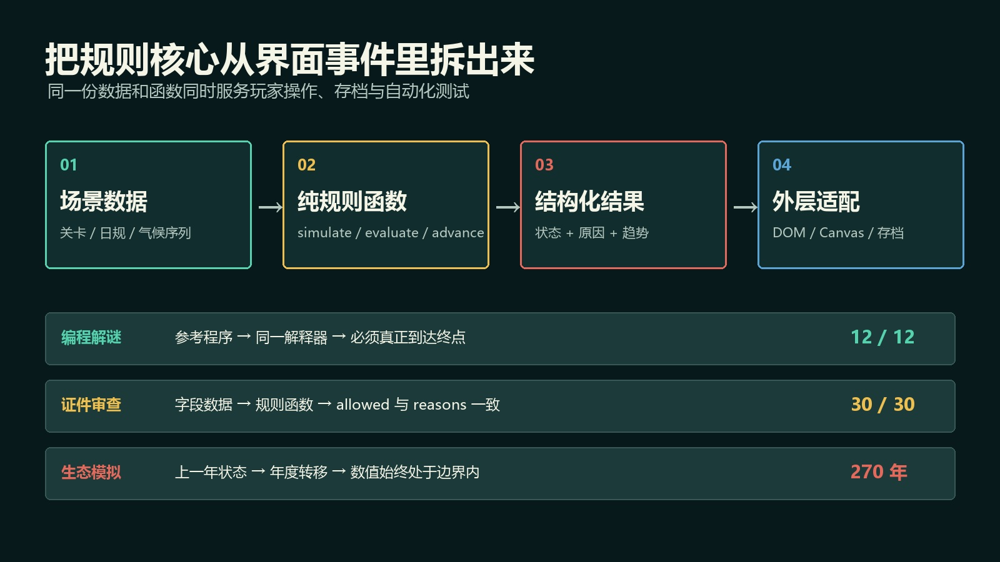
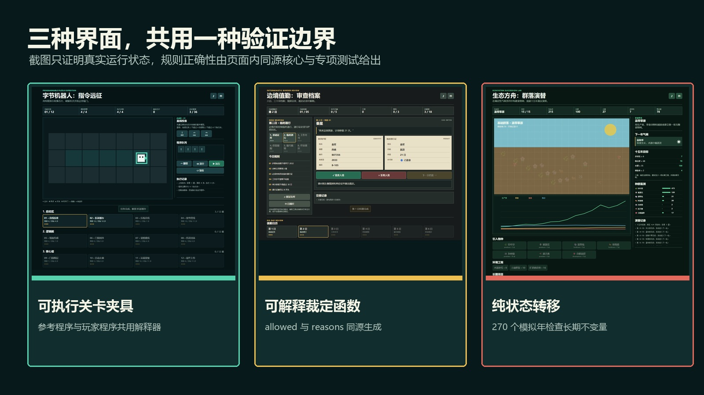
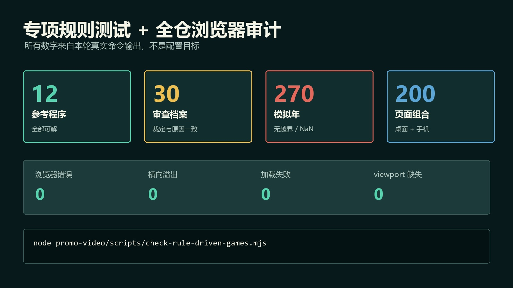

# 页面能打开，不代表规则正确：单 HTML 游戏的纯规则核心与不变量测试

> 发布说明（发布时可删除）
>
> - 文章类型：原创。
> - 推荐分区：前端；备选分区：游戏开发、软件工程。
> - 文章封面：`docs/images/rule-core/cover.jpg`，1920×1080；只设置为 CSDN 封面，不在正文重复插入。
> - 正文图 1：`docs/images/rule-core/architecture.jpg`，放在“先划清四层边界”一节。
> - 正文图 2：`docs/images/rule-core/runtime-evidence.jpg`，放在“三种规则，三种验证方式”一节。
> - 正文图 3：`docs/images/rule-core/validation-results.jpg`，放在“浏览器测试仍然需要”一节。
> - 建议摘要：页面能加载、按钮能点击，并不能证明游戏规则正确。我把三个单 HTML 浏览器游戏从 DOM 事件驱动结构改成可独立调用的规则核心：编程关卡用可执行参考程序验证真实可解性，证件审查让裁定结果与违规原因同源生成，生态模拟用纯状态转移函数检查 270 个模拟年的数值不变量。本文结合真实代码和 Playwright 专项回归，说明怎样在不引入框架和后端的前提下，让单文件项目同时具备可玩界面、跨设备档案和可重复的模型测试。
> - 建议标签：`JavaScript`、`自动化测试`、`HTML5 游戏`、`Playwright`、`软件架构`。

我以前给浏览器小游戏做回归时，最容易得到一种虚假的安全感：

- 页面能打开；
- 点击开始后没有报错；
- Canvas 不是空白；
- 手机宽度没有横向滚动条。

这些都应该检查，但它们只能证明“界面大致活着”。

它们回答不了另外三个问题：

1. 编程解谜发布的 12 个关卡，是否真的都存在一条符合预算的解？
2. 证件审查显示“允许入境”时，违规原因是否一定为空？
3. 生态模拟连续推进数百年后，是否会出现负种群、`NaN` 或超过上限的环境值？

这三个问题无法靠截图回答，也不适合全部交给端到端点击脚本穷举。

我最后采用的做法很朴素：**把规则核心从 DOM 事件里拆出来，让界面和测试调用同一套函数。**

项目仍然是零依赖、单 HTML 文件。没有为了测试把它改成框架工程，也没有增加后端；变化只发生在代码边界。

## 本次验证范围

这次重构对应三个不同类型的规则系统：

| 规则类型 | 核心问题 | 验证样本 | 核心入口 |
| --- | --- | ---: | --- |
| 编程解谜 | 关卡是否可解，指令预算是否真实 | 12 个参考程序 | `simulate(levelIndex, program)` |
| 证件审查 | 裁定与违规原因是否一致 | 6 日 30 宗档案 | `evaluateCase(day, data)` |
| 生态模拟 | 长期状态是否始终处于合法边界 | 6 个生态区 × 45 年 | `advanceYear(input, scenario, weatherIndex)` |

专项测试还会实际操作三个页面，并检查三星、跨设备档案、Canvas 像素和 390×844 触屏布局。

随后执行全仓审计，共覆盖 100 个游戏在桌面和手机上的 200 个页面组合。结果为加载失败 0、JavaScript 错误 0、控制台错误 0、横向溢出 0、viewport 缺失 0。

这里需要区分两层证据：

- 模型测试证明特定规则约束成立；
- 浏览器审计证明这些规则接入真实页面后没有破坏运行和布局。

两者不能互相替代。

## 先划清四层边界



> 图 1：场景数据进入纯规则函数，得到结构化结果，再交给 DOM、Canvas 和存档层；三个专项检查都发生在规则核心，而不是复制一份测试专用逻辑。

原型阶段的代码通常长这样：

```javascript
button.onclick = () => {
  // 读取页面字段
  // 修改全局变量
  // 计算结果
  // 更新 DOM
  // 顺便保存 localStorage
};
```

它不是“写错了”，而是把五种职责塞进了同一个入口。

当内容只有一关、一个旅客或一个年度时，这种写法很快。内容量增加以后，问题开始出现：

- 测试必须点击按钮才能触发规则；
- 想验证一个边界，要先把页面操作到指定状态；
- 结果文本可能和真实布尔裁定来自两套 `if`；
- 随机输入让失败难以复现；
- 存档导入后很难单独确认数据清洗是否正确。

重构后的边界分成四层：

1. **场景数据**：关卡、日规、气候序列和目标；
2. **纯规则函数**：只接收输入，返回新状态或裁定结果；
3. **结构化结果**：状态、原因、趋势和星级所需指标；
4. **外层适配**：DOM、Canvas、音效、键盘、触屏和 `localStorage`。

测试不再模拟另一套规则，而是直接调用第二层。

## 三种规则，三种验证方式



> 图 2：三个页面分别处理指令执行、证件裁定和长期模拟；截图证明它们真实运行，规则正确性则由页面内同源核心和专项测试共同给出。

这三类玩法不能只写一个通用的“测试成功”断言。它们需要不同的可验证对象。

### 1. 可执行关卡夹具：参考解必须走同一解释器

编程解谜最危险的数据问题不是页面崩溃，而是关卡看起来完整，却没有合法解。

我给每个关卡保留一条参考程序：

```javascript
{
  name: "最终上传",
  map: [
    "############",
    "#>..S~.O####",
    "############",
    "####O..D.cG#",
    "############"
  ],
  budget: 8,
  par: 11,
  solution: "F3JFF33F"
}
```

参考程序不是显示给玩家的答案，而是关卡数据的可执行夹具。

页面启动时，校验器会检查：

- 地图每一行宽度一致；
- 起点和终点各有一个；
- 传送环成对出现；
- 参考程序没有超过源码预算；
- 程序通过真实解释器执行后，收齐芯片并到达终点；
- 实际执行步数没有超过关卡目标。

核心模拟函数与玩家点击“运行”时使用的是同一个：

```javascript
function simulate(levelIndex, program) {
  const expanded = expandProgram(
    Array.isArray(program) ? program : [...program]
  );
  const runtime = createRuntime(levelIndex);

  if (!expanded.ok) {
    return { ...runtime, reason: expanded.reason, expanded: [] };
  }

  for (const token of expanded.commands) {
    executeCommand(runtime, token);
    if (runtime.stopped || runtime.won) break;
  }

  return { ...runtime, expanded: expanded.commands };
}
```

这次校验确实抓到过问题：部分参考解把 `×2/×3` 理解成“重复整个分组”，而解释器实现的是“重复上一条原子指令”。页面可以正常打开，地图也能画出来，但 10 个参考解与真实语义不一致。

如果没有让参考解通过同一解释器，这类问题很容易被当成“以后手测关卡再说”。

### 2. 原因型规则函数：结果和解释必须同源

证件审查的旧结构会先随机制造旅客，再在多个位置判断姓名、国籍、有效期和许可章。

这种写法容易出现一种尴尬状态：界面说“拒绝”，日志却给出“无拒绝理由”。

新的规则函数不只返回布尔值，而是先收集原因：

```javascript
function evaluateCase(day, data) {
  const rule = DAY_RULES[day];
  const reasons = [];

  if (data.expiry < rule.expiry) {
    reasons.push(`护照有效期早于 ${rule.expiry}`);
  }
  if (rule.banned && data.nation === rule.banned) {
    reasons.push(`${rule.banned}公民暂停入境`);
  }
  if (rule.permit && (!data.hasPermit || data.permitName !== data.name)) {
    reasons.push(data.hasPermit
      ? "通行证姓名与护照不符"
      : "缺少临时通行证");
  }

  return {
    allowed: reasons.length === 0,
    reasons
  };
}
```

这样有两个直接收益。

第一，`allowed` 不再和解释分开维护。只要原因数组非空，就必须拒绝。

第二，UI、日志和测试都能复用 `reasons`。玩家收到的是具体规则反馈，测试也能检查：

```javascript
item.allowed === (item.reasons.length === 0)
```

六日 30 宗档案使用确定性索引生成。同一个 `day + slot` 重复构造，得到的对象必须完全一致。

这里的“确定性”不是取消变化，而是让变化来自可追踪的规则和数据，而不是无法复现的 `Math.random()`。

### 3. 纯状态转移：长期模拟先守住不变量

生态模拟的问题不是某一年算对就结束了。

一次很小的比例错误可能在第 20 年、第 40 年才变成负种群或 `NaN`。如果每次推进都依赖 DOM 和动画，长时间压力测试会很慢，也很难定位。

年度演替因此被抽成纯状态转移：

```javascript
function advanceYear(input, scenario, weatherIndex) {
  const weather = WEATHER[weatherIndex];
  const next = {
    ...input,
    pop: [...input.pop],
    projects: { ...input.projects },
    extinctions: [...input.extinctions]
  };

  // 根据营养层、环境和气候计算 next.pop

  next.water = Math.round(clamp(next.water, 10, 100));
  next.soil = Math.round(clamp(next.soil, 10, 100));
  next.habitat = Math.round(clamp(next.habitat, 10, 100));
  next.year = input.year + 1;
  return next;
}
```

函数不读取按钮、不绘制 Canvas，也不写存档。

测试可以从六个生态区的初始状态出发，各自连续推进 45 年，共检查 270 个模拟年：

```javascript
for (let year = 0; year < 45; year++) {
  sample = advanceYear(
    sample,
    scenario,
    scenario.weather[year % scenario.weather.length]
  );

  assert(sample.pop.every((value) => value >= 0 && value <= 999));
  assert([sample.water, sample.soil, sample.habitat]
    .every((value) => value >= 0 && value <= 100));
}
```

这不是为了证明数值平衡完美，而是先守住最基本的不变量：

- 所有数值有限；
- 种群不为负；
- 环境指标不越界；
- 输入状态不会被意外原地污染；
- 同一气候序列能够重复运行。

## 浏览器测试仍然需要

把规则函数拆出来，不代表可以删除 Playwright。

纯函数不知道下面这些事情：

- 玩家按键是否真的进入程序队列；
- 裁定按钮是否调用了正确的旅客数据；
- 十五次“推进一年”是否更新了图表与结算；
- 档案码是否能经过页面入口导出、清洗和导入；
- Canvas 是否绘制了非空且有颜色差异的像素；
- 390×844 手机视口是否横向溢出。

因此专项脚本保留真实浏览器层：

```powershell
node promo-video/scripts/check-rule-driven-games.mjs
```



> 图 3：专项测试验证 12 个参考程序、30 宗确定性档案和 270 个模拟年；全仓审计覆盖桌面与手机共 200 个页面组合。本轮浏览器错误、加载失败和横向溢出均为 0。

专项测试实际执行了这些动作：

- 在编程页面点击四次“前进”，运行后确认首关获得三星；
- 按规则完成第一日五宗裁定，确认 5/5、三星和下一日解锁；
- 建成滴灌网络，连续点击推进 15 年，确认四项目标、零灭绝和三星；
- 对 `BYTE2`、`CHECK2`、`ECO2` 三种档案码执行往返；
- 在桌面和触屏上下文中收集浏览器错误并检查布局。

然后再运行全仓审计：

```powershell
node promo-video/scripts/audit-games.mjs
```

模型测试负责“规则是否满足约束”，浏览器测试负责“真实页面是否正确接入”。这比让端到端脚本承担所有组合更快，也更容易在失败时定位到具体层。

## 这套方法没有证明什么

自动化结果必须和它真正覆盖的范围一致。

### 参考程序不等于关卡质量

12 个参考程序全部可解，只能证明至少存在一条合法路径。它不能证明：

- 关卡只有一条解；
- 难度曲线一定合理；
- 玩家能自然理解新指令；
- 最优解没有更短。

要回答这些问题，需要搜索算法、游玩数据或人工测试，而不是把“可解”写成“好玩”。

### 270 个模拟年不等于生态模型真实

不变量测试能发现负数、越界和非数值，但不能证明生态参数符合现实世界。

这里的模型服务于策略游戏反馈，不是科学预测工具。文章中的 270 年是自动化执行规模，不是实验或现实数据。

### 确定性档案不等于覆盖所有证件组合

30 宗档案覆盖当前六日规则，但姓名、国籍、目的和多重违规仍然存在更多排列。

后续如果规则继续增加，更适合引入属性测试或组合生成，而不是无限手写固定案例。

### 无浏览器错误不等于所有设备兼容

本轮真实检查的是 Playwright 驱动的桌面 1440×900 与移动端 390×844 上下文。它不能替代 Safari、低性能设备、辅助技术和真实触摸延迟测试。

## 什么时候值得这样拆

不是每个 200 行小游戏都需要完整测试架构。

当项目出现下面任意两项时，我会优先拆规则核心：

- 相同规则被 UI、日志、结算和存档重复使用；
- 内容数据开始批量增加；
- 存在随机或长时间演化；
- 失败后很难判断是界面错误还是规则错误；
- 需要跨设备档案或版本迁移；
- 每次改数值都必须手工重玩十几分钟。

最小可行改法也不复杂：

1. 让规则函数接收明确输入；
2. 返回结构化结果，不直接修改 DOM；
3. 给场景数据保存可执行样例或预期原因；
4. 为长期状态写出不会被破坏的不变量；
5. 最后用少量真实浏览器流程验证接线。

## 结语

单 HTML 不等于只能写一次性脚本。

即使所有 CSS、界面和 JavaScript 都在一个文件里，仍然可以划分清楚的模型边界：数据描述问题，纯函数执行规则，结构化结果解释发生了什么，页面只负责交互和呈现。

这样做最直接的价值不是“测试数量更多”，而是规则开始能够独立回答：

- 这关为什么可解？
- 这个人为什么被拒绝？
- 这个状态为什么仍然合法？

相关游戏源码、专项脚本和全仓审计都在开源仓库：

<https://github.com/wangzifan396-wzf/mini-browser-games>

当页面能打开时，测试才刚刚开始。真正需要被验证的，是按钮背后那套会持续产生结果的规则。

## 发布信息（发布时可删除）

- 推荐标题：页面能打开，不代表规则正确：单 HTML 游戏的纯规则核心与不变量测试
- 备选标题 1：别只测按钮能不能点：三个单 HTML 项目的规则核心与模型测试实战
- 备选标题 2：把游戏规则从 DOM 事件里拆出来：可执行关卡、裁定原因与 270 年模拟测试
- 备选标题 3：浏览器小游戏也能做模型测试：12 个参考程序、30 宗档案和 270 个模拟年
- 推荐标签：`JavaScript`、`自动化测试`、`HTML5 游戏`、`Playwright`、`软件架构`
- 推荐分区：前端；备选分区：游戏开发、软件工程
- 推荐封面：`docs/images/rule-core/cover.jpg`
- 正文共 3 张图；按正文顺序上传，并保留每张图后紧随的图注。
- 发布前在 CSDN 预览中检查宽表格、JavaScript 代码块和长命令行；由作者本人决定保存草稿或公开发布。
