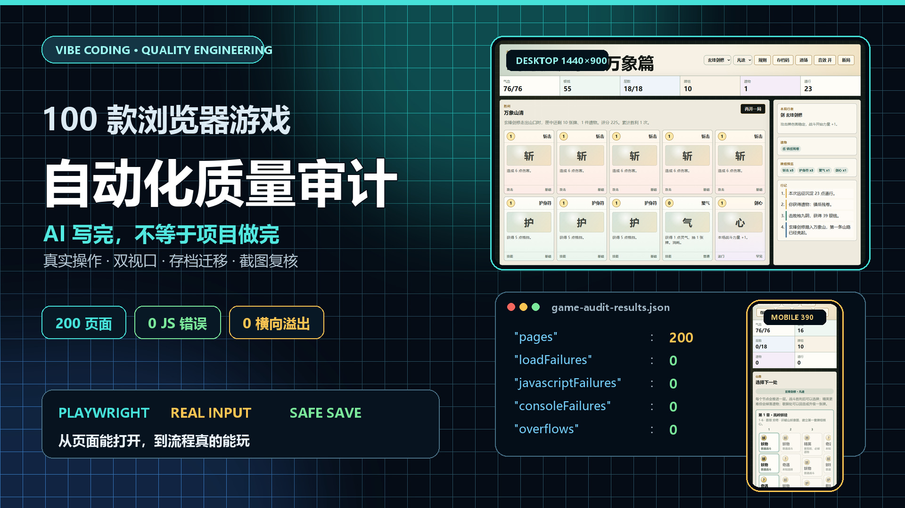

# Vibe Coding 做了 100 款浏览器游戏后，我搭了一套自动化质量审计流程

> 本文是这个开源项目的第三篇复盘，不再单独介绍某款游戏，而是讨论一个更实际的问题：AI 可以很快写出能运行的游戏，但我怎样确认它真的没有坏？
>
> 开源项目：<https://github.com/wangzifan396-wzf/mini-browser-games>
>
> 前两篇：
>
> - [我用 Vibe Coding 做了 100 款浏览器游戏，并把它们全部开源了](https://blog.csdn.net/m0_74023007/article/details/162945755)
> - [100 款浏览器游戏里，我最推荐这 8 款：两款旗舰与 Vibe Coding 质量复盘](https://blog.csdn.net/m0_74023007/article/details/162976006)

<!-- 发布说明：图 1 同时设置为 CSDN 文章封面。其余图片均已写明本地路径与准确插入位置，发布时在 CSDN 编辑器逐张上传，并保留图注。 -->

做完 100 款游戏以后，我遇到的最大问题已经不是“AI 能不能写出来”，而是“我凭什么相信它真的能玩”。

一个页面成功打开，和一款游戏通过验收，中间隔着很远：按钮可能只在桌面端能点，触屏拖拽可能没有释放，存档导入可能让等级越界，物理物体可能在第一帧自己倒塌，胜利结算也可能在某个分支永远不触发。

更麻烦的是，这些问题往往不会以语法错误的形式出现。代码可以合法运行，页面也可以看起来正常，但玩家走到某一步时，状态已经错了。

所以当项目从“100 个原型”进入质量阶段后，我给它补了一套自动化审计与专项回归流程。现在每一轮重要更新，都要同时经过脚本语法、真实浏览器操作、桌面/手机布局、存档迁移、状态结算和全仓页面检查。



*图 1（同时设为文章封面）：100 款游戏、200 个桌面/手机页面，从“继续生成”转向“持续验收”。*

## “能运行”为什么不是一个可靠的验收标准

Vibe Coding 最容易让人产生满足感的时刻，是页面第一次动起来的时候。

但从质量角度看，这只能证明浏览器成功解析了代码。下面这些问题依然可能存在：

- 页面加载正常，但第一次真实操作没有反应；
- 鼠标可以玩，触屏事件没有覆盖；
- 首屏没有溢出，打开弹窗或进入后期内容后才溢出；
- 新存档工作正常，旧版本玩家升级后数据丢失；
- 胜利流程能走通，失败、重试、最终关返回大厅却会卡死；
- 单个关卡正常，连续加载十几关后监听器或定时器重复注册；
- 系统数量很多，但它们没有构成可重复游玩的闭环。

前六项可以通过工程手段提高发现概率，最后一项仍然需要真实试玩和人的判断。这也是我现在对自动化测试的定位：它不能证明游戏好玩，但能阻止大量“不该交给玩家发现的问题”。

## 我把质量检查分成两层

目前项目使用两层检查，它们解决的问题不同。

### 第一层：100 款游戏的全仓冒烟审计

第一层不深入玩某一款游戏，而是快速检查全部 HTML 页面。审计脚本会启动本地静态服务器，用 Playwright 分别打开桌面和手机视口。

当前固定视口是：

```js
const viewports = [
  { id: "desktop", width: 1440, height: 900 },
  { id: "mobile", width: 390, height: 844 },
];
```

每个页面至少检查：

- HTTP 状态和加载超时；
- `pageerror` JavaScript 异常；
- 浏览器控制台错误；
- 是否包含 viewport；
- 页面是否产生横向溢出；
- Canvas 和主要交互控件是否真实可见；
- 能否找到开始按钮并进入游戏状态。

横向溢出的判断本身很简单：

```js
horizontalOverflow:
  document.documentElement.scrollWidth >
  document.documentElement.clientWidth + 4
```

但它放到 100 个页面、两个视口上执行，就能快速发现人工很容易漏掉的响应式问题。

截至 2026 年 7 月 18 日，最新一轮结果是：

```json
{
  "pages": 200,
  "loadFailures": 0,
  "javascriptFailures": 0,
  "consoleFailures": 0,
  "overflows": 0,
  "missingViewport": 0,
  "weakPages": 17
}
```

这里的 `weakPages` 不是错误，而是“首屏文字很少且暂时没有可见 Canvas”的启发式候选列表。它提醒我继续人工检查，但不会直接把游戏判为失败。

### 第二层：核心游戏的专项深度回归

全仓审计只能证明页面基础状态健康，不能证明一个复杂游戏真的完成了关键流程。

因此每次把 A/A+ 作品升级到 S 级时，我会再写一个只针对这款游戏的专项测试。它不只点击“开始”，而是检查玩法独有的状态。

例如专项回归会覆盖：

- 真实拖拽、滑动、键盘或卡牌点击；
- 关卡数量、锁定关系和首领数据；
- 胜利、失败、重试、下一关和终章返回；
- 三星、分数、奖励和永久成长；
- 老存档迁移、异常字段清洗和跨设备存档码；
- 桌面与手机的弹窗、滚动区和主操作按钮。

## 测试必须模拟玩家操作，而不只是调用内部函数

这是我踩过最重要的坑之一。

如果测试只调用 `launchProjectile()`，它只能证明这个函数没有抛错，却不能证明玩家真的能通过鼠标或手指触发它。输入坐标换算、Pointer Capture、拖拽阈值、静态物体释放，都可能出问题。

物理类游戏的专项测试会真实执行鼠标轨迹：

```js
await page.mouse.move(pouch.x, pouch.y);
await page.mouse.down();
await page.mouse.move(pull.x, pull.y, { steps: 8 });
await page.mouse.up();
```

随后再检查弹丸是否真正变成动态物体、质量是否为有限值、速度是否大于最低阈值、发射次数是否增加。


*图 2：物理游戏回归不是检查按钮存在，而是真实执行拖拽、释放并验证弹丸状态。*

这种测试曾经抓到过一个很隐蔽的问题：物体创建时直接设为静态，释放后保留了不正确的质量与惯性。页面、瞄准线和按钮全部正常，但弹丸就是发不出去。

这类故障仅靠“打开页面看一眼”几乎发现不了。

## 存档测试比我最初预想的重要

当游戏只有一局时，刷新页面重新开始并不严重。但当项目开始加入章节、长期成长、实验室、道场和里程碑后，存档就变成了玩法的一部分。

我的存档回归现在至少包含四项：

1. 新版本可以读取旧版本的核心数据；
2. 导出后再导入，关键字段保持一致；
3. 负数、超大等级、非法关卡等异常字段会被限制；
4. 长流程游戏能够恢复最近一次安全断点。

导入存档不能简单地把 JSON 覆盖到当前对象上。我现在会逐字段清洗：

```js
function cleanInteger(value, min, max) {
  const number = Number(value);
  if (!Number.isFinite(number)) return min;
  return Math.max(min, Math.min(max, Math.floor(number)));
}
```

数组也要重新验证。牌组中的卡牌必须存在于当前牌库，遗物必须存在于当前遗物表，地图必须按当前版本重新构造，而不是完全相信导入数据。


*图 3：长流程游戏需要验证终章结算、永久成长与安全断点，而不只是第一场战斗。*

## 截图检查不是装饰，而是自动化之后的人工复核

浏览器可以告诉我“没有横向溢出”，却不能告诉我界面是否舒服。

一个页面可能技术上没有超出视口，但按钮挤成一团、标题被压成四行、主要操作被次要信息盖住。对此最有效的办法仍然是保存桌面与手机截图，再按玩家视角查看。


*图 4：同一套三章地图在 390×844 手机视口中的实际布局，每章内部滚动，页面本身不产生横向溢出。*

这张截图就曾暴露过一个断言没有发现的问题：状态栏虽然没有越过页面宽度，但旧版 CSS 让其中一项独占整行，旁边留下了明显空白。测试结果是“通过”，视觉结果却不合格。

所以我现在坚持两步都做：

- 自动化检查负责发现确定性的错误；
- 截图和试玩负责发现信息层级、节奏与手感问题。


*图 5：复杂弹窗需要单独检查内部滚动、粘性主按钮和页面外层布局，不能只看首屏宽度。*

## AI 写代码之后，我会让它重新站到测试者的位置

同一轮 Vibe Coding 里，我会刻意把“实现”和“审查”分开。

实现阶段关注的是：系统怎样接进去，数据怎样流动，界面怎样呈现。

审查阶段则重新从零提问：

- 首次进入会发生什么？
- 玩家中途刷新会发生什么？
- 最后一关和普通关是否走同一条结算路径？
- 旧存档缺少新字段时会发生什么？
- 手机端弹窗内容超过一屏时，按钮还能不能触达？
- 一个挑战条件到底记录的是整局，还是被每次操作重置？

这种角色切换很重要。AI 很擅长沿着刚才的实现思路继续补代码，也因此容易默认原来的结构是对的。重新建立验收条件，比继续提示“再优化一下”有效得多。

## 我的发布前检查清单

现在一个重要更新准备提交前，我会按下面的顺序检查。

### 代码层

- 内联脚本能被 `new Function()` 解析；
- 独立脚本通过 `node --check`；
- `git diff --check` 没有空白和补丁错误；
- 只提交本轮相关文件，不覆盖其他未提交修改。

### 游戏层

- 首次开始和真实操作有效；
- 胜利、失败、重试和终章有效；
- 关卡与首领初始化不会自毁；
- 成长奖励、解锁与挑战条件能够持久化；
- 音效关闭后不会继续创建声音。

### 存档层

- 旧版迁移；
- 新版导出与导入；
- 异常字段清洗；
- 长流程安全断点；
- 完成或失败后正确清除断点。

### 设备层

- 1440×900 桌面视口；
- 390×844 触屏视口；
- 无页面级横向溢出；
- 弹窗可滚动，主要按钮始终可触达；
- Canvas 实际绘制，不是空白画布。

### 仓库层

- 专项回归通过；
- 100 款游戏的 200 页面全仓审计通过；
- README、质量评级和更新记录与代码一致；
- 提交后本地 `HEAD` 与远端分支一致。

## 自动化仍然不能回答“好不好玩”

这套流程能证明很多事情，但它不能证明一款游戏值得玩十小时。

脚本可以计算关卡数量，不能判断关卡是否只是换了数值；可以确认成长系统保存成功，不能判断成长是否制造了新策略；可以验证按钮能点，不能判断点击反馈是否令人满足。

因此项目里的 S/A/B/C/D 评级仍然来自内容体量、系统闭环、重复游玩性、操作反馈和人工体验的综合判断。自动化只是底线，不是作品质量的上限。

这也是我做完 100 款游戏后最大的变化：我不再把“AI 成功生成了代码”当作完成，而是把它当作一次可以开始测试的候选实现。

## 如果你也在用 Vibe Coding 做项目

不一定要一开始就建立很复杂的测试框架。最值得优先做的是：

1. 固定一个桌面视口和一个手机视口；
2. 记录页面错误和控制台错误；
3. 让测试执行一次真实核心操作；
4. 保存一张桌面截图和一张手机截图；
5. 给存档写一次导出、清空、导入回归；
6. 每修一个真正出现过的故障，就把它加入永久测试。

测试不需要一次写完。它可以和项目一起成长，把每次踩坑变成以后不会重复踩的规则。

我的 100 款浏览器游戏、全仓审计脚本和专项回归都已经开源：

<https://github.com/wangzifan396-wzf/mini-browser-games>

如果你正在用 AI 做游戏或前端项目，也欢迎交流你遇到过哪些“页面正常，但流程其实已经坏了”的问题。

---

## 发布格式建议

- CSDN 文章类型：原创
- 推荐分类：JavaScript / 前端 / 人工智能
- 摘要：做完 100 款 Vibe Coding 浏览器游戏后，我为项目建立了 Playwright 双视口全仓审计、真实操作专项回归、存档迁移清洗和截图复核流程。本文复盘自动化能检查什么、不能替代什么，以及如何把 AI 生成结果变成可持续验证的工程交付。
- 建议标签：`Vibe Coding`、`Playwright`、`JavaScript`、`自动化测试`、`浏览器游戏`

备选标题：

1. AI 写完不等于做完：100 款浏览器游戏背后的自动化验收
2. 我给 100 款 Vibe Coding 游戏加了一套 Playwright 质量审计
3. 从“页面能打开”到“流程真能玩”：AI 游戏项目的测试复盘
