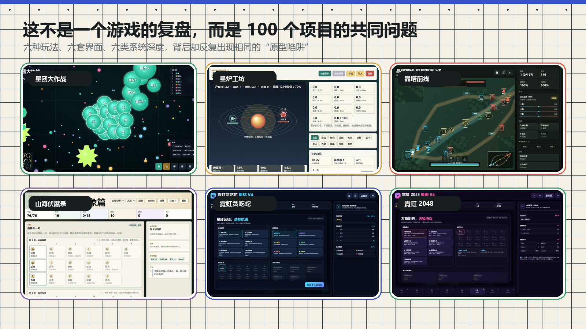
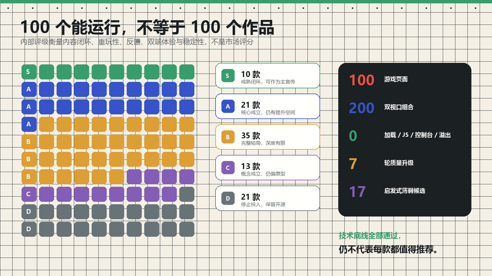
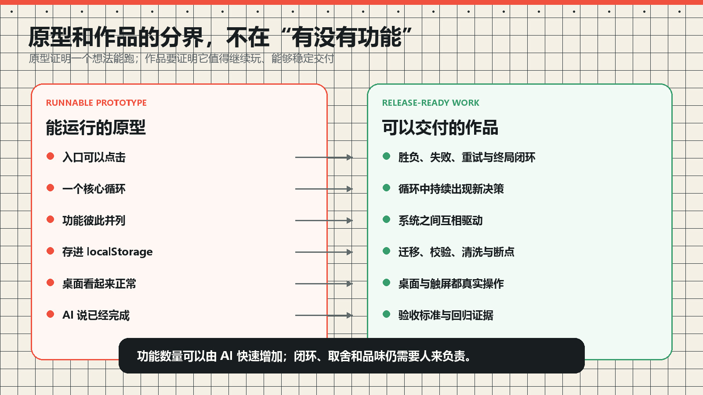
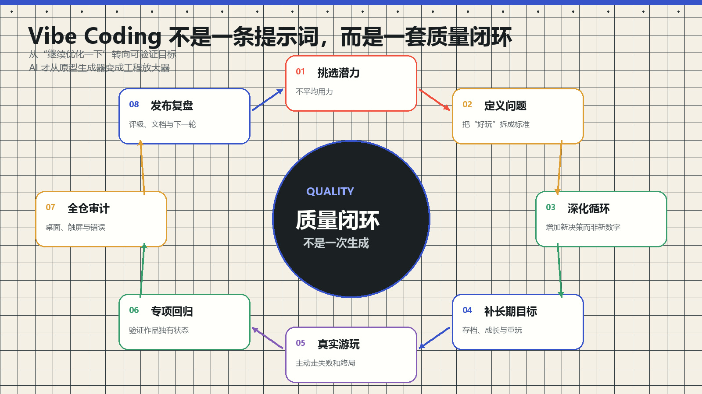

# 我用 AI 做了 100 款游戏后发现：Vibe Coding 最容易制造的不是作品，而是原型

> 发布说明（发布时可删除）
>
> - 文章类型：原创。
> - 推荐分区：人工智能 / 软件工程；备选分区：游戏开发。
> - 文章封面：`docs/images/vibe-coding-retrospective/cover.jpg`，1920×1080。只设置为 CSDN 封面，不在正文首屏重复插入。
> - 正文图 1：`project-gallery.jpg`，放在开场数据之后，证明讨论来自整个项目而非单作开发日志。
> - 正文图 2：`quality-distribution.jpg`，放在“100 个能运行不等于 100 个作品”一节。
> - 正文图 3：`prototype-vs-work.jpg`，放在原型与作品的边界一节。
> - 正文图 4：`quality-loop.jpg`，放在质量闭环一节。
> - 建议摘要：我用 Vibe Coding 做了 100 款零依赖浏览器游戏，又对 100 个桌面页面和 100 个触屏页面进行了全仓审计。所有页面都能加载，技术错误为 0，但按内容闭环、重玩性、反馈和交付质量衡量，真正达到项目内部 S 级的只有 10 款。本文不讨论如何再生成一款游戏，而是复盘为什么 AI 天然擅长制造“能运行的原型”，以及怎样通过选择、取舍、真实游玩和验证闭环把原型推进为作品。

做到第 100 款游戏时，我原本以为自己完成了一个很明确的里程碑。

仓库里有 100 个独立 HTML 文件，不需要构建工具，双击就能运行。题材从吞噬竞技、挂机工坊、卡牌肉鸽，到塔防、推理、经营、体育和益智。把页面逐个打开，按钮能点、Canvas 会动、胜负也大多存在。

如果只看“AI 能不能写出游戏”，答案似乎已经非常乐观。

但当我真正把 100 款游戏放在同一套标准下审计，结论变得有些尴尬：

- 100 款游戏全部可以加载；
- 1440×900 桌面端和 390×844 触屏端共检查了 200 个页面组合；
- 加载失败、JavaScript 错误、控制台错误、横向溢出全部为 0；
- 但项目内部评级里，S 级只有 10 款，A 级 21 款；
- 其余 69 款停留在 B、C 或 D。

这套 S/A/B/C/D 是我给项目制定的内部质量标准，不是市场评分，更不代表商业成功。但它揭示了一个很重要的差别：

> 我确实做出了 100 个可以运行的游戏页面，但并没有因此自动得到 100 个值得推荐的作品。



> 图 1：同一仓库里的六种玩法。本文讨论的不是某一款游戏遇到的技术问题，而是大量项目反复暴露出的共同完成度问题。

这不是在否定原型。原型非常有价值，它能验证方向、操作和技术可行性。

真正危险的是：Vibe Coding 把原型生成得太快、太完整，以至于我们很容易把“像作品的原型”误认为“已经完成的作品”。

## 生成成本下降以后，最稀缺的东西变了

传统开发里，很多想法死在实现成本上。一个按钮、一套存档、一个 Canvas 动画，都需要真实时间。

Vibe Coding 改变了这一点。描述玩法、等待代码、刷新页面，几十分钟就可能出现一个看起来相当完整的东西。

代码不再是最稀缺的资源以后，瓶颈逐渐转移到了另外几件事：

- 哪个想法值得继续做；
- 什么算好玩，什么只是会动；
- 哪些功能应该删除；
- 哪个系统真的创造新决策；
- 做到什么程度才可以称为完成；
- 怎样证明这次修改没有破坏其他流程。

也就是说，AI 降低了“把东西造出来”的成本，却没有同比降低“判断什么值得被造出来”的成本。

当原型变得近乎无限时，选择、品味和验收反而更稀缺。

## 为什么 AI 天然容易交付一个“像完成品的原型”

我后来发现，这并不是偶然，而是 Vibe Coding 工作方式本身带来的倾向。

### 1. 提示词天然偏向可见功能

我们很容易描述：

```text
加入商店、技能、三种模式、排行榜和存档。
```

却很难用一句话描述：

```text
让玩家在第 20 分钟仍然面临新的、可读的、有代价的选择。
```

前者可以直接转化成按钮、对象和字段，完成状态清楚；后者依赖节奏、重复、取舍和体验，需要反复游玩才能判断。

于是 AI 很自然地优先生产“看得见的完成度”：更多卡片、更多模式、更多数字、更多页面。

### 2. AI 擅长局部正确，不会自动承担整段体验

一个函数可以是正确的，一个按钮也可以正常工作，但游戏体验发生在时间里。

玩家会经历第一次进入、理解规则、尝试、失败、重开、成长、重复游玩和最终完成。很多问题只有在第十分钟、第二局或旧存档导入时才出现。

AI 可以分析这些状态，却不会像玩家一样自然地感到：

- 这一局已经重复了；
- 这个升级只是换了数值；
- 失败后我没有理由重开；
- 新模式其实没有改变策略；
- 玩到这里，所有系统都已经见过了。

如果提示词没有主动要求它走完整段流程，它通常会在局部功能成立时停止。

### 3. 功能很便宜，一致性却越来越贵

第一项系统加入时，规则很好理解。第十项系统加入后，问题开始变成：

- 它是否和前面的系统发生冲突；
- UI 说明与实际数值是否一致；
- 新字段在旧存档里是什么；
- 手机端是否还能触达关键按钮；
- 失败、终局和重试是否走同一套结算；
- 不同模式是否真的拥有不同策略。

AI 可以继续添加功能，但系统之间的一致性成本会不断累积。

这就是一种“完成度债务”：页面看起来越来越丰富，真正完成它所需的检查却越来越多。

### 4. 生成太容易，会削弱删除和放弃的意愿

自己写了三天的功能，人会舍不得删；AI 三分钟生成的功能，理论上应该更容易删。

实际情况却不一定如此。因为生成速度很快，我们更容易继续说“再加一个”，把选择问题推迟到以后。

最后项目中出现很多看起来都不错、却没有任何一个被真正推进到成熟的方向。

原型过剩以后，最重要的能力不是继续生成，而是敢于冻结、降级和停止投入。

## 100 个能运行，不等于 100 个作品



> 图 2：S/A/B/C/D 来自项目内部评级，只用于决定投入顺序。技术底线全部通过，仍不代表每款都值得推荐。

这次评级分布是：

| 评级 | 数量 | 我的定义 |
| --- | ---: | --- |
| S | 10 | 局内循环、长期目标、内容量、反馈和双端体验完整，可以作为项目主宣传 |
| A | 21 | 核心机制成立，能够多次游玩，仍有明显提升空间 |
| B | 35 | 完整的短局作品，但深度、变化量或演出有限 |
| C | 13 | 概念成立，但仍然明显像原型 |
| D | 21 | 同质化、重复度或完成度问题较大，停止投入但保留开源 |

最值得注意的不是“只有 10 款 S”，而是另一组看似矛盾的数据：

- 200 个页面组合没有技术性失败；
- 仍有 69 款没有达到 A 或 S。

这说明自动化审计和代码正确性解决的是交付底线，不是作品上限。

页面可以没有错误，但仍然不好玩；存档可以成功写入，但长期成长仍然空洞；按钮可以全部触达，但选择仍然没有意义。

## 原型不是“小作品”，它们证明的是不同的事情

我现在更愿意这样区分：

> 原型证明一个想法能够运行；作品要证明这个想法值得继续体验，而且能够稳定交付。



> 图 3：原型与作品都可能拥有很多功能。真正的分界是闭环、持续决策、系统关系、长期状态、双端体验和验收证据。

### 原型关心“有没有”

- 有没有开始按钮；
- 有没有敌人；
- 有没有升级；
- 有没有胜利；
- 有没有存档；
- 有没有手机布局。

### 作品关心“这些东西如何一起工作”

- 失败后是否愿意重试；
- 升级是否改变打法；
- 不同系统是否互相驱动；
- 长期目标是否支持重复游玩；
- 旧档案是否能迁移；
- 手机端是否真的能完成一次核心操作；
- 终局是否兑现了前面的积累。

这也是为什么“再加五个功能”通常不能把一个 C 级原型直接变成 A 级作品。

如果核心循环缺少选择，增加五种颜色没有用；如果长期目标不存在，增加更多关卡只会放大重复；如果系统彼此孤立，功能越多，玩家越难感受到它们的价值。

## 100 款游戏里最常出现的七种“原型陷阱”

这些问题并不来自某一款游戏，它们在不同题材里反复出现。

### 1. 用数字变化冒充内容变化

敌人血量更高、速度更快、奖励更多，很容易生成，但玩家做出的决策没有变化。

真正的内容变化应该改变至少一件事：路线、资源优先级、风险、操作节奏、构筑方向或胜利条件。

### 2. 系统很多，却彼此没有关系

商店、任务、角色、科技和成就都存在，但每个系统只是独立增加一个数字。

成熟系统应该互相推动。例如局内选择影响通关方式，通关结果产生长期资源，长期成长再打开新的局内策略。

### 3. 第一局有趣，第二局已经看完

原型通常擅长制造第一分钟的新鲜感，却没有回答重复游玩为什么不同。

模式数量不是答案。六个规则如果只改变倍率，本质上仍然是一局；三个选择如果总有唯一最优，也不是真正的构筑。

### 4. 只有成功路径，没有失败路径

按钮正常、胜利正常，不代表游戏流程完整。

很多真正的故障发生在：

- 玩家中途刷新；
- 最后一个敌人与玩家同时死亡；
- 终章首领走了普通结算；
- 失败后状态没有清空；
- 暂停期间后台逻辑仍然运行；
- 弹窗内容超过手机一屏，确认按钮无法触达。

原型验证“正常情况下能玩”，作品需要验证“不正常情况下不会坏”。

### 5. 有 localStorage，不等于有可靠存档

长期项目至少还要考虑：

- 新版本缺少字段时的默认值；
- 非法值和损坏字段清洗；
- 旧版本迁移；
- 导出与导入校验；
- 长流程安全断点；
- 完成或失败后何时清除断点。

“能够保存”只是一项功能，“玩家敢相信它”才接近系统。

### 6. 响应式布局，不等于移动端可玩

CSS 没有横向溢出，只能证明页面没有撑破视口。

触屏还需要检查目标尺寸、画布坐标换算、手势冲突、弹窗滚动、虚拟按钮、误触和视野分配。真正的移动端测试应该完成一次核心操作，而不是只截一张 390px 宽的图。

### 7. 自动化只证明“没崩”，没有证明“完成”

全仓审计适合检查：页面加载、控制台错误、横向溢出和基本入口。

但每一款成熟游戏还需要自己的专项验证：卡牌游戏要真正出牌并经过敌方回合，物理游戏要真实拖拽发射，长线游戏要迁移存档和恢复断点，构筑游戏要验证叠加结果而不只是卡片数量。

自动化不是统一脚本越大越好，而是要能表达作品独有的不变量。

## 七轮质量更新以后，我改变了升级方式

项目早期的思路很直接：发现薄弱作品，就继续增加内容。

后来我逐渐把升级分成了两种阶段。

### 第一阶段：广泛重制，先拉高底线

我选择了自走棋、背包构筑、炼金、钓鱼、地牢、农场、实时战略、推理、监控生存和地铁规划等不同类型，补齐内容、存档和移动端。

这个阶段的目标，是验证哪些类型值得继续做，以及项目最常缺少什么。

### 第二阶段：单作深挖，不再追求一轮更新多少款

第三到第七轮分别集中在少数核心循环已经成立的作品上。

不同项目的升级内容完全不同，但方法开始统一：

- 经典短局加入有独立规则的长线节点，而不是复制关卡；
- 动作循环加入连续构筑、首领结构和断点；
- 物理关卡加入材料连锁、技能弹丸、工坊和挑战星级；
- 卡牌肉鸽加入章节敌池、流派倾向、长期道场和安全断点；
- 实时竞技加入能真正进入结算的局内构筑、评价和赛季目标。

这些升级不是简单地让文件变大，而是反复回答三件事：

1. 下一局为什么会不同？
2. 这局的选择如何影响长期目标？
3. 我怎样证明它真的走到了终局？

## 从“继续优化一下”到可验证的质量闭环



> 图 4：生成代码只是循环中的一环。挑选、定义、游玩、验证、发布和复盘共同决定原型能否继续成熟。

我现在不会再用“继续优化一下”作为主要任务描述，因为这句话没有终点。

更有效的流程是：

### 1. 挑选潜力，不平均用力

100 款游戏不应该平均投入。核心循环已经成立、题材有区分、玩家操作有反馈的作品，值得优先升级；重复度高、没有明确方向的作品可以保留开源，但停止投入。

这是最难交给 AI 的一步，因为它天然会尝试完成面前的任务，不会主动替项目做残酷的资源分配。

### 2. 把“好玩”拆成问题

不要问“还能加什么”，而要问：

- 现在重复发生在哪里；
- 玩家在哪一分钟失去新决策；
- 哪个系统没有参与核心循环；
- 失败后缺少什么理由重开；
- 长期目标是否只是数字增长。

问题越具体，AI 的实现能力越能发挥作用。

### 3. 深化循环，而不是继续堆数字

新增内容必须带来新的决策、风险或系统关系。否则它只是在扩大维护面。

### 4. 补上长期目标和状态边界

成长、存档、章节、挑战、里程碑和评价，不应该独立存在，而要把一次游玩与下一次游玩连接起来。

### 5. 重新站到玩家的位置真实游玩

实现阶段的思路很容易带着代码结构看游戏。验收阶段必须忘掉实现，主动走失败、重试、刷新、终章和旧档案。

### 6. 把踩过的坑变成专项回归

每修复一次真实故障，就把它变成以后不会重复出现的断言。

### 7. 做全仓底线审计

专项测试保证单作深度，全仓审计保证这次修改没有污染其他 99 款页面。

### 8. 发布、评级，再决定下一轮

评级不是奖牌，而是资源分配工具。文档也不是完成后的装饰，它迫使我重新解释：这次升级到底创造了什么价值。

## AI 在这套流程里真正擅长什么

经过 100 款项目，我对 AI 的期待反而更具体了。

它非常擅长：

- 快速搭出可运行的核心循环；
- 在已有结构里增加内容和状态；
- 查找散落的引用并完成机械迁移；
- 生成测试夹具和调试接口；
- 执行双视口回归并整理结果；
- 把重复逻辑收口成数据或 helper；
- 根据明确验收条件持续修复。

它不应该独自负责：

- 哪款作品值得继续投入；
- 什么感觉算好玩；
- 哪个功能应该删除；
- 内容是否已经重复；
- 项目的审美与优先级；
- 没有数据时宣称“会火”或“现象级”。

我越来越认为，Vibe Coding 不是把开发者从项目中拿走，而是把开发者的工作从“亲手写完每一行”推向了“定义问题、选择方向、验证结果和承担判断”。

## Vibe Coding 可能有三个成熟阶段

### 第一阶段：提示词驱动

关注“能不能生成”。看到页面运行就获得很强的完成感。

### 第二阶段：证据驱动

开始写验收条件、记录真实状态、检查失败路径、迁移存档和跑自动化。关注“能不能稳定交付”。

### 第三阶段：品味驱动

代码和测试已经不再是最大瓶颈，真正重要的是选择：什么值得做、什么应该删除、什么已经足够、什么仍然不够好玩。

很多关于 Vibe Coding 的讨论停留在第一阶段：比较谁能更快生成页面、谁的提示词更复杂。

但当生成能力越来越普遍，后两个阶段会决定项目之间真正的差距。

## 如果重新开始，我不会先追求 100 款

100 款项目让我看到了足够多的问题，但它并不是效率最高的产品路径。

如果重新来一次，我可能会：

1. 先做 10 个机制差异足够大的原型；
2. 每个原型只验证一个最核心的乐趣；
3. 真实游玩后冻结一半；
4. 从剩下的作品中选择 2–3 个建立长期闭环；
5. 在内容扩张前先建立存档、调试和回归边界；
6. 尽早让真实玩家参与，而不是只做内部评级。

当生成原型越来越便宜时，“多做几个看看”仍然有价值。但探索结束后，必须进入收敛。

否则 Vibe Coding 会让项目永远停留在第一天最兴奋的状态：每个方向都像有潜力，没有一个方向真正完成。

## 这篇复盘的边界

这 100 款都是零依赖浏览器小游戏，不等同于商业团队开发的大型项目。

S/A/B/C/D 是我根据内容体量、系统闭环、重玩性、反馈、双端体验和稳定性做的内部判断，没有用户留存、付费、在线人数或市场传播数据。

因此我能证明的是：

- AI 可以大幅降低原型和实现成本；
- 大量可运行页面并不会自动变成大量成熟作品；
- 明确的选择与验证流程能够持续提高内部完成度。

我不能据此证明某款游戏一定会火，也不能把内部 S 级包装成行业级质量。

这种边界本身也很重要。Vibe Coding 最容易制造的不只有原型，也包括听起来非常确定、实际没有数据支撑的结论。

## 开源项目与原始审计数据

项目地址：

<https://github.com/wangzifan396-wzf/mini-browser-games>

仓库包含：

- 100 款零依赖单 HTML 浏览器游戏；
- 项目级 S/A/B/C/D 质量审计；
- 100 款×桌面/触屏的全仓检查脚本；
- 多款深度升级作品的专项 Playwright 回归；
- 文章截图、原始测量 JSON 和可复现配图脚本。

本文项目级数据位于：

```text
docs/images/vibe-coding-retrospective/project-data.json
```

对应采集与配图：

```text
promo-video/scripts/capture-vibe-coding-retrospective.mjs
promo-video/scripts/create-vibe-coding-retrospective-images.py
```

如果你也在用 AI 做项目，我最想分享的不是某条提示词，而是这个判断：

> 当写代码不再是最贵的环节，决定什么值得完成、以及怎样证明它完成了，会成为新的核心能力。

原型不是失败。把原型误认为作品，才会让项目过早停止成长。

---

## 发布信息（发布时可删除）

- 推荐标题：我用 AI 做了 100 款游戏后发现：Vibe Coding 最容易制造的不是作品，而是原型
- 备选标题 1：100 款游戏全部能运行，但我只把 10 款评为 S：一次 Vibe Coding 复盘
- 备选标题 2：AI 让原型变得无限便宜以后，真正稀缺的是什么？
- 备选标题 3：从“页面能跑”到“作品完成”：我做完 100 款 AI 游戏后的反思
- 推荐标签：`Vibe Coding`、`人工智能`、`软件工程`、`游戏开发`、`开源项目`
- 推荐封面：`docs/images/vibe-coding-retrospective/cover.jpg`
- 正文建议保留二级目录；三级标题较多，不建议全部加入 CSDN 目录。
