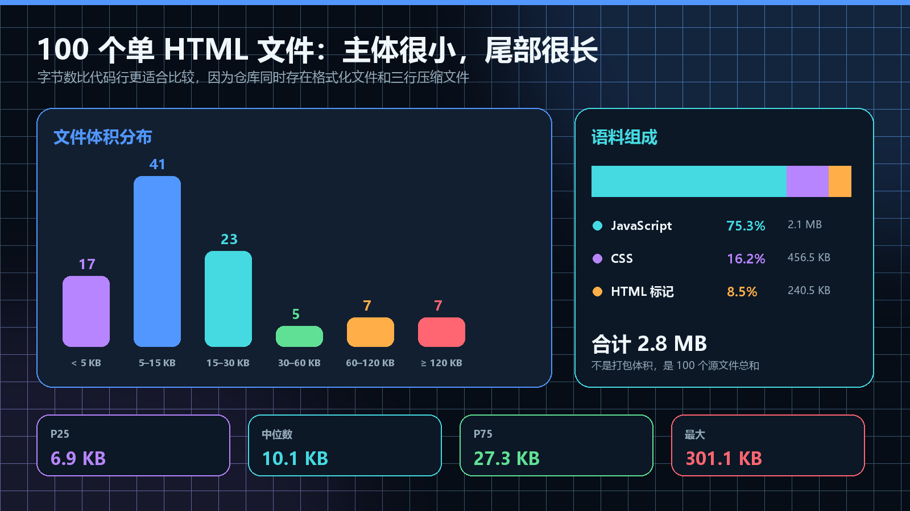
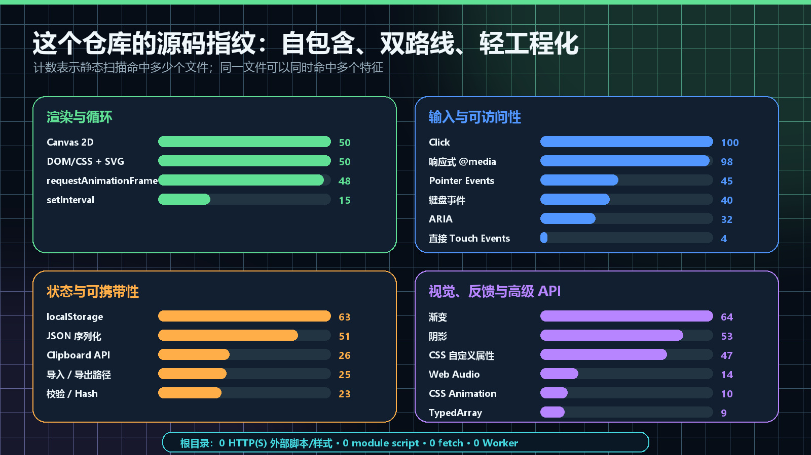
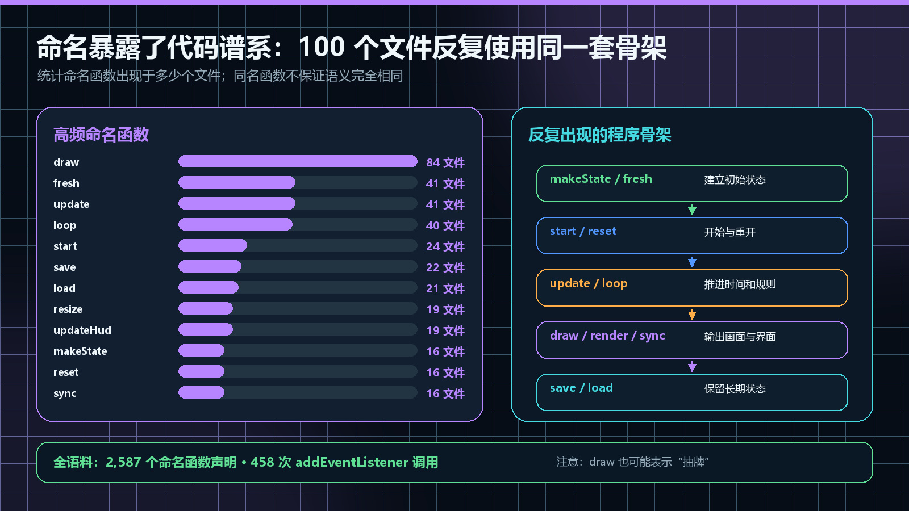
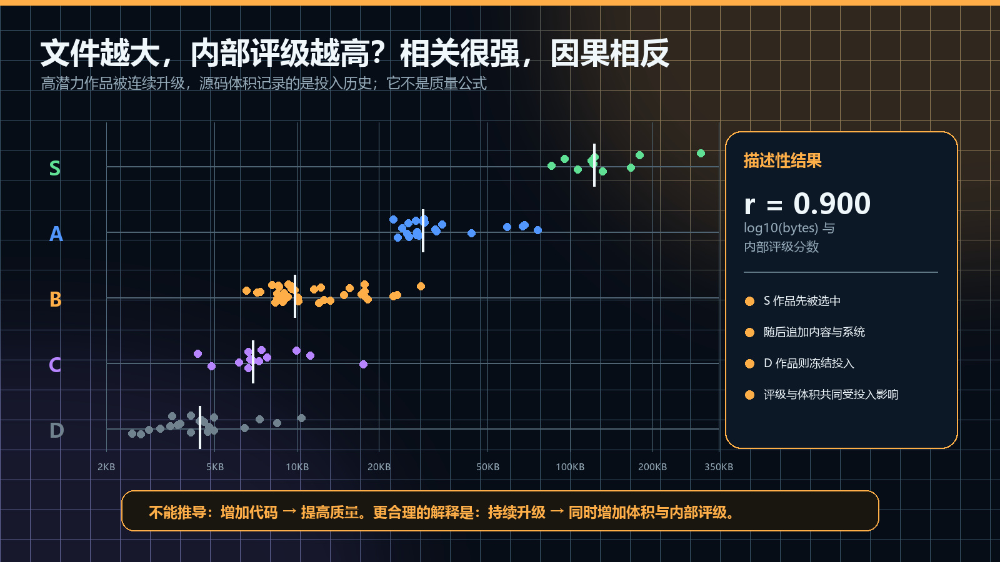

# 我扫描了 100 个 Vibe Coding 浏览器游戏源码：AI 最爱写什么？

> 发布说明（发布时可删除）
>
> - 文章类型：原创。
> - 推荐分区：人工智能 / JavaScript；备选分区：前端、游戏开发。
> - 文章封面：`docs/images/source-corpus-analysis/cover.jpg`，1920×1080。只设置为 CSDN 封面，不在正文首屏重复插入。
> - 正文图 1：`corpus-overview.jpg`，放在语料规模与文件分布之后。
> - 正文图 2：`api-fingerprint.jpg`，放在浏览器 API 使用分布一节。
> - 正文图 3：`code-vocabulary.jpg`，放在高频函数与代码谱系一节。
> - 正文图 4：`rating-vs-size.jpg`，放在文件体积与内部评级相关性一节。
> - 建议摘要：我把 100 款 Vibe Coding 浏览器游戏的根目录 HTML 当成一个源码语料库，编写静态分析器统计文件体积、代码组成、Canvas/DOM 路线、动画循环、输入 API、存档、音频、可访问性和高频函数。结果显示：100 个文件总计 2.8MB，50 款使用 Canvas 2D，63 款使用 localStorage，但只有 25 款能识别到明确导入/导出路径；100 款都使用 Click，98 款有响应式 CSS，Pointer Events 只有 45 款。文章同时讨论哪些现象来自 AI/模板复用，哪些其实来自“单 HTML、零外部依赖”的人为约束。

前面几篇文章里，我讨论过项目质量、自动化审计、浏览器性能，以及“原型和作品有什么区别”。

但还有一个问题一直没有用数据回答：

> 当 AI 持续参与生成和迭代 100 个同类项目时，它到底会反复写出什么？

是 Canvas 更多，还是 DOM 更多？

多少项目真的有可携带存档？多少项目用了音频？键盘、触屏、Pointer Events 和响应式 CSS 的覆盖是什么关系？不同质量等级的文件体积是否有差异？AI 会不会在不同游戏里反复使用相同的函数命名和程序骨架？

仅凭印象回答这些问题，很容易把几个显眼案例当成整个仓库。

所以我写了一个静态分析器，扫描仓库根目录的 100 个 HTML 游戏页面，并把逐文件结果、特征定义、评级分组和限制条件全部输出成 JSON。

这篇文章不再介绍某一款游戏，也不评价某段代码写得“像不像 AI”，而是把仓库当成一个小型源码语料库来分析。

## 分析范围：我究竟扫描了什么

本次分析对应仓库提交：

```text
4db4ddbab9cfd514ad0efb425c074a63eca20aa6
```

扫描对象是仓库根目录的 100 个 `.html` 游戏文件。

需要先说明三个边界。

### 1. 统计的是根目录单文件版本

仓库中还有《星团大作战》《星炉工坊》的前后端增强版本，它们使用独立目录、多文件前端和 Node 服务。这些增强版不在本次 100 个根 HTML 的静态语料里。

因此后面出现“根目录 WebGL 命中为 0”，并不与已经开源的 WebGL2 增强版矛盾。它只描述这 100 个根页面。

### 2. 这是正则驱动的静态分析，不是 AST 和运行时追踪

分析器会提取内联 `<script>`、`<style>`，再检测：

- `getContext("2d")`、`requestAnimationFrame`；
- `localStorage`、`JSON.stringify`；
- Pointer、Touch、Keyboard、Mouse、Click 事件；
- Web Audio、Clipboard、TypedArray；
- `@media`、ARIA、CSS 变量、渐变和阴影；
- 导入导出、校验、调试 Hook；
- 命名函数和 `addEventListener` 调用。

它可能漏掉动态构造的 API 名称，也可能统计到当前没有执行的代码。所以文章使用的是“静态命中”，不是“运行时一定执行”。

### 3. 内部评级不是市场评分

S/A/B/C/D 来自项目自身的内容闭环、重玩性、反馈、双端体验和稳定性评估，只用于项目投入决策。

它没有用户留存、商业收入或市场传播含义。

## 100 个文件总共多大

分析结果首先给出了整个语料的规模：

| 指标 | 结果 |
| --- | ---: |
| HTML 文件 | 100 |
| 源码总字节 | 2,887,069 Bytes |
| 约合体积 | 2.8MB |
| 总行数 | 64,359 |
| 非空行 | 61,390 |
| 内联 JavaScript | 2,173,346 Bytes |
| 内联 CSS | 467,419 Bytes |
| 命名函数声明 | 2,587 |
| `addEventListener` 调用 | 458 |

这里最不应该直接使用的是“64,359 行代码”。

因为仓库同时存在完整格式化文件和只有三行的压缩式单文件。同样的逻辑，换一种排版就会产生完全不同的行数。

因此后续主要使用字节数，而不是代码行数比较文件规模。



> 图 1：大部分文件很小，少数深度升级文件形成明显长尾。总量是源文件总和，不是网络传输或打包体积。

## 中位数只有 10.1KB，但最大文件超过 300KB

文件体积分布如下：

| 区间 | 文件数 |
| --- | ---: |
| 小于 5KB | 17 |
| 5–15KB | 41 |
| 15–30KB | 23 |
| 30–60KB | 5 |
| 60–120KB | 7 |
| 大于等于 120KB | 7 |

也就是说：

- 58 款游戏小于 15KB；
- 81 款游戏小于 30KB；
- 只有 14 款达到 60KB 以上；
- 最大文件约 301.1KB。

几个分位数是：

```text
P25      6.9 KB
中位数  10.1 KB
P75     27.3 KB
最大   301.1 KB
```

这很符合项目的发展过程：早期原型通常只有一段核心规则和简洁 UI；被选中深度升级的作品，会继续加入章节、角色、构筑、存档迁移、移动端和调试接口，于是进入长尾。

它不是一个“典型文件大约 30KB”的均匀仓库，而是大量轻量原型加少数持续扩张作品。

## 语料里 75.3% 是 JavaScript

按内联块拆分后：

```text
JavaScript   75.3%   约 2.1MB
CSS          16.2%   约 456.5KB
HTML 标记     8.5%   约 240.5KB
```

这说明“单 HTML”主要是一种交付容器，而不是大量静态页面标记。

游戏状态、规则和绘制逻辑占据绝大部分体积；CSS 负责布局和主题；真正的 HTML 结构反而最少。

## 渲染路线刚好一半一半

100 个根页面的渲染分类是：

```text
Canvas 2D    50
DOM/CSS      49
DOM + SVG     1
```

这组 50:50 不是预先设计的配额，但非常接近项目里的两套主要原型路线。

### Canvas 路线

更适合：

- 连续移动；
- 物理与碰撞；
- 射击、竞速和动作；
- 大量自由坐标对象；
- 需要每帧重绘的游戏画面。

50 款 Canvas 2D 游戏中，48 款静态命中了 `requestAnimationFrame`。剩余页面可能使用事件驱动绘制，或由其他入口间接推进。

### DOM/CSS 路线

更适合：

- 卡牌与棋盘；
- 经营面板；
- 文字推理；
- 表格、按钮和分步状态；
- 更依赖可访问性和布局的交互。

DOM 游戏不一定比 Canvas 简单。例如长线挂机、复杂管理和卡牌构筑可能没有连续画布，却拥有更多状态和系统。

所以“Canvas 数量”只能描述渲染方式，不能当作复杂度指标。

## 浏览器 API 指纹：Click 100，Pointer 45，Web Audio 14



> 图 2：同一文件可以同时命中多个特征。例如 Canvas 游戏既可能有 Pointer Events，也会给页面按钮绑定 Click。

## 输入层：每个游戏都有 Click，但直接游戏输入差异很大

输入与界面相关统计：

| 特征 | 文件数 |
| --- | ---: |
| Click | 100 |
| 响应式 `@media` | 98 |
| Pointer Events | 45 |
| Keyboard Events | 40 |
| ARIA | 32 |
| 直接 Touch Events | 4 |
| Mouse Events | 2 |

“Click 100”并不意味着 100 款都只有鼠标操作。它主要说明每个页面都有按钮或可点击 DOM 控件。

Pointer Events 同时覆盖鼠标、触控笔和触摸，所以只有 4 款直接监听 Touch Events 并不代表只有 4 款支持手机。

更值得注意的是另一组差距：

```text
响应式 CSS  98
Pointer      45
Keyboard     40
ARIA         32
```

几乎所有页面都考虑了窄屏布局，但真正需要连续操作的游戏，输入适配并不由 `@media` 自动解决。

这也提醒我：静态扫描可以告诉我们“代码里有没有输入路径”，却不能证明手势是否舒服、按钮是否容易误触。运行时双视口审计仍然必要。

## 存档层：63 款能本地保存，25 款能够识别到导入导出

状态相关统计形成了一个很明显的漏斗：

```text
localStorage       63
JSON 序列化         51
Clipboard API      26
明确导入/导出路径    25
校验或 Hash         23
```

这几层分别代表不同成熟度。

### localStorage：设备内记住状态

它适合保存最高分、设置和短期进度，但数据仍然绑定浏览器和当前设备。

### JSON：开始保存结构化状态

51 款使用 `JSON.stringify` 或 `JSON.parse`。这通常意味着状态不再只是一个最佳分数，而是对象、数组或多字段档案。

### 导入导出：档案开始可携带

只有 25 款能静态识别到明确导出/导入路径。它们通常属于长线作品，需要跨浏览器迁移成长、纪录或断点。

### 校验：开始防止损坏和错误粘贴

23 款出现了 checksum、hash 或存档码校验语义。

这比“63 款用了 localStorage”更有信息量：本地保存很常见，真正可迁移、可检查的档案集中在少数长期作品里。

但这仍然只是代码特征。是否支持旧版本迁移、非法字段清洗和安全断点，还需要阅读具体实现或运行专项测试。

## 视觉层：渐变和阴影很常见，音频明显更少

视觉与反馈相关统计：

| 特征 | 文件数 |
| --- | ---: |
| CSS/Canvas 渐变 | 64 |
| 阴影 | 53 |
| CSS 自定义属性 | 47 |
| Web Audio | 14 |
| CSS Animation | 10 |
| TypedArray | 9 |

在这个仓库里，渐变、阴影和主题色变量远比音频常见。

这很容易理解：视觉效果可以直接出现在生成结果中，截图立即可见；声音需要用户手势、开关状态、音量控制和真实播放检查，完成成本更高。

不过 `CSS Animation = 10` 也不能解释为只有 10 款有动画。48 款使用 `requestAnimationFrame`，大量动画发生在 Canvas，而不是 CSS。

## 根目录是高度自包含的：0 外部脚本，0 module，0 fetch

分析器没有在根目录 100 个页面中检测到：

```text
HTTP(S) 外部脚本或样式   0
type="module"            0
fetch()                   0
Worker                    0
OffscreenCanvas           0
WebGL Context             0
```

这组数字看起来很像“AI 的技术偏好”，但其实主要来自项目约束：

- 每款游戏要能直接双击运行；
- 不依赖 CDN；
- 不需要安装包；
- HTML、CSS 和 JavaScript 封装在同一个文件；
- 增强版才单独进入前后端目录。

因此正确结论不是“AI 不喜欢模块”，而是：

> 在单文件、离线、零外部依赖的任务约束下，AI 会稳定回到经典脚本、内联样式和浏览器原生 API。

这是文章标题里最需要限制的地方。我们观察到的是“AI 在这个仓库约束下最常写什么”，不是所有 AI 编程项目的普遍分布。

## 高频函数暴露了代码谱系

静态分析器还提取了命名函数，并按“出现于多少个不同文件”排序。



> 图 3：命名相同不等于语义相同。`draw()` 既可能绘制 Canvas，也可能表示“抽牌”。这张图反映的是代码词汇和谱系，不是严格调用图。

最常见的命名函数是：

| 函数名 | 出现文件数 |
| --- | ---: |
| `draw` | 84 |
| `fresh` | 41 |
| `update` | 41 |
| `loop` | 40 |
| `start` | 24 |
| `save` | 22 |
| `load` | 21 |
| `resize` | 19 |
| `updateHud` | 19 |
| `makeState` | 16 |
| `reset` | 16 |
| `sync` | 16 |

其中 `draw = 84` 看起来甚至超过了 Canvas 游戏数，因为在卡牌项目里，draw 还可能表示抽牌。

真正有意思的是组合关系：

```text
makeState / fresh
→ start / reset
→ update / loop
→ draw / render / sync
→ save / load
```

这套骨架在不同题材中反复出现。

它既是浏览器游戏的自然结构，也反映了项目代码谱系：大量早期作品从相似的生成模板出发，后续再根据题材增加规则。

`fresh` 在 41 个文件里出现尤其明显。它不是浏览器标准 API，也不是所有 JavaScript 项目的惯例，更像是同一批代码生成和复用留下的“家族特征”。

这比寻找“AI 常用某个变量名”更有意义：AI 与模板复用往往不会复制完整游戏，却会保留状态初始化、循环、渲染和保存的基本语法。

## 2,587 个函数，但只有 458 次 addEventListener

100 个文件共有：

```text
命名函数声明             2,587
addEventListener 调用      458
```

458 并不是全部事件绑定数量，因为不少页面使用 `.onclick = ...`，HTML 内联或一次集中委托。

它再次说明静态指标必须和检测口径放在一起，单独看一个大数字很容易产生错误解释。

## 文件越大，内部评级越高？r = 0.900

把文件字节数取 `log10`，再与内部评级映射的分数做 Pearson 相关，结果是：

```text
r = 0.900
```

从分组中位数看也非常明显：

| 评级 | 数量 | 文件体积中位数 |
| --- | ---: | ---: |
| S | 10 | 122.2KB |
| A | 21 | 28.9KB |
| B | 35 | 9.8KB |
| C | 13 | 6.9KB |
| D | 21 | 4.4KB |



> 图 4：白色竖线是各评级中位数。相关性很强，但不能推导“增加代码会提高质量”。

如果只看图，很容易得出一个危险结论：

```text
代码越多，质量越高。
```

但这个项目里的因果更可能相反：

1. 先根据核心循环挑选有潜力的作品；
2. 对被选中的作品持续升级；
3. 加入内容、角色、关卡、存档、移动端和测试接口；
4. 文件体积与内部评级同时上升；
5. D 级作品停止投入，所以长期保持很小。

也就是说，体积记录的是投入历史。

同样是 120KB，一个文件可能拥有完整系统，也可能只是重复内容和耦合代码。字节数不理解结构，更不理解好玩。

## 评级分组里的功能差异

部分特征按评级分组如下：

| 评级 | localStorage | 导入/导出 | Web Audio | Pointer |
| --- | ---: | ---: | ---: | ---: |
| S（10） | 10 | 10 | 6 | 9 |
| A（21） | 18 | 12 | 6 | 11 |
| B（35） | 17 | 3 | 0 | 10 |
| C（13） | 7 | 0 | 1 | 5 |
| D（21） | 11 | 0 | 1 | 10 |

这里比较有区分力的不是 localStorage，而是导入/导出路径。

D 级也有 11 款使用本地存储，说明保存最佳分数很容易；10 款 S 级则全部具备可识别的导入/导出路径，因为它们承担更长的成长和纪录。

音频也主要集中在 S/A。B 级 35 款中，本次检测没有命中 Web Audio。

但这依然不是评级公式。短局益智游戏不一定需要跨设备档案，DOM 管理游戏也不一定需要 Pointer Events。特征必须服务玩法，而不是为了通过表格强行补齐。

## 哪些结果属于 AI，哪些不属于

写到这里，必须把观察拆成四种来源。

### 仓库硬约束

```text
0 外部脚本、0 module、0 fetch
```

主要来自“单 HTML、离线、零依赖”的人为要求，不能泛化成 AI 的技术偏好。

### 游戏题材需求

Canvas、`requestAnimationFrame`、键盘和 Pointer Events 的数量，首先由动作、射击、棋盘或经营题材决定。

### AI 与模板复用

`fresh`、`makeState`、`updateHud` 等重复命名，以及相似的初始化—循环—渲染骨架，更接近代码生成谱系。

### 后期人工选择和迭代

S 级文件体积、可携带存档、音频和调试 Hook 的集中，主要来自后续质量投入，而不是一次提示词自动生成。

所以这次分析没有得出“AI 永远喜欢 Canvas”或“AI 不会写模块”这样的结论。

更准确的回答是：

> AI 会非常稳定地适应项目约束，并在相似任务里复用一套可工作的程序语法；最终源码分布，是任务要求、题材、生成模板和后期人工取舍共同形成的。

## 分析以后，我认为这个仓库最值得调整什么

### 1. 把单 HTML 当作发布格式，不一定继续当作唯一开发格式

对于 5–15KB 的短局作品，单文件非常合适。

进入 100KB 以后，状态、样式、绘制和存档继续堆在同一作用域，定位成本会明显上升。更合理的方向可能是：

```text
模块化源码
→ 构建或内联
→ 继续发布零依赖单 HTML
```

用户仍然得到一个可双击文件，开发过程却不必拒绝模块边界。

### 2. 不必抽象所有游戏，但可以统一基础协议

100 款游戏的核心规则差异很大，强行共用一个游戏引擎可能制造耦合。

更适合统一的是边界协议：

- 存档版本与清洗；
- 音效开关；
- Pointer/Keyboard 输入适配；
- 调试快照命名；
- 页面错误和双视口审计；
- 导入导出格式。

### 3. 把静态分析变成发布报告，而不是只写一次文章

以后每轮升级都可以比较：

- 哪些 API 覆盖发生变化；
- 是否意外引入外部资源；
- 哪些文件进入新的体积区间；
- 可访问性与调试 Hook 是否提升；
- 分析器能否解释新增结构。

静态分析不能代替运行测试，但适合发现仓库级结构漂移。

### 4. 不为了指标给每款游戏补齐所有功能

分析数据最容易带来的副作用，是把“音频只有 14”理解成“剩下 86 款都要加音频”。

短局是否需要存档、纯按钮游戏是否需要 Pointer Events，都要回到实际体验。指标用于提出问题，不用于统一答案。

## 如何复现这次分析

项目地址：

<https://github.com/wangzifan396-wzf/mini-browser-games>

分析脚本：

```text
promo-video/scripts/analyze-game-source-corpus.mjs
```

原始 JSON：

```text
docs/images/source-corpus-analysis/source-analysis.json
```

配图脚本：

```text
promo-video/scripts/create-source-corpus-article-images.py
```

运行命令：

```powershell
cd promo-video
npm.cmd run article:source-corpus:analyze
npm.cmd run article:source-corpus:images
```

JSON 中包含：

- 100 个文件的逐文件字节数、行数和评级；
- 全部特征布尔值；
- 特征定义和方法限制；
- 渲染分类和体积分桶；
- 分评级统计；
- 高频函数；
- 最大与最小文件；
- 描述性相关系数。

## 这次分析的限制

最后再集中列出不能从数据中推出的结论。

### 静态命中不等于运行执行

代码存在不代表玩家一定走到该路径，也不能证明实现正确。

### 正则不是完整 JavaScript 解析器

动态属性、间接调用和字符串生成可能漏检，同名词也可能误判。

### 一个仓库不能代表所有 Vibe Coding

这 100 款共享题材范围、单文件要求、开发者偏好和历史模板，样本并不独立。

### 体积不代表复杂度或质量

格式、注释、重复代码和数据量都会改变字节数。相关性只描述当前仓库。

### 内部评级不是用户结果

没有留存、在线人数和商业数据，不能根据评级推断市场表现。

## 结语

扫描 100 个文件以后，我得到的最重要结论不是某个 API 的百分比，而是：

> AI 生成的代码从来不是孤立的模型输出，它会强烈吸收任务约束、项目模板和后续人工选择。

如果只看到“0 个 module script”，很容易说 AI 偏爱老式 JavaScript；把项目约束放回来，才知道这是离线单文件交付的自然结果。

如果只看到 S 级中位数 122.2KB，也很容易说代码越多越好；把升级历史放回来，才知道是高潜力作品获得了更多投入。

静态数据真正有价值的地方，不是替我们做结论，而是迫使结论带上范围、口径和证据。

这可能也是 Vibe Coding 项目走向成熟的一个标志：不仅能让 AI 继续生成代码，还能回过头来测量它究竟生成了什么，以及我们自己的选择怎样改变了最终结果。

---

## 发布信息（发布时可删除）

- 推荐标题：我扫描了 100 个 Vibe Coding 浏览器游戏源码：AI 最爱写什么？
- 备选标题 1：我对 100 个 AI 游戏源码做了静态分析：Canvas、localStorage 与单文件架构的真实分布
- 备选标题 2：100 个单 HTML 游戏共 2.8MB：一次 Vibe Coding 源码语料分析
- 备选标题 3：AI 生成的浏览器游戏都长什么样？100 个项目的代码数据告诉你
- 推荐标签：`Vibe Coding`、`JavaScript`、`静态分析`、`数据可视化`、`游戏开发`
- 推荐封面：`docs/images/source-corpus-analysis/cover.jpg`
- 正文建议保留二级目录；三级标题较多，可不全部加入 CSDN 目录。
