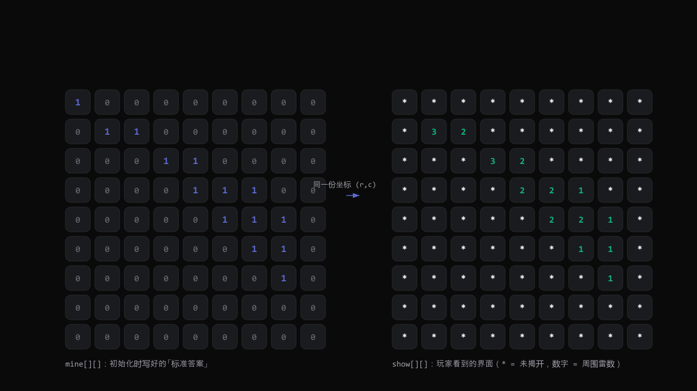
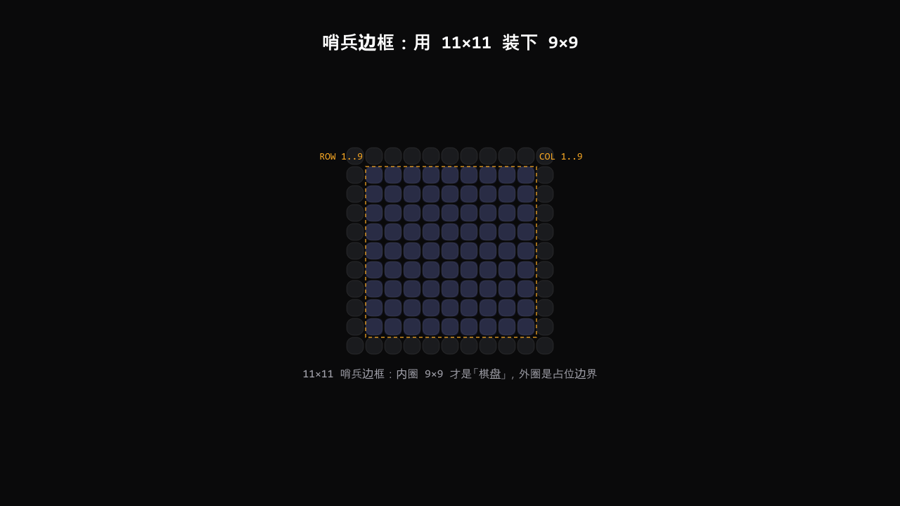
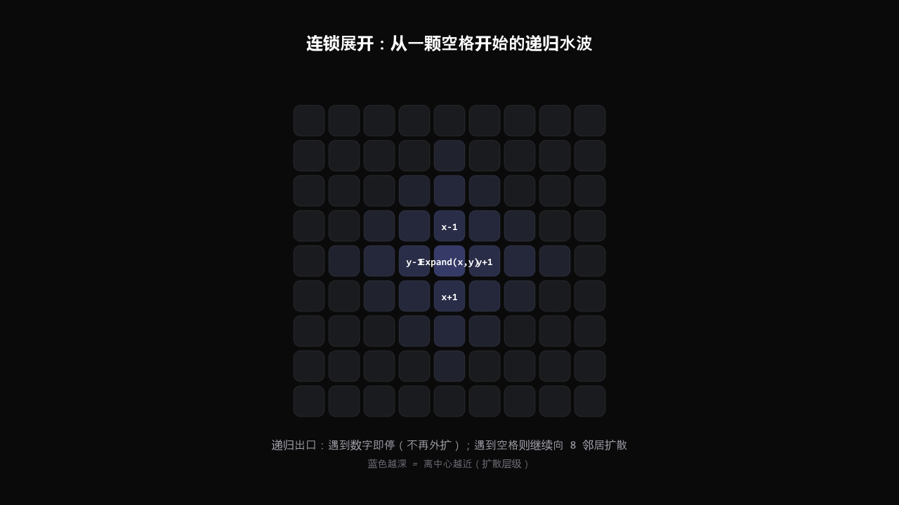

# 扫雷（C 语言控制台版）

一份**零依赖、单工程、能编译能玩**的 C 语言扫雷。9×9 棋盘、10 颗雷，支持首击保护、连锁展开、重复坐标拦截、非法输入处理，编译开满告警零 warning。

配套图文教程：[《从零写一个能玩的 C 语言扫雷》](https://github.com/wangzifan396-wzf/mini-browser-games/tree/main/minesweeper-c)（详细讲解双棋盘模型、哨兵边框、3×3 数雷与递归展开）。

## 文件结构

```text
minesweeper-c/
├── game.h        # 配置与函数声明（电路板说明书）
├── game.c        # 所有功能的实现（零件车间）
├── test.c        # 菜单与主流程（总装线）
├── Makefile      # 一行 make 即可编译
└── images/       # 教程用到的 5 张示意图（封面 + 4 正文）
```

## 编译与运行

需要任意 C11 编译器（gcc / clang / MSVC 均可）。

```bash
make                      # 等价于下面这条命令
# gcc -std=c11 -Wall -Wextra -Wpedantic -o minesweeper test.c game.c
./minesweeper            # Windows 下是 minesweeper.exe
```

Windows + MSVC 用户注意：源文件带 **UTF-8 with BOM** 签名，在 Visual Studio 里另存为时请选
「Unicode (UTF-8 带签名) - 代码页 65001」，否则中文注释会按 GBK 解析变成乱码。

## 玩法

1. 菜单选 `1` 开始游戏。
2. 输入坐标 `行 列`（空格隔开，例如 `5 5`）揭开那一格。
3. 数字 = 周围 8 格里的雷数；`0` 会自动连锁展开一大片。
4. 揭开所有非雷格子即胜利；踩到雷则结算。

## 核心设计（一图胜千言）


*双棋盘：`mine` 存真相，`show` 存界面，共用同一套坐标。*


*哨兵边框：11×11 数组外圈当护城河，省掉所有边界判断。*


*3×3 邻域扫描：遍历 9 格跳过中心，统计 8 个邻居中的雷。*


*递归连锁展开：三条出口决定继续、停止还是刹车，永不踩雷。*


*游戏主循环：从读坐标到判胜负的完整流程。*

## 改难度

只改 `game.h` 里的三个宏，其它代码一行都不用动：

```c
#define ROW  9
#define COL  9
#define EASY_COUNT 10
```

例如改成 `16 / 16 / 40` 就是中等难度。

## 许可

与仓库根目录 LICENSE 一致。
